# Grupo 5 - ASAP

# Sumário

1. Canvas proposta de valor

2. Matriz de Risco

3. Análise Financeira
    - 3.1 Tendências de Mercado
    - 3.2 Custos
    - 3.3 ROI
    - 3.4 Conclusão

4. Desenho da Solução - Mapeamento de Processos
    - 4.1 Requisição de Material Direto
    - 4.2 Requisição de Material Indireto

5. Entendimento de UX
    - 5.1 Pesquisa Exploratório
    - 5.2 Pesquisa Desk
    - 5.3 Conclusão baseada nos dados e Kick Off
    - 5.4 Sumário Conclusivo dos Principais Dados Obtidos

6. Personas

7. Jornada do Usuário
    - 7.1 Jornada Básica
    - 7.2 Jornadão

8. Mapa de Empatia

9. User Story

10. Manual

11. Plano de Cutover
    - 11.1 Testes Unitários
    - 11.2 Objetivo
    - 11.3 Escopo
    - 11.4 Resultado
    - 11.5 Conclusão

12. Matriz Raci

13. Estratégia de Cutover
    - 13.1 Checklist Go Live
    - 13.2 Plano de Comunicação e Identificação dos Stakeholders
    - 13.3 Validação do Ambiente de Produção

14. Plano de Contingência

15. Procedimentos e Regras de Negócio
    - 15.1 Procedimento de Compra de Licenças

16. Configurações SAP
    - 16.1 Configurações Inciais
    - 16.2 Configurações Específicas
    - 16.3 DTW

17. Validação dos Dados Mestres
    - 17.1 OCRD
    - 17.2 CRD1
    - 17.3 CRD7
    - 17.4 OCRB
    - 17.5 DTW
    - 17.6 Itens

18. Relatórios 

# Entendimento do Negócio

&emsp;&emsp; A implementação de um sistema SAP em uma empresa oferece vantagens significativas, como a melhoria na comunicação e na transferência de dados entre as áreas, aumento da agilidade dos processos e facilitação na tomada de decisões. No entanto, para que essa integração seja eficaz, é essencial realizar análises detalhadas utilizando metodologias e ferramentas específicas, alinhadas tanto ao desenvolvimento do projeto quanto às necessidades do cliente, e que podem ser encontradas abaixo neste documento. 

## 1. Canvas Proposta de Valor

&emsp;&emsp; O Canvas Proposta de Valor é uma ferramenta visual projetada para ajudar empresas a entenderem melhor as necessidades e desejos de seus clientes. Ele permite que as organizações definam e comuniquem claramente o valor que suas ofertas proporcionam, alinhando os benefícios dos produtos ou serviços com as expectativas dos consumidores. Utilizando essa metodologia, as empresas podem criar propostas de valor mais eficazes e direcionadas, facilitando a tomada de decisões estratégicas e o desenvolvimento de soluções que realmente atendam às demandas do mercado.

<!-- Molde para imagens -->

Imagem 1 - Canvas Proposta de Valor

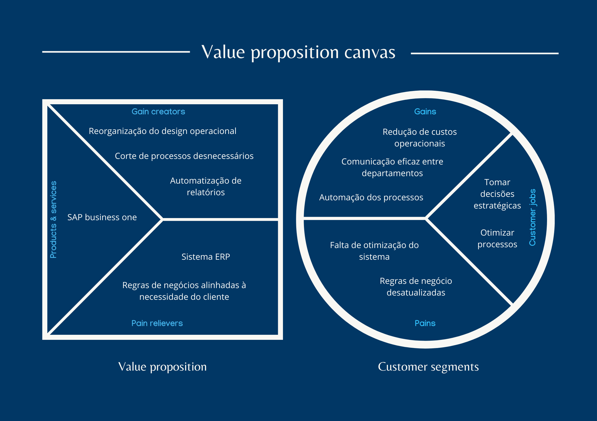

Fonte: Autoria própria.

<!------------------------>

&emsp;&emsp; O Segmento de Clientes, à direita, descreve o cenário atual do cliente. Nele, identificamos as tarefas executadas, como a Tomada de Decisões e a Otimização de Processos. Em seguida, são destacadas as vantagens do sistema utilizado, como a redução de custos e a comunicação eficaz entre departamentos. Por fim, são identificadas as dores do cliente, como a falta de otimização e as regras de negócio desatualizadas, que orientam a criação da proposta de valor.  
&emsp;&emsp; Já o quadrante de Proposta de Valor ajuda o cliente a entender o que será entregue no projeto. Primeiramente, são apresentados os “pain relievers”, que são os recursos destinados a resolver as dores do cliente. Em seguida, a etapa de produto detalha o que será entregue. Por fim, os criadores de ganho demonstram as vantagens que o cliente obterá com a nova solução.

## 2. Matriz de Risco

&emsp;&emsp;Esta seção tem como objetivo apresentar uma análise detalhada dos riscos e oportunidades identificados durante a Sprint 1 do projeto de implementação do SAP Business One para a G2 Tecnologia. A análise abrange ameaças que podem impactar negativamente o projeto, bem como oportunidades que podem ser aproveitadas para garantir o sucesso da implementação. Cada risco e oportunidade foi avaliado com base em sua probabilidade e impacto, e foram definidos planos de ação para mitigar riscos e potencializar oportunidades.

  
 <b>Tabela 1 </b> - Matriz de Risco

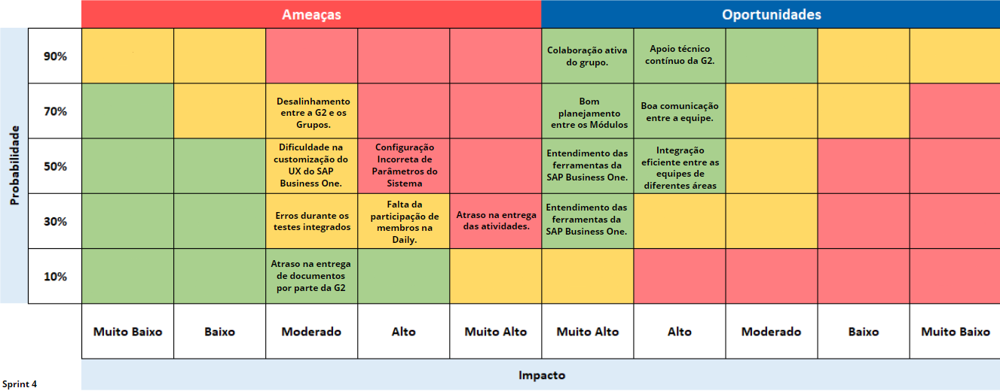
  
<b>Fonte: Matriz de Risco Sprint 4</b> 
  
  <b>Feito por Grupo ASAP.<b>

## Ameaças

### Desalinhamento entre a G2 e os Grupos
- **Probabilidade:** 70%
- **Impacto:** Moderado
- **Descrição:** Esta ameaça se refere à possibilidade de haver falta de alinhamento entre a G2 e os grupos da faculdade, o que pode causar desentendimentos, atrasos no cronograma e divergências na execução das atividades.
- **Responsável pelo Risco:** Equipe ASAP / G2
- **Plano de Contenção:** Estabelecer checkpoints regulares para alinhamento entre G2 e os grupos, garantindo que as expectativas e metas estejam claras e compartilhadas por todos.
- **Prazo:** Imediato.

### Dificuldade na Customização do UX no SAP Business One
- **Probabilidade:** 50%
- **Impacto:** Moderado
- **Descrição:** A dificuldade na personalização da interface de usuário do SAP Business One pode limitar a usabilidade do sistema e reduzir a eficiência da equipe durante a implementação.
- **Responsável pelo Risco:** Equipe ASAP / Instrutor de UX
- **Plano de Contenção:** Realizar workshops focados na customização do UX, com suporte da G2, para garantir que a equipe tenha a expertise necessária para realizar ajustes no sistema conforme necessário.
- **Prazo**: 

### Falta de Participação de Membros na Daily
- **Probabilidade:** 30%
- **Impacto:** Alto
- **Descrição:** A ausência de membros nas reuniões diárias pode levar a uma falta de coesão no time, causando atrasos na entrega das atividades e falta de visibilidade sobre o progresso do projeto.
- **Responsável pelo Risco:** Equipe ASAP
- **Plano de Contenção:** Incentivar a participação ativa nas Dailys através de lembretes e reforçar a importância dessas reuniões para o sucesso do projeto.

### Atraso na Entrega das Atividades
- **Probabilidade:** 30%
- **Impacto:** Muito Alto
- **Descrição:** Atrasos na entrega das atividades podem comprometer o cronograma do projeto, impactando negativamente a entrega final.
- **Responsável pelo Risco:** Equipe ASAP
- **Plano de Contenção:** Implementar um monitoramento rigoroso do cronograma, com reuniões de revisão de progresso e ajustes necessários ao longo do sprint para manter o prazo em dia.

### Atraso na entrega de documentos por parte da G2
- **Probabilidade:** 10%
- **Impacto:** Moderado
- **Descrição:** Atraso na entrega de documentos necessários para realizar atividades dos artefatos por parte da G2. Isso causa impedimentos e atrasos na entrega.
- **Responsável pelo Risco:** G2
- **Plano de Contenção:** Caso aconteça o atraso, entrar em contato com o responsável da G2 por enviar os documentos e entender até quando podemos receber os mesmos. Ademais, é importante colocar no Status Report os atrasos e alinhar isso com a G2.
- **Prazo:** 

### Erros durante os testes integrados
- **Probabilidade:** 30%
- **Impacto:** Moderado
- **Descrição:** Risco de ocorrer erros durante os testes integrados entre os módulos, impedindo a realização dos mesmos.
- **Responsável pelo Risco:** Turma 10
- **Plano de Contenção:** Entender o que está causando o erro, e corrigi-lo, ademais, reportar isso na planilha dos testes integrados para consultas futuras. 
- **Prazo:** Durante os Testes Integrados 

### Configuração Incorreta de Parâmetros do Sistema
- **Probabilidade:** 50%
- **Impacto:** Alto
- **Descrição:** Parâmetros configurados inadequadamente podem levar a erros no processamento de transações, cálculos incorretos ou comportamentos inesperados do sistema.
- **Responsável pelo Risco:** Equipe ASAP
- **Plano de Contenção:** Utilizar um checklist detalhado durante a configuração, revisar as definições com especialistas e realizar testes abrangentes para validar os parâmetros estabelecidos.
- **Prazo:** Durante a fase de configuração

## Oportunidades

### Colaboração Ativa do Grupo
- **Probabilidade:** 90%
- **Impacto:** Muito Alto
- **Descrição:** A colaboração ativa entre os membros do grupo pode fortalecer o desempenho coletivo e garantir a entrega bem-sucedida do projeto.
- **Responsável pela Oportunidade:** Equipe ASAP
- **Plano de Ação:** Promover um ambiente colaborativo através de ferramentas de comunicação e rituais ágeis, incentivando o compartilhamento de conhecimento e a ajuda mútua.

### Apoio Técnico Contínuo da G2
- **Probabilidade:** 90%
- **Impacto:** Alto
- **Descrição:** Receber suporte técnico contínuo da G2 pode garantir que problemas técnicos sejam resolvidos rapidamente, melhorando a eficiência do projeto e ajudando no aprendizado sobre o SAP Business One.
- **Responsável pela Oportunidade:** G2
- **Plano de Ação:** Garantir que a G2 esteja aqui na faculdade nos encontros e prazos acordados (segunda, quarta e sexta).

### Boa Comunicação entre a Equipe
- **Probabilidade:** 70%
- **Impacto:** Alto
- **Descrição:** Uma comunicação eficiente dentro da equipe pode reduzir mal-entendidos e aumentar a eficácia na execução das atividades do projeto.
- **Responsável pela Oportunidade:** Equipe ASAP
- **Plano de Ação:** Estabelecer canais de comunicação claros e acessíveis, promover a participação ativa em reuniões e incentivar feedback constante entre os membros da equipe.

### Entendimento das Ferramentas do SAP Business One
- **Probabilidade:** 50%
- **Impacto:** Muito Alto
- **Descrição:** Um bom entendimento das ferramentas oferecidas pelo SAP Business One pode maximizar a eficiência operacional e a qualidade das entregas.
- **Responsável pela Oportunidade:** Equipe ASAP
- **Plano de Ação:** Organizar sessões de treinamento e de prática, aproveitando o suporte da G2, para garantir que todos os membros da equipe dominem as funcionalidades principais do sistema.

### Integração Eficiente entre as Equipes de Diferentes Áreas
- **Probabilidade:** 50%
- **Impacto:** Alto
- **Descrição:** A integração eficiente entre as diferentes áreas do projeto pode garantir uma visão holística e um alinhamento estratégico, aumentando a qualidade e a consistência das entregas.
- **Responsável pela Oportunidade:** Turma 10
- **Plano de Ação:** Promover a comunicação ativa entre as equipes para alinhar as metas e processos entre as áreas de Compras, Vendas, Contábil, Financeiro e Estoque, garantindo que todos trabalhem em sinergia.

### Bom planejamento entre os módulos 
- **Probabilidade:** 70% 
- **Impacto:** Muito Alto 
- **Descrição:** Um bom planejamento para as entregas, entre os diferentes módulos (5 grupos), garantindo que os grupos estejam integrados e alinhados. 
- **Responsável pela Oportunidade:** Turma 10
- **Plano de Ação:** Promover dailys e fechamentos entre os grupos, além de uma comunicação afetiva por canais de mensagem como Slack e WhatsApp, garantindo que todos os grupos estejam alinhados com suas tasks.

A análise apresentada identifica os principais riscos e oportunidades relacionados ao projeto de implementação do SAP Business One para a G2 Tecnologia durante a primeira Sprint. A gestão proativa desses riscos, aliada ao aproveitamento das oportunidades, é essencial para o sucesso do projeto. A adoção de estratégias de mitigação e de potencialização das oportunidades permitirá que o projeto seja executado de forma eficiente e eficaz, garantindo que os objetivos sejam atingidos e que o sistema SAP Business One seja implementado com sucesso.

# 3. Análise Financeira

&emsp;&emsp;O planejamento financeiro é um pilar fundamental para o sucesso de qualquer projeto, fornecendo uma visão clara dos recursos necessários e dos resultados esperados. Esta seção tem como objetivo apresentar um conjunto de estratégias e ferramentas que permitem aos gestores e equipes da G2 elaborarem projeções financeiras robustas, mesmo em cenários de incerteza. 

&emsp;&emsp;Ao longo deste guia, exploraremos em detalhes como calcular o ROI de um projeto, considerando tanto os custos de desenvolvimento quanto as receitas projetadas para um período de um ano. Além disso, discutiremos a importância de simular custos de mercado e de considerar as despesas operacionais para garantir um planejamento financeiro completo e confiável.

## 3.1 Tendências de Mercado

&emsp;&emsp;Atualmente, as empresas enfrentam uma rápida transformação tecnológica, o que torna essencial a adoção de ferramentas que promovam eficiência operacional, integração e automação de processos. Nesse contexto, sistemas de Planejamento de Recursos Empresariais (ERP), como o SAP Business One (SAP B1), têm ganhado cada vez mais relevância, especialmente entre pequenas e médias empresas (PMEs), que buscam competir em um cenário global. Esta seção da documentação tem como objetivo analisar as principais tendências do mercado de ERP, com foco no SAP B1, identificando as motivações para sua adoção e as inovações que impulsionam essa transformação.

&emsp;&emsp;A motivação para a implementação de ERPs tem sido impulsionada por fatores como a necessidade de otimização de custos e a busca por maior transparência e controle nos processos empresariais. A centralização de informações e a automação de tarefas se destacam como pontos cruciais, promovendo não apenas melhorias operacionais, mas também permitindo uma gestão mais eficaz e orientada por dados. A digitalização tem facilitado essa transformação ao substituir processos manuais por fluxos digitais mais ágeis, aumentando a eficiência e reduzindo os erros humanos.

&emsp;&emsp;Nos últimos anos, os setores de óleo e gás, transporte e serviços públicos se consolidaram como os principais líderes na adoção de ERPs no Brasil, refletindo a demanda por soluções que permitam a integração de processos em larga escala. O varejo, a construção e as ciências da vida também estão adotando essas tecnologias, à medida que buscam soluções mais robustas para enfrentar os desafios de um mercado cada vez mais competitivo. Pequenas e médias empresas também estão adotando sistemas como o SAP B1, atraídas por suas funcionalidades que integram operações de estoque, contabilidade, vendas e relacionamento com clientes (CRM). [(SAP, 2024)](https://news.sap.com/brazil/2024/01/sap-brasil-cresce-com-maior-adocao-de-solucoes-de-nuvem-e-chegada-da-inteligencia-artificial/).

&emsp;&emsp;Com o aumento da demanda por personalização e integração, o SAP Business One tem se destacado por sua capacidade de adaptação às necessidades específicas de diferentes negócios. Isso permite que empresas de todos os portes possam escalar suas operações conforme crescem, mantendo a flexibilidade necessária para integrar outras ferramentas e sistemas já utilizados. Além disso, a escalabilidade do SAP B1 é um ponto de destaque, possibilitando que as PMEs adicionem novos módulos e funcionalidades conforme suas demandas aumentam, sem a necessidade de grandes investimentos adicionais em infraestrutura. [(Prime Institute, 2024)](https://www.primeinstitute.com/noticias/o-que-e-o-sap-business-one-sap-b1-e-suas-principais-vantagens-para-pequenas-e-medias-empresas-435).

&emsp;&emsp;Outro fator que impulsiona a adoção de ERPs é o avanço de tecnologias emergentes, como Internet das Coisas (IoT), Big Data e Inteligência Artificial (IA). Esses avanços, integrados ao SAP B1, permitem a coleta de dados em tempo real, otimizando a tomada de decisões e aumentando a previsibilidade operacional. O uso de Big Data aliado ao SAP HANA, por exemplo, facilita análises detalhadas e rápidas, enquanto a IA melhora a automação de tarefas repetitivas e a precisão dos processos. Esses recursos não apenas aumentam a eficiência operacional, mas também proporcionam uma visão mais estratégica e integrada das operações empresariais. [(Alfa Erp, 2024)](https://alfaerp.com.br/big-data-com-sap-business-one/).

&emsp;&emsp;A preferência por soluções baseadas em nuvem tem se consolidado como uma tendência clara no mercado de ERP, devido a benefícios como menor custo inicial, escalabilidade e acessibilidade remota. Soluções on-premise ainda têm seu espaço, principalmente em setores que exigem maior controle e segurança dos dados, mas a flexibilidade e a facilidade de implementação das soluções em nuvem estão ganhando cada vez mais adeptos, especialmente entre empresas que desejam modernizar suas operações com rapidez e eficiência. [(Teknisa, 2024)](https://www.teknisa.com/blog/o-que-e-erp/).

&emsp;&emsp;No entanto, a adoção de ERPs também traz desafios. Os custos iniciais de implementação, somados à resistência à mudança por parte de algumas equipes, podem dificultar o processo de transição. Além disso, a competitividade com ERPs personalizados pode representar uma ameaça, já que algumas empresas optam por soluções sob medida que atendem de forma mais específica às suas necessidades. Ainda assim, as oportunidades oferecidas pela centralização de dados e pela automação de processos superam esses desafios, tornando os ERPs uma ferramenta essencial para empresas que desejam se manter competitivas no cenário atual. Tais fatores podem ser facilmente vizualizados na matriz abaixo.

Imagem 2 - Matriz SWOT

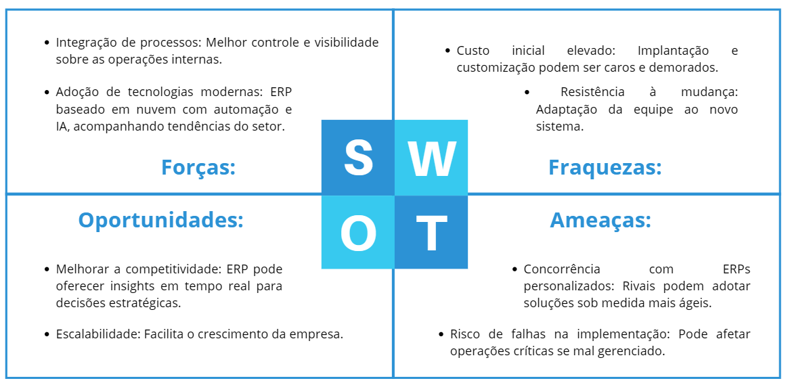

Fonte: Autoria própria.

&emsp;&emsp;A análise de fatores macroeconômicos, como a inflação e as flutuações cambiais, também desempenha um papel importante na adoção de ERPs. O aumento dos custos operacionais e a volatilidade cambial podem impactar diretamente o planejamento financeiro das empresas, principalmente na hora de investir em soluções tecnológicas de longo prazo. Por isso, é crucial que as empresas tenham uma gestão estratégica que considere esses fatores ao avaliar os custos e benefícios da implementação de um ERP como o SAP B1. [(Compare, 2024)](https://compareplanodesaude.com.br/empresarial/gestao-financeira/importancia-gestao-financeira-era-globalizacao/)

&emsp;&emsp;Em suma, o mercado de ERP está em constante evolução, impulsionado por inovações tecnológicas e pela crescente demanda por eficiência e integração nas operações empresariais. O SAP Business One, em particular, oferece uma solução robusta e escalável para empresas que buscam centralizar suas operações e automatizar processos, tornando-se uma escolha cada vez mais popular, especialmente entre as PMEs. A digitalização, a automação e a flexibilidade proporcionadas pelo ERP são fatores que continuarão a moldar o futuro das empresas no cenário competitivo atual.

## 3.2 Custos

### Desenvolvimento do Projeto

&emsp;&emsp;A seguir, são apresentados os custos de desenvolvimento inicial do projeto ASAP. O projeto, com duração de 10 semanas, tem alguns custos semanais e outros mensais, portanto, eles estão separados em tabelas diferentes e em seguida somados, estimando um valor de investimento para o desenvolvimento do projeto.

### Custos Semanais
&emsp;&emsp;Os custos semanais envolvem principalmente o valor dos funcionários envolvidos na produção. Cada um tem uma carga horária diferente, que, multiplicada pelo valor pago por hora e a quantidade de funcionários, resulta no custo total semanal. Consideramos 10 semanas nos cálculos.

| Descrição             | Horas/Semana | Valor por Hora (R$) | Quantidade | Custo Total Semanal (R$)     | Custo de 10 Semanas (R$) |
|-----------------------|--------------|---------------------|------------|------------------------------|--------------------------|
| Consultores Junior (alunos)    | 10           | 75                  | 34          |  25.500       |  255.000      |
| Consultores Sênior    | 10           | 75                  | 3          | 2.250      |  22.500      |
| Gerente de Projeto    | 2,5          | 100                 | 1          | 250          |  2.500         |
| **Total Semanal**     |              |                     |            | **28.000**                    | **280.000**               |

### Custos Mensais

&emsp;&emsp;Aqui são apresentados os serviços cobrados mensalmente. São envolvidas as licenças usadas e o serviço de nuvem contratado. Como o projeto tem duração de dois meses e meio, consideramos três, pois o serviço é cobrado integralmente independente da quantidade de uso por mês.

| Descrição               | Quantidade | Valor unitário por Mês (R$) | Valor Total Mensal (R$) | Valor 3 Meses (R$) |
|-------------------------|------------|-----------------------------|-------------------------|--------------------|
| Licenças SAP B1 Professional | 5          | 750                           | 3.750                       |11.250                  |
| Cloud Skyone            | 5          | 180                           | 900                       | 2.700                  |
| **Total**               |            |                             | 4.650                       | 13.950                  |

### Custo Total

| Descrição               | Valor (R$)     |
|-------------------------|----------------|
| Total Custos Semanais   | 280.000         |
| Total Custos Mensais    |  13.950             |
| Total Custos Projeto    | 293.950               |

### Resumo

&emsp;&emsp;Os custos de desenvolvimento do projeto ASAP são divididos em semanais e mensais.  Os semanais, que envolvem os consultores junior, sênior e gerente de projeto, totalizam 280.000 reais (considerando 10 semanas).  Os mensais, que compõem as licenças e a nuvem, totalizam 13.950 reais (considerando 3 meses). Portanto, o desenvolvimento na totalidade requer um investimento de 293.950 reais.

### Observações

- Esta seção cobre apensas os custos de desenvolvimento e não contempla os custos de operação.
- Os valores são estimativas baseadas nos custos correntes e podem variar conforme as negociações com fornecedores e alterações no escopo do projeto.
- É importante considerar custos adicionais como impostos, treinamentos e outros gastos não listados nesta tabela.

### Custos de Manutenção da Operação

&emsp;&emsp;Após a implementação do SAP B1 no cliente G2, consideramos os seguintes custos fixos e opções para a manutenção da operação ao longo de um ano.

#### Licenças Profissionais
- **Quantidade**: 5 licenças
- **Custo por licença**: R$740,00 mensalmente
- **Cálculo Mensal**: 5 licenças x R$740,00 = R$3.700,00 por mês
- **Cálculo Anual**: R$3.700,00 x 12 meses = R$44.400,00

#### Cloud
- **SkyOne (Nuvem)**: Os custos associados ao serviço de nuvem fornecido pela SkyOne durante a duração de implementação do projeto (3 meses) é de R$180,00 por usuário.
Portanto, consideranndo os custos de manutenção da operação em um período de 1 ano, temos que:
  -  Quantidade: R$180,00 x 5 usuários = R$900,00 (3 meses)
  - Custo por mês: R$900,00 / 3 meses = R$300,00 por mês
  - Custo por ano: R$300,00 x 12 meses = R$3600,00 por ano.

### Custos Opcionais
&emsp;&emsp;Esses custos não se aplicam ao nosso caso, mas estão disponíveis para o cliente:

- **Horas de Suporte**: Sistema de tickets onde o cliente pode contratar horas de suporte conforme necessário.
- **Melhoria Contínua**: Inclui melhorias na base de dados, relatórios personalizados, entre outros. Nota-se que a hora de suporte é mais barata que a hora de melhoria.

### Add-ons
- Os Add-ons são recursos ou funcionalidades adicionais que podem ser integrados ao SAP B1 para expandir suas funcionalidades. Embora eles sejam potenciais criadores de custo devido à licença e manutenção adicionais, não se aplicam ao nosso projeto específico.

### Conclusão 

&emsp;&emsp;O custo total fixo anual, considerando as Licenças profissionais e a Nuvem é de **R$47.600,00**, sendo que **R$44.000,00** é o custo das licenças e **R$3.600,00** é o custo da nuvem. Este é um exemplo baseado na nossa implementação.

&emsp;&emsp;As opções de suporte e melhoria, bem como os add-ons, são flexíveis e podem ser adaptadas conforme a necessidade do projeto e do cliente, mas não se aplicam para o nosso cenário.

## 3.3 ROI

&emsp;&emsp;O Retorno sobre Investimento (ROI) é uma métrica essencial no ambiente empresarial, utilizada para avaliar a eficácia e a rentabilidade de um investimento. No caso da G2, que está implementando o SAP Business One, o ROI oferece uma maneira de mensurar o ganho financeiro gerado em comparação ao custo da implantação, fornecendo insights sobre o valor agregado pela automação de processos e melhoria nas rotinas operacionais.

&emsp;&emsp;O cálculo do ROI é simples: divide-se o ganho líquido obtido com o investimento pelo custo inicial do projeto, e o resultado é expresso em porcentagem. A fórmula básica para calcular o ROI é:

&emsp;&emsp;ROI = (Ganho do Investimento - Custo do Investimento) / Custo do Investimento * 100

- **Custo Total do Projeto (Desenvolvimento + Manutenção Anual)**: A G2 estima um custo médio de R$ 7.000 a R$ 10.000 durante a implementação, sendo este o custo semanal para a G2 ao utilizar a plataforma SAPB1 (média de 16 horas semanais). O custo total inclui o desenvolvimento inicial e a manutenção anual, além das despesas fixas e variáveis associadas.
  
- **Receitas Previstas**: Para a G2, espera-se um ganho anual estimado de R$ 700.000 com a implementação do SAP Business One, baseando-se nas melhorias proporcionadas em rotinas como automação de processos financeiros, gestão de estoque, aprimoramento nas vendas, entre outros.

- **ROI**: Considerando um custo de investimento de R$ 250.000 e um ganho projetado de R$ 700.000, o ROI seria de aproximadamente 180%. Essa projeção reflete a lucratividade da G2 ao otimizar suas operações com o SAP Business One.

- **Tempo de Retorno do Investimento**: O tempo necessário para recuperar o valor investido dependerá do impacto financeiro direto nas operações e das economias geradas ao longo do tempo, que foram estimadas em 2% do faturamento anual da G2, uma economia significativa para a empresa.

- **Ganho Reputacional**: Além do retorno financeiro, a implementação do SAP Business One pode resultar em um aumento do reconhecimento de mercado, melhoria na reputação da empresa e impacto positivo nas operações dos clientes da G2, ampliando a adesão ao sistema e fortalecendo sua posição no mercado.

## 3.4 Conclusão

&emsp;&emsp; Nesta análise financeira, foram discutidos vários aspectos relacionados ao planejamento e execução de um projeto de implementação do SAP Business One para a G2. Primeiramente, foi abordada a importância do planejamento financeiro, que ajuda a enxergar uma boa base para prever os custos e as receitas esperadas.

&emsp;&emsp; Em seguida, a análise focou nas tendências de mercado para sistemas ERP, destacando a adoção dessas soluções por empresas de médio e pequeno porte, que buscam melhorar a eficiência operacional e a integração de processos. O SAP Business One foi identificado como uma escolha estratégica, especialmente por sua escalabilidade e capacidade de automação, além de ser o _Carro-Chefe_ de vendas da G2 e proposta do módulo.

&emsp;&emsp; Os custos de desenvolvimento e custos de manutenção também foram detalhados, evidenciando os custos envolvidos no projeto, tanto durante a fase de implementação (10 semanas) e após a implementação. Os custos após a implementação são analisados na seção de Custos de Manutenção da Operação em 1 ano, que seriam os custos que a empresa arcará após implementar o seu projeto, para poder mantê-lo.

&emsp;&emsp; A análise do Retorno sobre o Investimento (ROI) indicou que o projeto trará um retorno estimado em 180%, reforçando a viabilidade financeira da implementação.

&emsp;&emsp; Em resumo, a implementação do SAP Business One para a G2 oferece tanto benefícios financeiros quanto operacionais, que justificam o investimento, além de preparar a empresa para enfrentar os desafios futuros com maior eficiência.

 

# 4. Desenho da Solução - Mapeamento dos Processos
 

&emsp;&emsp; A SAP é uma das principais fornecedoras de software de gestão empresarial do mundo, oferecendo soluções que integram processos e informações dentro das empresas. Em nosso projeto atual, estamos focando em cinco setores essenciais para o bom funcionamento do negócio: vendas, compras, estoque, financeiro e contábil. 

&emsp;&emsp;Dentro de cada setor, existem atividades que se conectam e formam um macroprocesso, que é o conjunto de processos inter-relacionados que contribuem para um objetivo comum dentro da organização. Mapear esses macroprocessos é crucial, pois permite uma visão clara das interações entre diferentes áreas, ajudando a identificar oportunidades de melhoria, otimizar recursos e garantir que todos os processos estejam alinhados com as metas estratégicas da empresa. 

&emsp;&emsp;Este documento tem como objetivo explorar em detalhes o processo do setor de compras da G2, abordando suas etapas e interações, desde o pedido de aquisição de materiais até o recebimento e pagamento dos fornecedores.

## 4.1. Requisição de Material Direto

&emsp;&emsp; No contexto do mapeamento do processo de "compras" na G2, o primeiro  foco será nos produtos diretos que a empresa comercializa, ou seja, as licenças SAP. O mapeamento desse processo é essencial para garantir que a aquisição e a gestão das licenças sejam realizadas de maneira eficiente, alinhada aos padrões de qualidade e às necessidades dos clientes.

### 4.1.1. Requisição de Compras - Vendas

Imagem 3 - Processo de Compras iniciado pelo setor de Vendas

Fonte: Elaborado pelos Autores.

&emsp;&emsp; O processo de compras de licenças na G2 começa quando o setor de Vendas faz um pedido de X licenças a serem vendidas. Esse pedido é recebido pelo setor de Compras, que então verifica a disponibilidade no estoque. Se as licenças estiverem disponíveis, o processo é finalizado com a comunicação ao setor de Vendas. Caso contrário, o setor de Compras inicia um processo de aquisição, que envolve cotação com fornecedores e consulta ao setor Financeiro para aprovação do orçamento. Após a compra ser aprovada e realizada, as licenças são recebidas, e o processo é concluído com a disponibilização das licenças para venda.

### Detalhamento dos Macro Fluxos

#### **Pedido de Compras (Setor de Vendas)**
1. **Ponto de Entrada:** Pedido de X licenças feito pelo setor de Vendas.
2. **Atividades:**
   - **Vendas** realiza o pedido de X licenças para serem vendidas.
   - **Compras** recebe o pedido.
   - **Compras** requisita a disponibilidade no estoque.
3. **Resultado Esperado:** Pedido de compra iniciado e disponibilidade de estoque verificada.

#### **Verificação da Disponibilidade de Licenças**
1. **Ponto de Entrada:** Requisição de disponibilidade no estoque feita pelo setor de Compras.
2. **Atividades:**
   - **Estoque** confere a disponibilidade de licenças.
   - **Estoque** confirma a presença de licenças no estoque.
3. **Resultado Esperado:** Confirmação de licenças em estoque ou necessidade de adquirir mais.

#### **Aquisição de Licenças (Se necessário)**
1. **Ponto de Entrada:** Caso o estoque não tenha a quantidade necessária de licenças.
2. **Atividades:**
   - **Estoque** informa a necessidade de compra de mais licenças para o setor de Compras.
   - **Compras** realiza uma pré-cotação para a aquisição das novas licenças.
   - **Compras** verifica se a aquisição está dentro do orçamento disponível.
   - **Compras** realiza cotação com fornecedores e levanta o preço final.
   - **Compras** consulta o setor Financeiro para confirmar o valor orçado.
   - **Financeiro** aprova ou não a compra baseada no orçamento.
   - **Compras** realiza a compra se aprovado.
3. **Resultado Esperado:** Licenças adquiridas e recebidas, ou processo finalizado sem compra.

#### **Recebimento e Conclusão**
1. **Ponto de Entrada:** Compra de licenças aprovada e realizada.
2. **Atividades:**
   - **Compras** recebe as licenças.
   - **Compras** finaliza o processo, repassando a informação ao setor de Vendas.
3. **Resultado Esperado:** Licenças disponíveis para venda e conclusão do processo de compra.

### 4.1.2. Requisição de Compras - Estoque

Imagem 4 - Processo de Compras iniciado pelo setor de Estoque/p>

Fonte: Elaborado pelos Autores.

&emsp;&emsp; O processo de reposição de licenças na G2 é acionado quando o setor de Estoque identifica a necessidade de reposição de licenças, solicitando a compra ao setor de Compras. Este, por sua vez, trata a aquisição das licenças necessárias, verificando se a compra está dentro do orçamento. Se o orçamento permitir, a compra é realizada. Caso contrário, são realizadas cotações com fornecedores e o setor Financeiro é consultado para aprovar o orçamento. Após a aprovação, a compra é finalizada e as licenças são recebidas, encerrando o processo. 

### Detalhamento dos Macro Fluxos

#### **Identificação da Necessidade e Pedido de Compra**
1. **Ponto de Entrada:** Necessidade de reposição de licenças identificada pelo setor de Estoque.
2. **Atividades:**
   - **Estoque** identifica a necessidade de reposição de X licenças.
   - **Estoque** faz o pedido de compras para o setor de Compras.
   - **Compras** recebe o pedido.
3. **Resultado Esperado:** Pedido de reposição de licenças realizado e recebido pelo setor de Compras.

#### **Tratamento da Compra de Licenças**
1. **Ponto de Entrada:** Recebimento do pedido de reposição de licenças pelo setor de Compras.
2. **Atividades:**
   - **Compras** trata a compra de mais licenças, orçando com alguns fornecedores.
   - **Compras** verifica se a compra está dentro do orçamento (budget).
   - **Compras** realiza a compra diretamente, caso o valor esteja dentro do orçamento.
3. **Resultado Esperado:** Compra realizada ou necessidade de cotação e aprovação financeira identificada.

#### **Cotação e Consulta ao Setor Financeiro**
1. **Ponto de Entrada:** Caso a compra não esteja dentro do orçamento.
2. **Atividades:**
   - **Compras** realiza cotação com fornecedores para obter o melhor preço.
   - **Compras** levanta o preço final após cotação.
   - **Compras** consulta o setor Financeiro para verificar a aprovação do valor orçado.
   - **Financeiro** confere o valor orçado e decide sobre a aprovação.
   - **Financeiro** aprova ou não a compra com base na análise orçamentária.
3. **Resultado Esperado:** Aprovação financeira para a realização da compra ou ajuste do orçamento.

#### **Realização da Compra e Recebimento das Licenças**
1. **Ponto de Entrada:** Aprovação da compra pelo setor Financeiro.
2. **Atividades:**
   - **Compras** realiza a compra das licenças.
   - **Compras** recebe as licenças adquiridas.
   - **Estoque** é atualizado com as novas licenças recebidas.
3. **Resultado Esperado:** Licenças recebidas e estoque atualizado, finalizando o processo de reposição.

## 4.2. Requisição de Material Indireto

&emsp;&emsp; Seguindo as necessidades da G2, a compra de materias indiretos também precisa ser mapeada e analisada. O mapeamento desse processo é essencial para garantir que a aquisição desse material seja feita de maneira controlada e eficiente.

### 4.2.1 Requisição de Compras Internas

Imagem 5 - Processo de Compras de internos iniciado por tempo atingido/p>

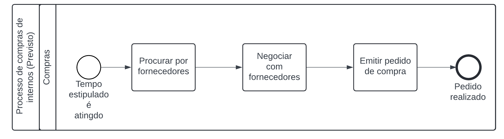

Fonte: Elaborado pelos Autores.

&emsp;&emsp; O processo de reposição de materiais na G2 é acionado quando o tempo estimado para a compra desses materiais é atingido. A área de compras trata de procurar os melhores fornecedores do(s) material(is) necessário(s). Após isso inicia as negociações sobre a compra, verificando valor, tempo, qualidade e outras características estipuladas pela G2. Em seguida, quando a negociação é feita, o pedido de compras é emitido. Depois da emissão, o pedido é finalizado. 

### Detalhamento dos Macro Fluxos

#### **Pedido de Compras Interno Periódico**
1. **Ponto de Entrada:** Atinge a data estipulada para fazer compras fixas.
2. **Atividades:**
   - Compras verifica se é a data determinada para as compras regulares.
   - Compras faz a cotação de fornecedores.
   - Compras emite o pedido.
3. **Resultado Esperado:** Pedido de compra periódico finalizado na data.

### 4.2.2. Requisição de Compras Internas Solicitada

Imagem 6 - Processo de Compras de internos iniciado por solicitação

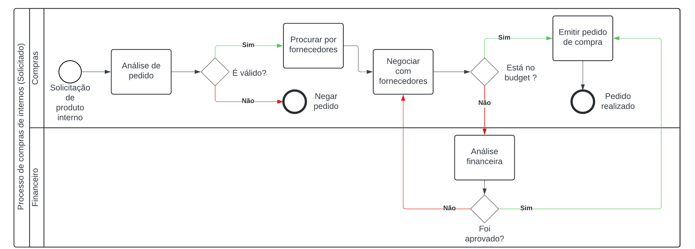

Fonte: Elaborado pelos Autores.

&emsp;&emsp; O processo de reposição é iniciado por uma solicitação dentro da empresa. A área de compras trata de analisar o pedido, uma vez que precisa verificar a urgência dessa compra assim como se a reposição por tempo está próxima, podendo o pedido ser negado, encerrando o processo, ou seguir adiante se aprovado. Caso siga, a área de compras procura os melhores fornecedores do(s) material(is) necessário(s). Após isso inicia as negociações sobre a compra, verificando valor, tempo, qualidade e outras características estipuladas pela G2. Em seguida, após as negociações com os fornecedores acabarem, é verificado se o valor final das negociações estão dentro do "Budget" do setor. Caso seja, o pedido de compras é emitido e o processo é finalizado em seguida. Se não, o caso é enviado para o setor finaceiro que realiza sua própria análise do caso, podendo aprovar a compra ou recusar. Caso for aprovado, o pedido de compra é emitido e o processo finalizado. Se não for aprovado, o processo volta para a etapa de negociar com os fornecedores. 

### Detalhamento dos Macro Fluxos

#### **Identificação da Necessidade e Pedido de Compra**
1. **Ponto de Entrada:** Solicitação de produto interno.
2. **Atividades:**
   - **Compras** Analisa o pedido solicitado.
   - **Compras** Julga se o pedido é válido ou não.
3. **Resultado Esperado:** 
   - O pedido é recebido por compras e negado.
   - O pedido é recebido por compras e aprovado.

#### **Negociação com fornecedores**
1. **Ponto de Entrada:** 
   - Pesquisa dos melhores fornecedores feita pela equipe de compras.
   - Negação do orçamento pelo setor financeiro.
2. **Atividades:**
   - **Compras** trata a compra de internos, orçando com alguns fornecedores.
   - **Compras** verifica se a compra está dentro do orçamento (budget).
   - **Compras** realiza a compra diretamente, caso o valor esteja dentro do orçamento.
3. **Resultado Esperado:** Compra realizada ou necessidade de cotação e aprovação financeira identificada.

#### **Cotação e Consulta ao Setor Financeiro**
1. **Ponto de Entrada:** Caso a compra não esteja dentro do orçamento.
2. **Atividades:**
   - **Compras** realiza cotação com fornecedores para obter o melhor preço.
   - **Compras** levanta o preço final após cotação.
   - **Compras** consulta o setor Financeiro para verificar a aprovação do valor orçado.
   - **Financeiro** confere o valor orçado e decide sobre a aprovação.
   - **Financeiro** aprova ou não a compra com base na análise orçamentária.
3. **Resultado Esperado:** Aprovação financeira para a realização da compra ou ajuste do orçamento.

#### **Realização da Compra e Recebimento das Licenças**
1. **Ponto de Entrada:** Aprovação da compra pelo setor Financeiro.
2. **Atividades:**
   - **Compras** realiza a compra dos internos.
   - **Compras** recebe os produtos adquiridos.
3. **Resultado Esperado:** Produto recebidos, finalizando o processo de reposição.

# 5. Entendimento de UX

&emsp;&emsp;As vantagens da implementação de um sistema SAP em uma empresa é muito relevante, para melhorar a comunicação e transferência de dados entre áreas, aumentar a agilidade dos processos e facilitar a tomada de decisão. Mas para realizar uma integração eficaz, é preciso realizar análises com diferentes metodologias e ferramentas voltadas ao desenvolvimento do projeto e ao negócio do cliente que irá receber a implementação (Chang, 2013). Neste arquivo serão apresentadas as ferramentas e matrizes desenvolvidas para este projeto, ressaltando a importância de sua utilização.  

# Imersão preliminar

## 5.1 Pesquisa Exploratória

### 5.1.1 Introdução

&emsp;&emsp; Um ERP (Planejamento de Recursos Empresariais) é um sistema que auxilia na gestão eficiente de todos os processos de uma empresa (como finanças, recursos humanos, produção, entre outros) em um ambiente integrado [1]. 
A pesquisa descrita neste tópico teve como objetivo mapear os processos de negócios da G2, empresa especializada em consultoria SAP e SAP Business One. A metodologia utilizada foi de entrevista, utilizando a técnica de coleta de dados em pesquisa qualitativa. Os resultados obtidos foram satisfatórios para o entendimento inicial do projeto. 
A G2 Tecnologia, atuando como consultora em soluções SAP, possui um profundo conhecimento do mercado e das melhores práticas para implementação de sistemas ERP. Ao adotar o SAP Business One como ferramenta de gestão interna, a empresa busca otimizar seus próprios processos, demonstrar a eficácia da solução e fortalecer sua posição como referência no mercado.  
A pesquisa realizada neste tópico teve como objetivo mapear os processos de negócio da G2 Tecnologia. Através de entrevistas e coleta de dados qualitativos, foi possível obter um entendimento inicial dos desafios e oportunidades presentes na organização. Os resultados dessa pesquisa servirão como base para o planejamento e execução da implementação do SAP Business One.

### 5.1.2 Objetivos

**Objetivo Geral**  
&emsp;&emsp; O objetivo dessa pesquisa é tomar ciência dos processos da G2, visando compreender de maneira objetiva sua estrutura, desafios e pontos de melhora. Abrindo também o alicerce para a pesquisa desk que irá aprofundar as ferramentas utilizadas e como elas vão impactar o cliente positivamente. 

**Objetivo Específicos**  

- Identificar as incossistências dos processos;
- Compreender a estrutura organizacional da empresa;
- Mapear o macroprocesso de compras da empresa;
- Identificar possíveis obstáculos que possam surgir durante a implantação do sistema;
- Identificar os indicadores e métricas de desempenho do projeto;

### 5.1.3 Justificativas

&emsp;&emsp; O crescimento de uma empresa é acompanhado de sua complexidade e especificidades, o que pode levar os seus processos e atividades que antes eram funcionais começarem a apresentar atrasos e gargalos que não podem mais ser tolerados. Com isso em pauta, a necessidade de ter controle da estruturas dos processos da empresa se torna um conhecimento chave para a implantação ou melhora de um ERP.  

&emsp;&emsp; Para realizar uma atualização de sistema eficaz, é crucial mapear e identificar como os processos estão ocorrendo e os dados que são disponibilizados pela ferramenta ERP. Ter essas informações devidamente analisadas e interpretadas é um passo essencial na melhoria dos processos. Portanto, a pesquisa exploratória com o cliente e a coleta de dados secundários (pesquisa desk) têm como objetivo reunir informações externas (casos de implementação de sistemas ERP), visando compreender os casos em que as implatações podem ser aprimoradas para atingirem o melhor desempenho possível.  

### 5.1.4. A pesquisa 

&emsp;&emsp; No dia 7 de agosto de 2024 foi realizado um kick-off com a G2, onde foi introduzido pelo cliente junto ao Inteli o objetivo do projeto e quais seriam os deveres de cada uma das partes envolvidas nele. Em um segundo momento, a turma teve a oportunidade de interagir com a G2 para, além de tirar duvidas e questionamentos sobre o projeto, preparar o lean inception que seria de uso comum entre os grupos. Os mesmos elaboraram um conjunto de perguntas, disponível <a href="https://docs.google.com/spreadsheets/d/11F5aHJoakw1ickrlGt5Zhl1xxdPOiXoA-pEeTLzRlAY/edit?usp=sharing">aqui</a>, que foram feitas para a Eduarda (representante da G2) sobre os detalhes de cada área envolvida (Vendas, Financeiro, Contábil, Estoque e Compras).  

&emsp;&emsp; A dinâmica foi realizada seguindo um padrão de 5 perguntas por grupo, onde essas perguntas foram feitas em relação ao projeto como um todo, ou em relação da área do grupo em questão. Ao fim das perguntas foi possível ter um entendimento bem mais aprofundado em relação a como o projeto seria orientado e em relação aos detalhes do funcionamento da empresa. Contudo, devido a indisponibilidade da G2, as perguntas específicas de cada área acabaram ficando em aberto por não ter a presença do pessoal responsável por cada uma das áreas citadas no início desse tópico. 

&emsp;&emsp; No momento atual da empresa, todos os departamentos operam de forma integrada, o que facilita a obtenção das informações de desempenho. Além disso, foi obtido nesse encontro alguns gargalos comuns para todas as áreas, como a produção manual de relatórios das áreas. Portanto, a releitura do SAP Business One implantado visa reduzir os disperdícios, automatizar a geração de relatórios e melhorar coesão dos processos como um todo.  
## 5.2 Pesquisa Desk

&emsp;&emsp;O objetivo da pesquisa desk é proporcionar uma compreensão aprofundada e fundamentada sobre os sistemas SAP e ERP (Enterprise Resource Planning), com especial atenção à Experiência do Usuário (UX), tendo como finalidade identificar as melhores práticas, tendências emergentes, desafios e soluções no contexto do uso desses sistemas empresariais. Além disso, pretende-se mapear contribuições que podem ser úteis ao projeto.

&emsp;&emsp;As soluções SAP são amplamente utilizadas por grandes e médias empresas em todo o mundo, sendo essenciais para a integração e otimização de processos internos. Contudo, a eficiência desses sistemas muitas vezes não é acompanhada por uma experiência do usuário satisfatória, o que pode comprometer a adesão, eficácia e satisfação do cliente.

&emsp;&emsp;Esta pesquisa busca, portanto, fornecer uma base teórica robusta que suporte a fase de imersão do projeto, permitindo a formulação de hipóteses e estratégias.
  

### 5.2.1 Artigo I - Fatores críticos de sucesso (CSFs) para implementação de ERP 

&emsp;&emsp;O estudo apresentado foi realizado através de uma revisão sistemática da literatura, analisando artigos publicados entre 1991 e 2009. Foram coletados dados de diversas fontes acadêmicas e práticas para identificar os **CSFs na implementação de ERP**. A análise incluiu a classificação dos fatores em categorias como ambiente cultural, ambiente estrutural, características do software, características da empresa, características da equipe de implementação, papel da alta gestão, processo de implementação e características dos usuários finais.[2]

&emsp;&emsp;**Objetivo da Pesquisa:** Revisar sistematicamente os fatores críticos de sucesso (CSFs) na implementação de sistemas ERP (Enterprise Resource Planning), com foco em identificar e categorizar os fatores que influenciam o sucesso da implementação de ERP em organizações. 

&emsp;&emsp;**Justificativa:** Fornecer à G2 uma compreensão abrangente dos fatores críticos que devem ser considerados durante a implementação do SAP Business One, com base em evidências empíricas e literatura acadêmica, garantindo assim uma maior probabilidade de sucesso no projeto.

#### Sumário dos Principais Dados Obtidos:

**Ambiente Cultural**

- Importância da Capacitação e Sistemas: A ênfase na capacitação e na importância dos sistemas para capacitar a organização são fatores críticos.

- Resistência à Mudança: A resistência organizacional à mudança é um dos principais impedimentos ao sucesso na implementação de ERP.

- Comunicação Aberta e Honesta: Comunicação clara e transparente em todos os níveis da organização é essencial para o sucesso.

**Ambiente Estrutural**

- Pressão Competitiva: A pressão do mercado pode ser um motivador importante para a implementação de ERP.

- Disponibilidade de Pessoal de TI e Especialistas em Negócios: A falta de pessoal qualificado e a alta rotatividade de funcionários podem comprometer o sucesso da implementação.

**Características do Software**

- Complexidade do Software: A complexidade do ERP pode dificultar sua incorporação nos processos de negócios da organização.

- Conformidade com a Legislação Local: A capacidade do software de se adaptar às leis locais é um fator crítico para implementações internacionais.

**Características da Empresa**

- Tamanho da Empresa: O tamanho da empresa pode influenciar significativamente o sucesso da implementação de ERP.

**Características da Equipe de Implementação** 

- Inclusão de Consultores Experientes: Consultores com experiência em implementação são fundamentais para o sucesso.

- Composição da Equipe: A combinação certa de especialistas em TI, negócios e consultores aumenta a probabilidade de sucesso.

**Papel da Alta Gestão**

- Clareza nos Objetivos e Metas: Objetivos claros e definidos pela alta gestão são cruciais.

- Apoio e Envolvimento da Alta Gestão: O suporte contínuo e a participação ativa da alta gestão são essenciais para superar obstáculos.

**Processo de Implementação**

- Reengenharia de Processos vs. Modificação de Software: A escolha entre adaptar os processos de negócios ao software ou modificar o software para se adequar aos processos existentes é uma das principais decisões durante a implementação.

- Treinamento e Educação: A capacitação adequada dos usuários é vital para a adoção bem-sucedida do ERP.

**Características dos Usuários Finais**

- Atitudes em Relação ao ERP: A percepção e aceitação dos usuários em relação ao sistema ERP afetam diretamente o sucesso da implementação.

- Envolvimento dos Usuários: O envolvimento ativo dos usuários no processo de implementação aumenta a satisfação e a eficácia do sistema.

 

&emsp;&emsp;**Método de Coleta:** Revisão sistemática da literatura, utilizando bases de dados acadêmicas e prática de revisão de artigos publicados sobre a implementação de ERP. 

&emsp;&emsp;**Método de Análise:** Análise categorizada dos fatores críticos de sucesso com base em estudos empíricos, levando à construção de um modelo teórico para guiar futuras implementações.

---

 

### 5.2.2 Artigo II - Fatores críticos de sucesso para implementação de ERP em PMEs (Pequenas e Médias Empresas)

&emsp;&emsp;A pesquisa incluiu uma revisão crítica de mais de 50 artigos relevantes, além de uma pesquisa industrial e entrevistas com gerentes de oito empresas no nordeste do Reino Unido. O foco foi em identificar os CSFs específicos para a implementação de ERP em PMEs, bem como entender como esses fatores interagem e impactam o sucesso da implementação. [(Ahmad, 2024)](https://www.sciencedirect.com/science/article/abs/pii/S0736584512000658#preview-section-references)

&emsp;&emsp;**Objetivo da Pesquisa:** Identificar e analisar os fatores críticos de sucesso (CSFs) na implementação de sistemas ERP em Pequenas e Médias Empresas (PMEs), com foco nas interrelações entre esses fatores e seu impacto ao longo do processo de implementação. 

&emsp;&emsp;**Justificativa:** Fornecer à G2 insights específicos sobre a implementação do SAP Business One em PMEs, considerando tanto os fatores organizacionais quanto operacionais, para garantir uma integração bem-sucedida do sistema ERP em ambientes de recursos limitados.

#### Sumário dos Principais Dados

- Complexidade e Custo: A implementação de ERP é frequentemente vista como um processo complexo e caro, muitas vezes ultrapassando os recursos estimados. O processo envolve a seleção do melhor software disponível, a configuração dos sistemas, treinamento de pessoal, e personalização das soluções, tudo sem impactar as operações diárias.

**Fatores Organizacionais vs. Operacionais**

- Fatores Organizacionais: Identificados como mais críticos que os operacionais na implementação de ERP. Incluem estrutura organizacional, cultura organizacional, e alinhamento entre a gestão e TI.

- Fatores Operacionais: Incluem a seleção de software, configuração, e treinamento, sendo fundamentais, mas dependentes do sucesso dos fatores organizacionais.

**Implementação em PMEs**

- Desafios em PMEs: As PMEs enfrentam desafios únicos, como a escassez de recursos e fundos, o que dificulta o sucesso na implementação de ERP.

- Processo Contínuo: A implementação de ERP deve ser vista como um processo dinâmico e contínuo, e não como um projeto com início e fim definidos.

- Inter-relações entre os CSFs: A pesquisa destaca a importância de entender as inter-relações entre os CSFs durante a implementação, onde falhas em fases iniciais podem levar a uma má integração do sistema.

- Ferramenta de Monitoramento: Os resultados do estudo foram utilizados para desenvolver uma ferramenta que permite monitorar e melhorar as implementações de ERP em PMEs.

 

&emsp;&emsp;**Método de Coleta:** Revisão da literatura, pesquisa industrial, e entrevistas com gerentes de empresas. 

&emsp;&emsp;**Método de Análise:** Análise das inter-relações entre os CSFs utilizando uma metodologia de análise de referência cruzada.

 

---

### 5.2.3 Artigo III - Design da Experiência do Usuário (UX) em sistemas ERP: otimizando a interface do Usuário 

&emsp;&emsp;O artigo centra-se na melhoria da usabilidade dos sistemas ERP, em especial para usuários novos e inexperientes. Através de métodos de investigação qualitativa, incluindo entrevistas aprofundadas com especialistas do setor, o estudo examina os atuais processos de compreensão em UX, os desafios e as oportunidades de melhoria. 

&emsp;&emsp;A investigação visa diminuir a lacuna entre a teoria da experiência do usuário e a implementação prática em sistemas ERP, oferecendo ideias para melhorar a ideação da interface (UI) e a eficácia geral do sistema. [(Jawad; Villatoro, 2024)](https://www.theseus.fi/handle/10024/816039)

#### Sumário dos Principais Dados

&emsp;&emsp;As entrevistas destacam vários aspectos fundamentais em UX/UI nos sistemas ERP:

- A simplicidade e o minimalismo são cruciais para interfaces fáceis de utilizar.

- A normalização dos projetos de ERP para as PME é possível, mas deve permitir alguma personalização com base em necessidades específicas e restrições orçamentais.

- Interfaces intuitivas que guiam os usuários através das tarefas podem reduzir a curva de aprendizagem. Dicas visuais e instruções simplificadas ajudam a melhorar a usabilidade.

- Princípios de design centrado no usuário (UCD) estão sendo aplicados juntamente com metodologias Lean e design de serviços para melhorar a usabilidade do ERP, fator chave para melhorar a satisfação dos usuários, reduzir o tempo de treinamento e aumentar a eficácia geral do sistema.

- A adesão a normas de acessibilidade, como a [W3C ARIA](https://www.w3.org/WAI/standards-guidelines/aria/), e a princípios de design de fácil utilização, como o Google Material UI, também melhoram a usabilidade.

- O feedback regular dos usuários e os processos de design iterativos são importantes para melhoria contínua.

- A personalização é fundamental nos sistemas ERP modernos, permitindo que os usuários vejam apenas informações relevantes. Isto reduz a complexidade e a necessidade de formação ou treinamento extensivos.

- As técnicas de visualização, como as representações gráficas dos dados, podem melhorar a compreensão e a satisfação do usuário. No entanto, as tabelas tradicionais continuam a ser a forma mais comum de apresentação de dados.

- O aspeto psicológico da transição de sistemas antigos para novos sistemas é significativo. Os usuários resistem frequentemente à mudança, o que torna crucial uma gestão eficaz da mudança.

- Alguns especialistas alertam contra a personalização extensa com base no input dos usuários, citando potenciais problemas de manutenção e segurança.

 

&emsp;&emsp;**Método de Coleta e Análise**

&emsp;&emsp;Os métodos de pesquisa utilizados neste estudo envolveram principalmente técnicas qualitativas, com foco em entrevistas em profundidade com especialistas do setor. As entrevistas foram realizadas presencialmente e através de reuniões online, com duração aproximada de 60 a 90 minutos cada. 

&emsp;&emsp;Os pesquisadores utilizaram um estilo de entrevista aberto com perguntas semi-estruturadas, permitindo o acompanhamento e o esclarecimento de questões. As entrevistas foram transcritas na íntegra para manter a exatidão. 

&emsp;&emsp;O estudo também incluiu uma revisão da literatura para estabelecer o contexto e identificar as lacunas existentes na investigação. Essa combinação de entrevistas a peritos e análise da literatura permitiu uma exploração abrangente do design UX em sistemas ERP.

 

## 5.3 Conclusão baseada nos dados e Kick Off

&emsp;&emsp;Um grande ponto de dor mencionado algumas vezes pelo parceiro foi a dificuldade em tornar a implementação do SAP um processo fluído e satisfatório. Por ser um sistema complexo, muitas vezes os clientes não se engajam o suficiente durante a implementação, sendo que esse engajamento é um dos pontos críticos para o sucesso do trabalho.

&emsp;&emsp;Essa dificuldade e complexidade, em conjunto com um sistema que busca ser funcional em vez de amigável, tornam tudo ainda mais complicado. É necessário acompanhar o cliente passo a passo, desenvolvendo treinamentos longos e detalhados, procurando minimizar os possíveis erros.

&emsp;&emsp;Dado este cenário, durante a pesquisa desk procuramos artigos e trabalhos que pudessem abordar, além das criticidades na implementação do ERP, como tornar a experiência das pessoas um pouco mais agradável e com menos atritos, mesmo com as limitações do sistema.

&emsp;&emsp;Entre alguns benefícios de um maior investimento na experiência do usuário em sistemas ERP, destacamos:

- **Redução da carga cognitiva dos usuários**, permitindo-os concentrarem-se nas suas tarefas em vez de lutar com a interface, o que pode levar a menos erros e a uma conclusão mais rápida das tarefas.

- **Melhoria da tomada de decisões devido a uma melhor visualização e acessibilidade dos dados**. Os usuários podem interpretar e agir mais facilmente com base em informações apresentadas de forma intuitiva.

- **Menores custos de implementação e formação**, uma vez que os usuários se adaptam mais rapidamente a um sistema intuitivo, o que resulta num melhor retorno do investimento para a empresa.

&emsp;&emsp;Com os dados reunidos e interpretados, temos a capacidade de apresentar sugestões e argumentos lógicos para o parceiro, assim como possibilidades de inovação, com o objetivo de tornar o processo de implementação do ERP simples e intuitivo.

### 5.4 Sumário Conclusivo dos Principais Dados Obtidos

&emsp;&emsp;A pesquisa exploratória e desk focou na compreensão dos processos internos e externos da G2 Tecnologia, com o intuito de otimizar a implementação do SAP Business One. A coleta de dados primários foi realizada por meio de entrevistas qualitativas, enquanto a pesquisa desk aproveitou revisões sistemáticas de literatura para consolidar conhecimentos sobre práticas e desafios na implementação de sistemas ERP.

**Métodos de Coleta e Análise:**

1. **Pesquisa Exploratória:**
   - **Método de Coleta:** Conversas e kickoff com stakeholders da G2 Tecnologia.
   - **Método de Análise:** Análise qualitativa para identificar desafios, oportunidades e expectativas.

2. **Pesquisa Desk:**
   - **Método de Coleta:** Revisão sistemática de artigos publicados entre 1991 e 2021, focando em fatores críticos para o sucesso de implementações de ERP.
   - **Método de Análise:** Análise categorizada dos dados coletados para formar um modelo teórico dos CSFs (Critical Success Factors).

**Principais Dados Obtidos:**

1. **Ambiente Organizacional:**
   - Identificação de macroprocessos críticos como vendas, compras, contabilidade e estoque.
   - Necessidade de treinamentos intensivos e acompanhamento próximo durante a implementação devido à complexidade do ERP.

2. **Fatores Críticos de Sucesso:**
   - **Cultural:** Capacitação e gestão da resistência à mudança.
   - **Estrutural:** Pressão competitiva e disponibilidade de pessoal qualificado.
   - **Software:** Complexidade e conformidade legal.
   - **Empresa:** Influência do tamanho da empresa na implementação.
   - **Equipe:** Importância de consultores experientes e uma equipe multidisciplinar bem composta.
   - **Alta Gestão:** Clareza nos objetivos e envolvimento ativo.
   - **Processo de Implementação:** Decisão entre reengenharia de processos ou modificação do software.
   - **Usuários Finais:** Atitudes, envolvimento e treinamento dos usuários.

3. **UX no ERP:**
   - Simplificação da interface para melhorar a experiência do usuário.
   - Normalização com possibilidade de personalização para atender necessidades específicas.

**Kickoff e Conclusões Baseadas nos Dados:**

&emsp;&emsp;Durante o kickoff, foi enfatizado que a eficácia da implementação do SAP Business One depende crucialmente de um entendimento profundo dos processos da empresa. A pesquisa apontou para a necessidade de focar na experiência do usuário para facilitar a adoção do sistema e reduzir a resistência à mudança. Foi reconhecida a importância de um acompanhamento detalhado e personalizado durante a implementação para garantir a integração efetiva do sistema nos processos da empresa.

## 6. Personas

&emsp;&emsp;Persona é a representação fictícia do seu cliente ideal. Ela é baseada em dados reais sobre comportamento e características demográficas dos seus clientes. [(Siqueira, 2024)](https://www.rdstation.com/blog/marketing/persona-o-que-e/)

&emsp;&emsp;A seguir, temos a persona criada para o projeto:

Imagem 7 - Persona

Fonte: Elaborado pelos Autores.

## 7. Jornada do Usuário

### 7.1 Jornada Básica

&emsp;&emsp;A jornada de usuário é um mapeamento visual ou narrativo que descreve as etapas pelas quais um usuário passa ao interagir com um produto, serviço ou sistema. Esse mapeamento ajuda a entender a experiência do usuário desde o primeiro contato até a conclusão de uma tarefa ou objetivo.

&emsp;&emsp;Componentes da Jornada de Usuário:

- **Personas:** Representações fictícias dos diferentes tipos de usuários que utilizarão o sistema ou serviço. Elas ajudam a entender as necessidades e expectativas de diferentes perfis de usuários.

- **Cenários:** Contextos ou situações específicas em que o usuário interage com o produto ou serviço. Isso inclui o ambiente, o estado emocional do usuário e os desafios que ele pode enfrentar.

- **Etapas:** As diferentes fases pelas quais o usuário passa, como a descoberta do produto, a decisão de usar, o uso efetivo e o pós-uso.

- **Pontos de contato:** Os momentos e locais onde o usuário interage com o produto ou serviço, como websites, aplicativos, atendimento ao cliente, etc.

- **Emoções e dores:** O que o usuário sente em cada etapa da jornada, tanto as experiências positivas quanto as frustrações ou dificuldades.

- **Oportunidades:** Identificação de áreas onde o produto ou serviço pode ser melhorado para oferecer uma experiência mais satisfatória.

&emsp;&emsp;A jornada ideal do usuário é aquela que consegue criar um ciclo completo de interação entre cliente e marca/produto/serviço. [(Lugão, 2024)](https://www.cursospm3.com.br/blog/as-diferentes-estruturas-da-jornada-do-usuario/)

&emsp;&emsp;Podemos mencionar algumas vantagens, como:

- **Credibilidade:** já que é um processo que ajuda a identificar e corrigir falhas;

- **Alinhamento e comunicação:** mapear a jornada do usuário é muito útil para times que trabalham com OKRs e outros sistemas de acompanhamento de resultados, já que o alinhamento com líderes e outras equipes também fica mais transparente;

- **Tomada de decisão baseada em dados:** os dados coletados durante o mapeamento da jornada do usuário podem ser usados para embasar decisões relacionadas ao roadmap do produto;

- **Inovação centrada no cliente:** o mapeamento da jornada do usuário fornece insights que podem ser usados para orientar a inovação. É possível identificar oportunidades para criar novos recursos ou produtos com base no feedback dos usuários.

 

Imagem 8 - Jornada Básica do Usuário

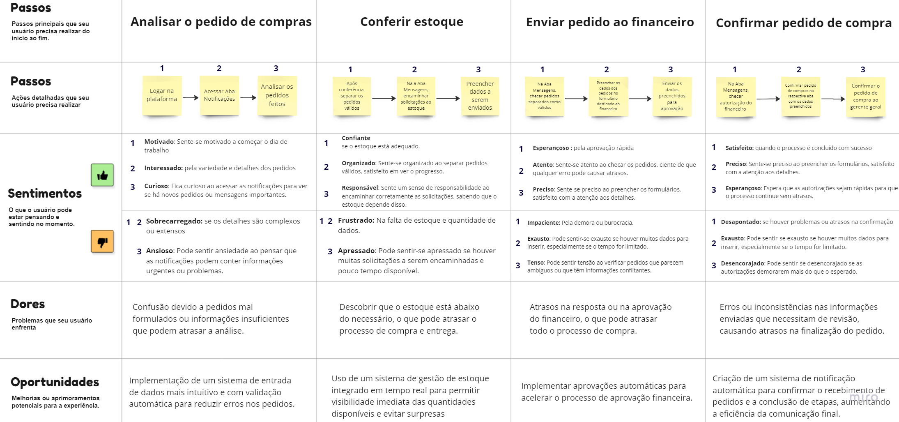

Fonte: Elaborado pelos Autores.

### 7.2 Jornadão

&emsp;&emsp;A jornada do usuário abaixo foi desenvolvida com o objetivo de mapear e compreender os principais processos que integram as operações de todos os módulos. Através de um levantamento detalhado das etapas que envolvem estoque, vendas, compras, contabilidade e financeiro, é possível obter uma visão ampla do funcionamento da G2. Cada fase foi estruturada para representar um dos fluxos operacionais, considerando as interações entre as diferentes áreas e seus papéis. O foco está em como essas áreas se conectam e impactam umas às outras, proporcionando uma visão integrada do sistema como um todo.

 

Imagem 9 - "Jornadão"

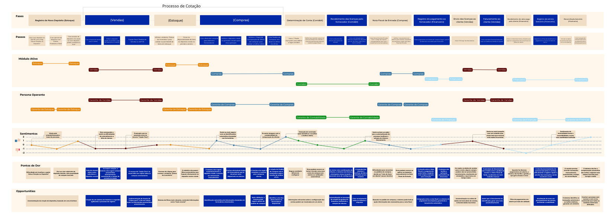

Fonte: Elaborado pelos Autores.

O jornadão acima pode ser melhor vizualizado <a href="https://www.canva.com/design/DAGRIh1Fg3k/WM_Ye9DzOdgdoYiquKp6Cw/edit">aqui</a>.
 

&emsp;&emsp;Ter uma jornada bem definida é fundamental para o sucesso de qualquer operação empresarial. Ela serve não apenas para padronizar e otimizar processos, mas também para proporcionar um entendimento claro dos papéis e responsabilidades de cada persona envolvida. Ao visualizar o processo completo, desde a solicitação de um produto até a sua contabilização, é possível identificar gargalos, melhorar a comunicação entre as áreas e garantir que o sistema funcione de maneira eficiente e integrada. A jornada também facilita a tomada de decisões estratégicas, permitindo uma visão mais clara das interdependências e do impacto das ações dentro do negócio.

## 8. Mapa de Empatia

&emsp;&emsp;Mapa da Empatia é um material utilizado para conhecer melhor o cliente. A partir do mapa da empatia é possível detalhar a personalidade do cliente e compreendê-la melhor. O mesmo é composto de 6 perguntas para identificar seu público-alvo e assim conhecer seus sentimentos, dores e necessidades. [(Custódio, 2024)](https://www.rdstation.com/blog/marketing/mapa-da-empatia/)

&emsp;&emsp;Essas perguntas são divididas no mapa:

&emsp;&emsp;**Parte de cima:**
- O que pensa e sente?
- O que escuta?
- O que fala e faz?
- O que vê?

&emsp;&emsp;**Parte de baixo:**
- Quais são as dores dele?
- Quais são seus ganhos?

Imagem 10 - Mapa de Empatia

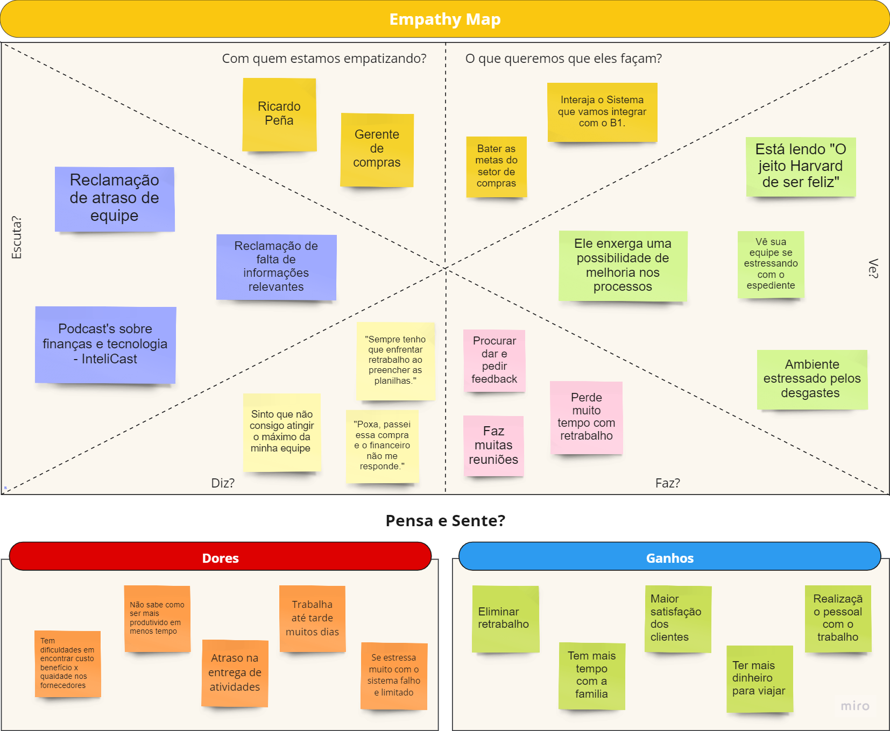

Fonte: Elaborado pelos Autores.

 

## 9. User Story

&emsp;&emsp;As user stories são uma explicação informal e geral de um recurso de software escrita sob a perspectiva do usuário final. É a menor unidade de trabalho em um framework ágil e sua finalidade é expressar como um recurso de software agregará valor ao cliente [(Atlassian, 2024)](#4-referências).

&emsp;&emsp;Apesar de soar parecido com requisitos de software, este seria um mal-entendido, afinal, o objetivo das User Stories é colocar as pessoas como prioridade, trazendo o usuário ao centro do desenvolvimento do produto, suscitando empatia e propósito aos envolvidos no projeto. 

### Requisitos de Software

&emsp;&emsp;Mesmo não sendo um requisito de software, as user stories estão conectadas aos mesmos, sendo assim, vamos definir o que é um requisito de software:

&emsp;&emsp;Um requisito é uma condição ou capacidade que deve ser atendida ou possuída por um sistema, produto, serviço, projeto ou processo para atender às necessidades e expectativas de seus usuários, clientes ou stakeholders. [(Morais, 2024)](https://login.vitalsource.com/?redirect_uri=https%3A%2F%2Fintegrada.minhabiblioteca.com.br%2Freader%2Fbooks%2F9788595022539&brand=integrada.minhabiblioteca.com.br)

#### Tipos de Requisitos:

1. **Requisitos Funcionais**: “São declarações de serviços que o sistema deve fornecer, de como o sistema deve reagir a entradas específicas e de como o sistema deve se comportar em determinadas situações. Em alguns casos, também podem explicitar o que o sistema não deve fazer” (Sommervile, 2011, p. 59).

2. **Requisitos Não Funcionais**: “Pode ser descrito como um atributo de qualidade, de desempenho, de segurança ou como uma restrição geral em um sistema” (Pressman; Maxim, 2016, p. 141). 

### Regras de Negócio

&emsp;&emsp;Regras de negócio são condições ou políticas que definem ou restringem vários aspectos de um negócio. Elas são essenciais para garantir que as operações sejam realizadas de acordo com diretrizes estabelecidas, ajudando a padronizar processos e garantir conformidade com normas e políticas internas [(Brandão, 2024)](https://afonsobrandaointeli.github.io/modulo7si/01regras/).

#### Importância das Regras de Negócio:

- **Padronização:** Garantem que todas as operações sejam realizadas de acordo com um conjunto uniforme de diretrizes.

- **Conformidade:** Ajudam a garantir que as práticas estejam alinhadas com leis, regulamentações e políticas internas.

- **Eficiência:** Automatizam processos e decisões, reduzindo a necessidade de intervenção manual e minimizando erros.

- **Transparência:** Facilitam a compreensão e a comunicação dos processos e decisões de negócios entre as partes interessadas.

### Conexão entre Requisitos de Software, Regras de Negócio e User Stories

&emsp;&emsp;As regras de negócios, os requisitos de software e as histórias de usuário estão profundamente conectadas para garantir que um sistema atenda tanto às necessidades organizacionais quanto às dos usuários. As regras de negócios estabelecem diretrizes e políticas que a organização deve seguir, influenciando diretamente os requisitos de software, que traduzem essas diretrizes em funcionalidades específicas e técnicas. As histórias de usuários, por sua vez, contextualizam esses requisitos ao focar nas necessidades dos usuários, garantindo que o software seja intuitivo e eficaz. 

&emsp;&emsp;Em conclusão, as regras de negócios moldam os requisitos de software, que são então validados e refinados através das histórias de usuários, assegurando uma solução que esteja alinhada com os objetivos da empresa e que atenda às expectativas dos usuários.

### User Stories

| **Número** | 1 |
|------------|---|
| **Título** | Acessar o Sistema Integrado de Compras |
| **Descrição** | **Como** gerente de compras, eu **quero** acessar um sistema que se comunique diretamente com o setor financeiro, **para** que eu possa garantir que as aprovações de compras sejam rápidas e eficientes. |
| **Critérios de Aceitação** | O sistema deve permitir comunicação direta com o setor financeiro; aprovações de compras devem ser rápidas e eficientes. |

 

| **Número** | 2 |
|------------|---|
| **Título** | Eliminar o Retrabalho ao Preencher Formulários |
| **Descrição** | **Como** gerente de compras, eu **quero** um sistema que preencha automaticamente as informações em formulários, **para** que eu possa eliminar o retrabalho e focar em tarefas mais estratégicas. |
| **Critérios de Aceitação** | O sistema deve preencher formulários automaticamente com informações corretas sem necessidade de intervenção manual. |

 

| **Número** | 3 |
|------------|---|
| **Título** | Receber Notificações Automáticas do Financeiro |
| **Descrição** | **Como** gerente de compras, eu **quero** receber notificações automáticas quando o financeiro aprovar um pedido, **para** que eu possa agir imediatamente e evitar atrasos. |
| **Critérios de Aceitação** | Notificações automáticas devem ser enviadas em tempo real quando o financeiro aprovar um pedido. |

 

| **Número** | 4 |
|------------|---|
| **Título** | Sistema de Gerenciamento de Estoque Automatizado |
| **Descrição** | **Como** gerente de compras, eu **quero** um sistema que monitore o estoque e faça pedidos automáticos, **para** que eu possa evitar rupturas (falta de produtos) e manter a operação fluida. |
| **Critérios de Aceitação** | O sistema deve monitorar o estoque e gerar pedidos automáticos quando o estoque atingir níveis baixos. |

 

| **Número** | 5 |
|------------|---|
| **Título** | Facilitar a Comunicação entre Setores |
| **Descrição** | **Como** gerente de compras, eu **quero** uma ferramenta que centralize a comunicação entre o setor de compras e o financeiro, **para** que eu possa resolver problemas mais rapidamente e evitar mal-entendidos. |
| **Critérios de Aceitação** | A comunicação entre setores deve ser centralizada, facilitando a resolução rápida de problemas e evitando mal-entendidos. |

# 10.   Manual
&emsp;&emsp; O objetivo do documento apresentado a seguir é oferecer as instruções sobre como utilizar o sistema SAP B1 no módulo de compras, assim como as modificações específicas do cliente.

###  Passo 1: Solicitação de compra, oferta de compra

&emsp;&emsp; Este passo tem como objetivo criar uma solicitação de compra dentro do sistema.

#### Passo 1.1: Acessar o sistema

- Clique em "Módulos";
- Selecione "Compras - C/P"
- Clique em "Solicitação de compra"

Imagem 11 - Passo 1.1: Caminho

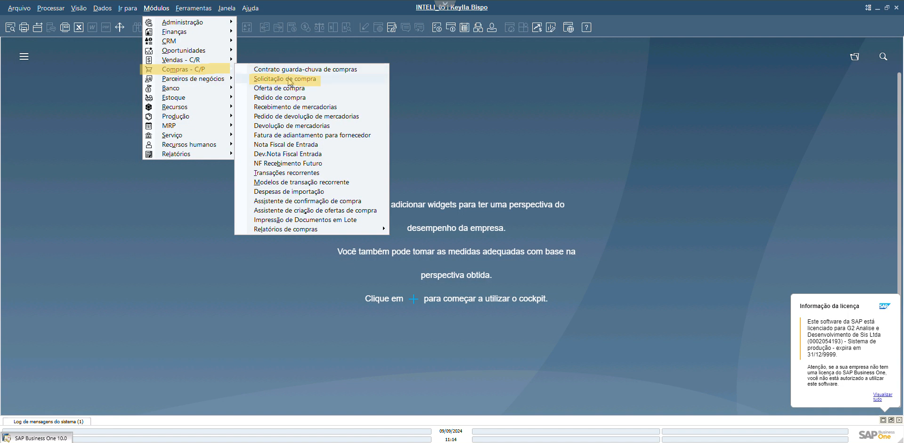

Fonte: Elaborado pelos Autores.

#### Passo 1.2: Solicitante

- Na aba solicitante escolha quem está fazendo a solicitação;

Imagem 12 - Passo 1.2: Solicitante

Fonte: Elaborado pelos Autores.

#### Passo 1.3: Seleção do Item

- Clique na célula 1 do "Nº de item;
- Clique no símbolo que aparece dentro da cédula;
- Na janela, selecione o item desejado;

Imagem 13 - Passo 1.3 

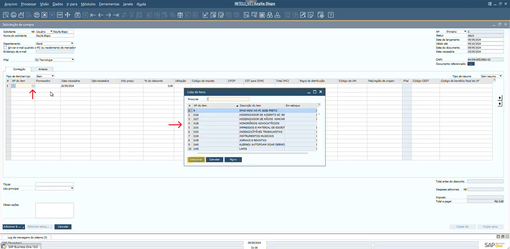

Fonte: Elaborado pelos Autores.

#### Passo 1.4: Acessar o sistema

- Clique em "Adicionar &..." para finalizar a tarefa.

Imagem 14 - Passo 1.4 

Fonte: Elaborado pelos Autores.

###  Passo 2: Criar pedido de compra

&emsp;&emsp; Este passo tem como objetivo criar um pedido de compra dentro do sistema.

#### Passo 2.1: Acessar o sistema

- Clique em "Módulos";
- Selecione "Compras - C/P"
- Clique em "Pedido de compra"

Imagem 15 - Passo 2.1 - Caminho

Fonte: Elaborado pelos Autores.

#### Passo 2.2: Selecionar fornecedor

- Clique no campo "Fornecedor";
- Clique no pequeno símbolo;
- Selecione o fornecedor na janela apresentada;

Imagem 16 - Passo 2.2

Fonte: Elaborado pelos Autores.

#### Passo 2.3: Selecionar fornecedor

- Clique na célula 1 do "Nº de item";
- Clique no símbolo que aparece dentro da cédula;
- Na janela, selecione o item desejado;

Imagem 17 - Passo 2.3

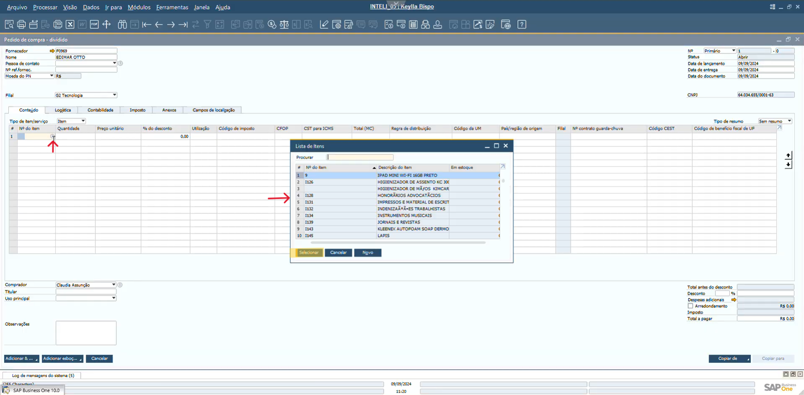

Fonte: Elaborado pelos Autores.

#### Passo 2.4: Preencher preço unitário

- Clique na cédula 1 do "Preço unitário";
- Preencha com o valor;

Imagem 18 - Passo 2.4

Fonte: Elaborado pelos Autores.

#### Passo 2.5: Finalizar pedido

- Clique no "Adicionar &..." para finalizar o pedido.

Imagem 19 - Passo 2.5

Fonte: Elaborado pelos Autores.

###  Passo 3: Criar nota fiscal de entrada

#### Passo 3.1: Acessar o sistema

- Clique em "Módulos";
- Selecione "Compras - C/P"
- Clique em "Pedido de compra"

Imagem 20 - Passo 3.1 

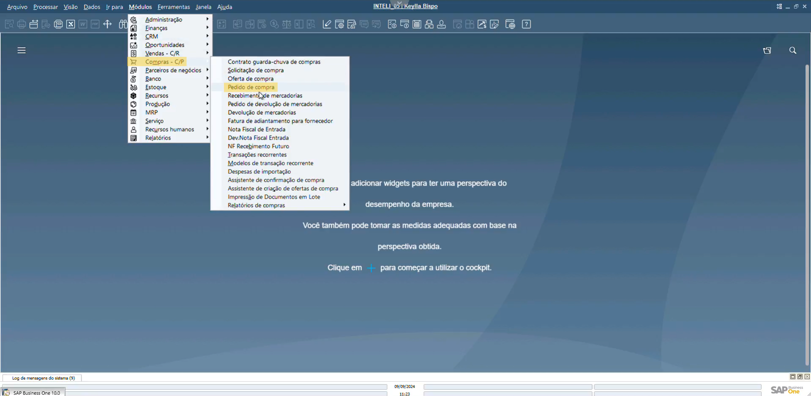

Fonte: Elaborado pelos Autores.

#### Passo 3.2: Acessar registro

- Clique em "Registro anterior" ou selecione o registro desejado;

Imagem 21 - Passo 3.2 

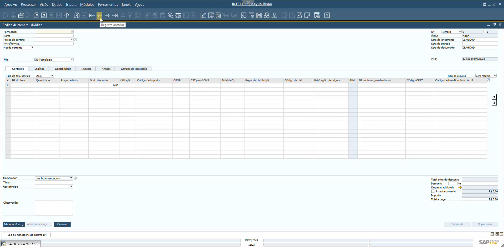

Fonte: Elaborado pelos Autores.

#### Passo 3.3: Acessar nota fiscal de entrada

- Clique em "Copiar para";
- Selecione "Nota fiscal de Entrada"

Imagem 22 - Passo 3.3

Fonte: Elaborado pelos Autores.

#### Passo 3.4: Preencher os campos de Utilização e Código de imposto

- Preencha a cédula "Utilização";
- Preencha a cédula "Código de imposto";

Imagem 23 - Passo 3.4

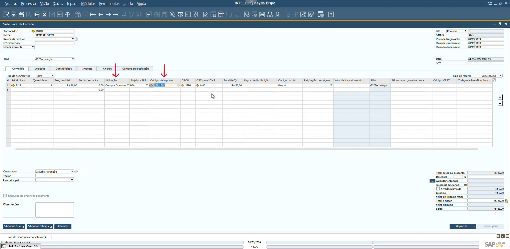

Fonte: Elaborado pelos Autores.

#### Passo 3.5: Preencher condição de pagamento

- Clique na aba "Contabilidade"
- Clique no campo "Condições de pagamento" e selecione a opção que se aplica;

Imagem 24 - Passo 3.5

Fonte: Elaborado pelos Autores.

#### Passo 3.6: Preencher a aba imposto

- Clique na aba "Imposto"
- Preencha o campo "Nº NF" e "Série";

Imagem 25 - Passo 3.6

Fonte: Elaborado pelos Autores.

#### Passo 3.7: Selecionar o modelo

- Clique na aba "Modelo"
- Preencha o campo com "NFe(55)";

Imagem 26 - Passo 3.7

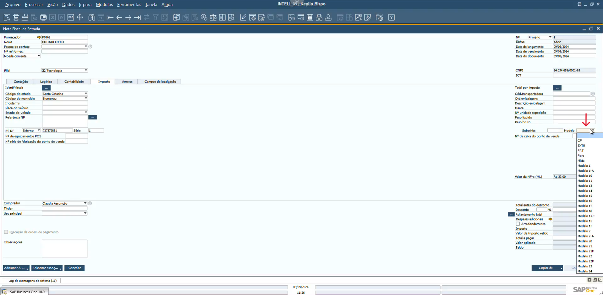

Fonte: Elaborado pelos Autores.

#### Passo 3.8: Finalizar a nota fiscal

- Clique em "Adicionar & ..." para finalizar a nota fiscal.

Imagem 27 - Passo 3.8

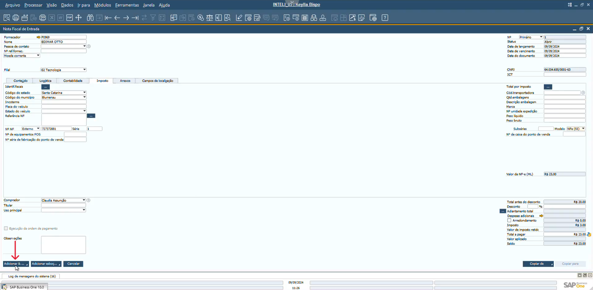

Fonte: Elaborado pelos Autores.

###  Passo 4: Devolução da nota fiscal de entrada

#### Passo 4.1: Acessar o sistema

- Clique em "Módulos";
- Selecione "Compras - C/P"
- Clique em "Nota Fiscal de Entrada"

Imagem 28 - Passo 4.1

Fonte: Elaborado pelos Autores.

#### Passo 4.2: Acessar a Dev/Nota Fiscal de Entrada

- Selecione uma nota fiscal já registrada; 
- Clique em "Copiar para";
- Selecione "Dev/Nota Fiscal de Entrada";

Imagem 29 - Passo 4.2

Fonte: Elaborado pelos Autores.

#### Passo 4.3: Selecionar as datas

- No canto superior direito possui datas;
- As datas podem ser alteradas de acordo com o intuito desejado;

Imagem 30 - Passo 4.3 

Fonte: Elaborado pelos Autores.

#### Passo 4.4: Acessar a aba Imposto

- Clique na aba "Imposto";
- Nessa aba, os campos podem ser preenchidos de acordo com a necessidade

Imagem 31 - Passo 4.4

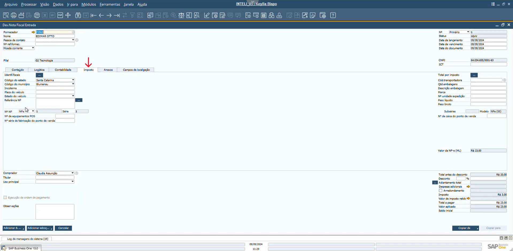

Fonte: Elaborado pelos Autores.

#### Passo 4.5: Finalizar a devolução

- Clique em "Adicionar & ..." para finalizar o processo.

Imagem 32 - Passo 4.5

Fonte: Elaborado pelos Autores.

###  Passo 5: Recebimento de mercadoria

#### Passo 5.1: Acessar o sistema

- Clique em "Módulos";
- Selecione "Compras - C/P"
- Clique em "Pedido de Compra"

Imagem 33 - Passo 5.1

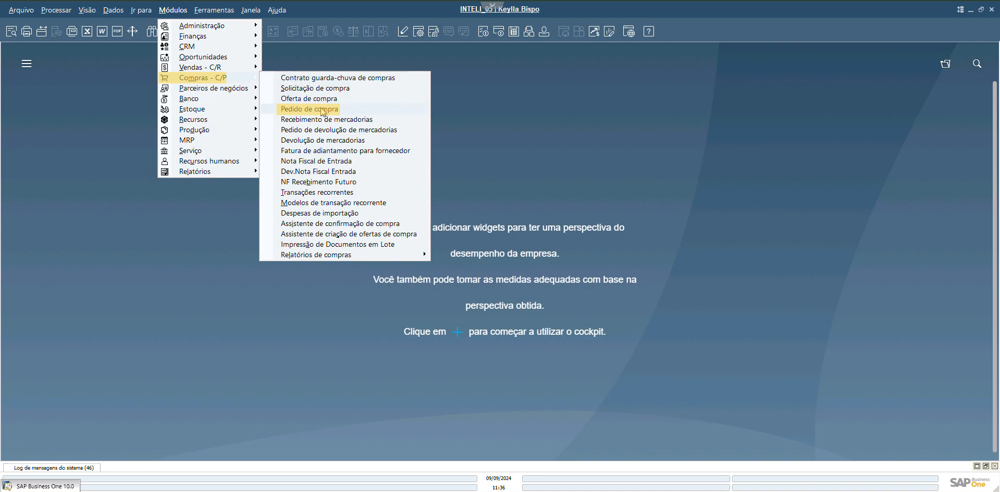

Fonte: Elaborado pelos Autores.

#### Passo 5.2: Selecionar Fornecedor

- Clique no campo "Fornecedor";
- Clique no pequeno símbolo;
- Selecione o fornecedor desejado e confirme;

Imagem 34 - Passo 5.2

Fonte: Elaborado pelos Autores.

#### Passo 5.3: Selecionar Item

- Clique na cédula "Nº do Item";
- Clique no pequeno símbolo;
- Selecione o item desejado e confirme;

Imagem 35 - Passo 5.3

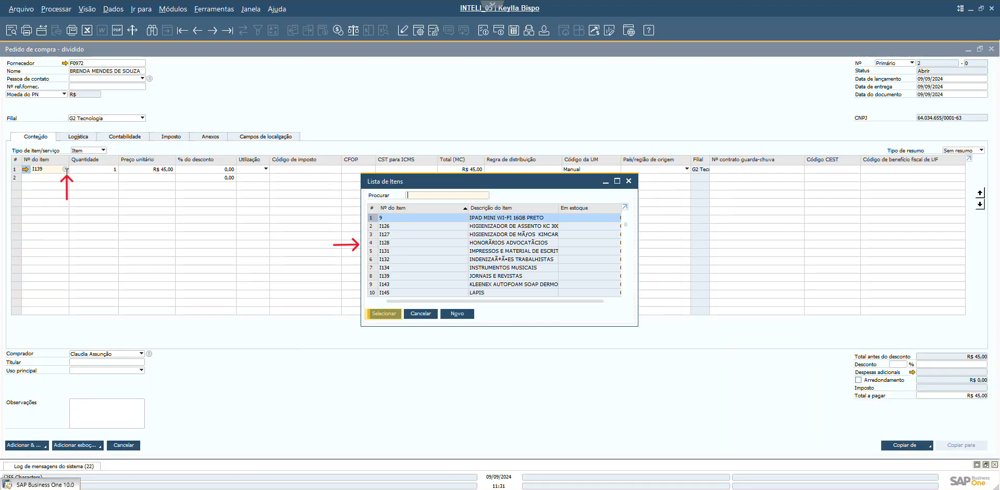

Fonte: Elaborado pelos Autores.

#### Passo 5.4: Selecionar itens de estoque

&emsp;&emsp; Para confirmar o recebimento de um item, o item em questão deve estar cadastrado como um item de estoque. Para verificar se um item é de estoque ou não, deve-se fazer o seguinte passo:

- Clique no campo "Configuração de formulário";

Imagem 36 - Passo 5.4

Fonte: Elaborado pelos Autores.

#### Passo 5.5: Selecionar itens de estoque

- Selecione um novo campo e escolha "item de estoque";

Imagem 37 - Passo 5.5 

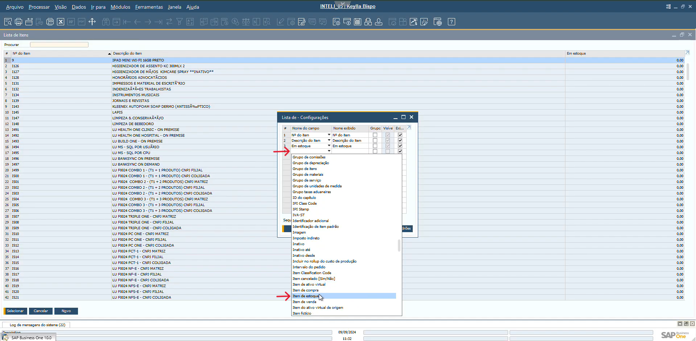

Fonte: Elaborado pelos Autores.

#### Passo 5.6: Selecionar itens de estoque

- Ao lado escreva o nome da coluna e confirme a mudança;

Imagem 38 - Passo 5.6 

Fonte: Elaborado pelos Autores.

#### Passo 5.7: Coluna de estoque

- Ao lado da tabela anterior vai aparecer uma nova coluna indicando se o item pertence ao estoque ou não;

Imagem 39 - Passo 5.7 

Fonte: Elaborado pelos Autores.

#### Passo 5.8: Coluna de estoque

- Clique no botão "Adicionar & ..."

Imagem 40 

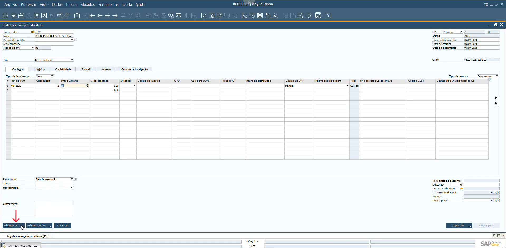

Fonte: Elaborado pelos Autores.

#### Passo 5.9: Confirmação do pedido

- Clique em "Registro anterior" ou no registro desejado;

Imagem 41 - Passo 5.9

Fonte: Elaborado pelos Autores.

#### Passo 5.10: Recebimento de mercadoria

- Clique em "Copiar para";
- Em seguida clique em "Recebimento de mercadoria"

Imagem 42 - Passo 5.10 

Fonte: Elaborado pelos Autores.

#### Passo 5.11: Recebimento de mercadoria 2

- Clique em na cédula de utilização;
- Em seguida clique na utilização do item em questão;

Imagem 43 - Passo 5.11 

Fonte: Elaborado pelos Autores.

#### Passo 5.12: Código de imposto

- Clique na cédula de "Código de imposto";
- Em seguida clique no imposto adequado e confirme;

Imagem 44 - Passo 5.12 

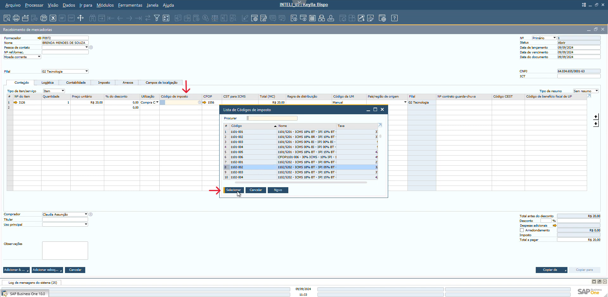

Fonte: Elaborado pelos Autores.

#### Passo 5.13: Aba imposto

- Clique na aba "Imposto";
- Em seguida preencha os campos "Nº NF" e "Série";

Imagem 45 - Passo 5.13 

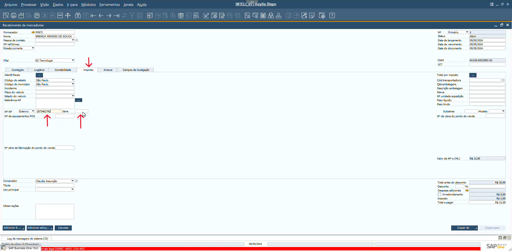

Fonte: Elaborado pelos Autores.

#### Passo 5.14: Recebimento de mercadoria 3

- Clique em "Adicionar & ..." para concluir o registro;

Imagem 46 - Passo 5.14 

Fonte: Elaborado pelos Autores.

#### Passo 5.15: Seleção de registro

- Clique em "Registro anterior" ou no registro desejado;

Imagem 47 - Passo 5.15 

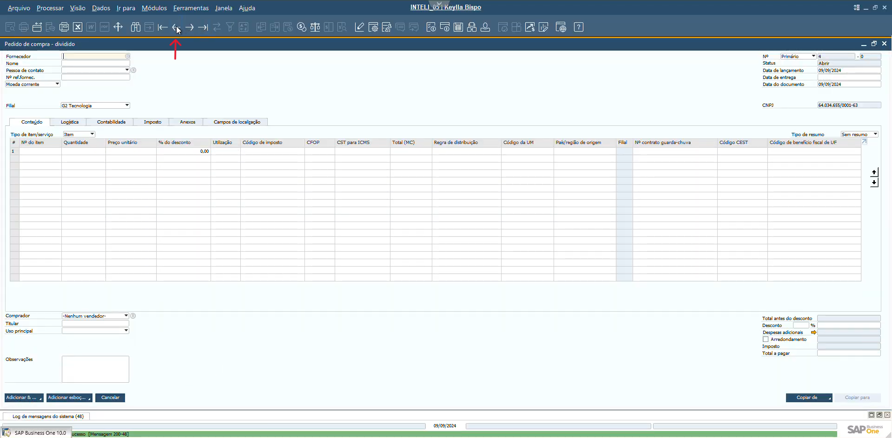

Fonte: Elaborado pelos Autores.

#### Passo 5.16: Confirmação do pedido

- Clique em "Copiar para" e em seguida clique em "Nota Fiscal de Entrada";

Imagem 48 - Passo 5.16 

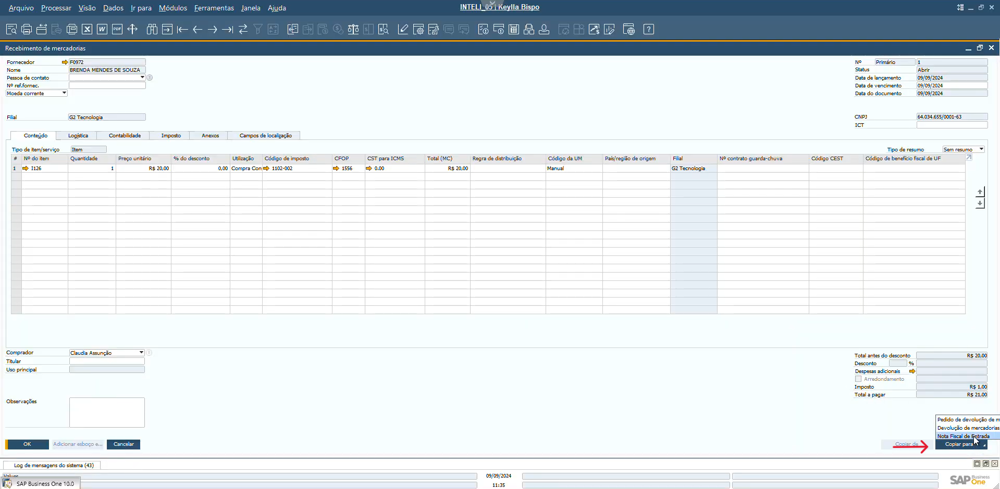

Fonte: Elaborado pelos Autores.

#### Passo 5.17: Confirmação do modelo

- Na aba imposto vá na opção de "Modelo"
- Selecione a opção "NFe(55)";

Imagem 49 - Passo 5.17

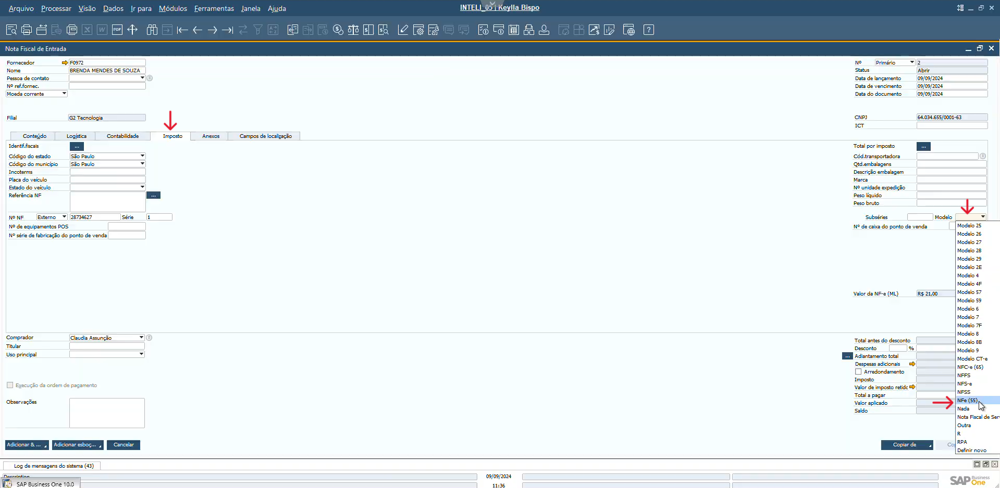

Fonte: Elaborado pelos Autores.

#### Passo 5.18: Aba de contabilidade

- Na aba "Contabilidade" vá no campo "Condições de pagamento"
- Selecione a opção que melhor se encaixa;

Imagem 50 - Passo 5.18

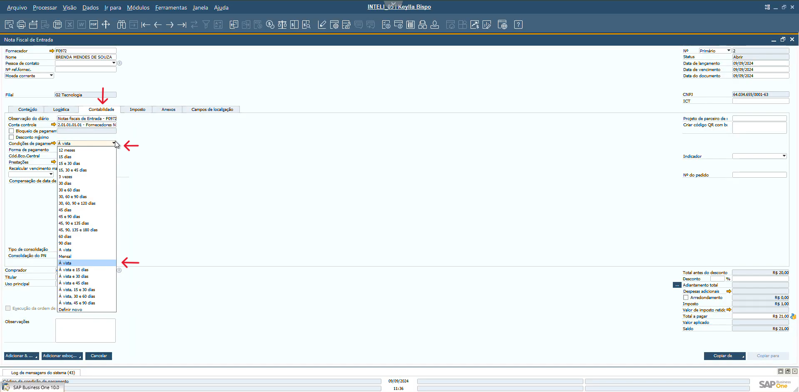

Fonte: Elaborado pelos Autores.

#### Passo 5.19: Aba de conteúdo

- Clique no botão "Adicionar & ..." para finalizar esse passo.

Imagem 51 - Passo 5.19 

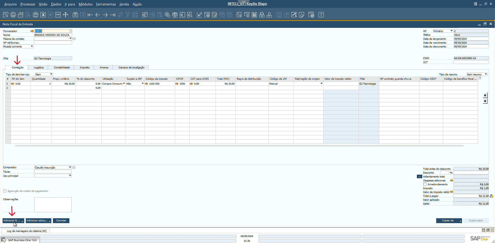

Fonte: Elaborado pelos Autores.

###  Passo 6: Processo de adiantamento

#### Passo 6.1: Acessar o sistema

- Clique em "Módulos";
- Selecione "Compras - C/P"
- Clique em "Pedido de Compra"

Imagem 52 - Passo 6.1 

Fonte: Elaborado pelos Autores.

#### Passo 6.2: preencher fornecedor

- Clique no campo "Fornecedor";
- Selecione o fornecedor desejado e confirme;

Imagem 53 - Passo 6.2 

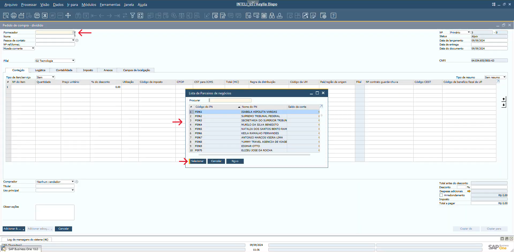

Fonte: Elaborado pelos Autores.

#### Passo 6.3: Preencher preço unitário

- Preencha o preço unitário do item;

Imagem 54 - Passo 6.3 

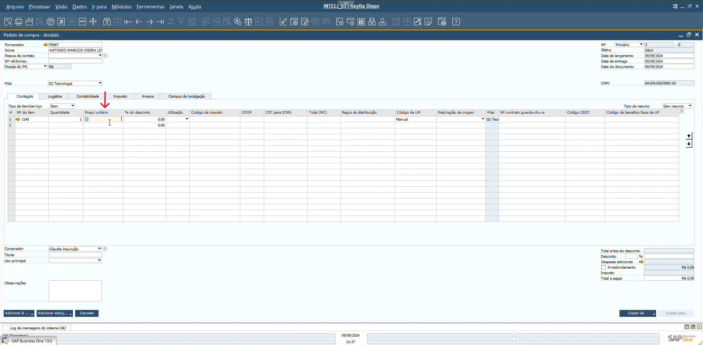

Fonte: Elaborado pelos Autores.

#### Passo 6.4: Adicionar item

- Clique no botão "Adicionar & ...";
- Selecione o fornecedor desejado e confirme;

Imagem 55 - Passo 6.4 

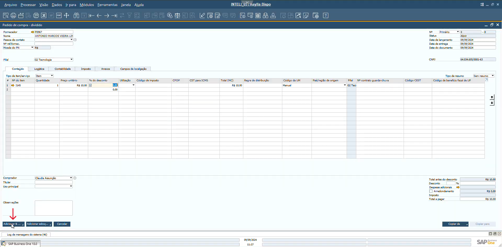

Fonte: Elaborado pelos Autores.

#### Passo 6.5: Selecionar registro

- Clique no botão "Registro anterior" ou selecione o registro desejado;

Imagem 56 - Passo 6.5 

Fonte: Elaborado pelos Autores.

#### Passo 6.6: Adiantar fornecedor

- Clique no botão "Copiar para";
- Selecione o "Adiantamento para fornecedor";

Imagem 57 - Passo 6.6 

Fonte: Elaborado pelos Autores.

#### Passo 6.7: Adiantamento

- Na seção de adiantamento, coloque a porcentagem do valor a ser adiantado;
- Clique no botão "Adicionar & ..." para finalizar o processo;

Imagem 58 - Passo 6.7 

Fonte: Elaborado pelos Autores.

###  Passo 8: Relatório compras

#### Passo 8.1: Acessar o sistema

- Clique em "Módulos";
- Selecione "Compras - C/P"
- Selecione "Relatórios de Compras"
- Clique em "Lista de itens em aberto"

Imagem 59 - Passo 8.1 

Fonte: Elaborado pelos Autores.

#### Passo 8.2: Acessar os relatórios

- Clique em "Notas fiscais de saída";
- Abaixo irá aparecer todos os documentos em aberto da área que for selecionada;

Imagem 60 - Passo 8.2 

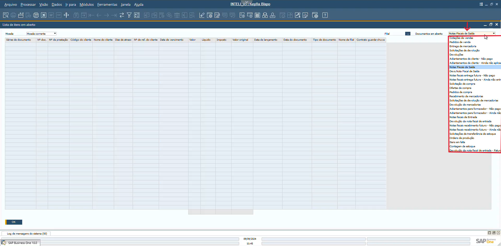

Fonte: Elaborado pelos Autores.

###  Passo 11: Checar estoque de licenças

#### Passo 11.1: Acessar o sistema

- Clique em "Módulos";
- Selecione "Estoque"
- Selecione "Relatórios de estoque"
- Clique em "Relatório de verificação de estoque"

Imagem 61 - Passo 11.1 

Fonte: Elaborado pelos Autores.

#### Passo 11.2: Relatórios

- Clique o campo da data;
- Selecione até que periodo se deseja visualizar o relatório;
- Após a escolha clique em "Ok";

Imagem 62 - Passo 11.2 

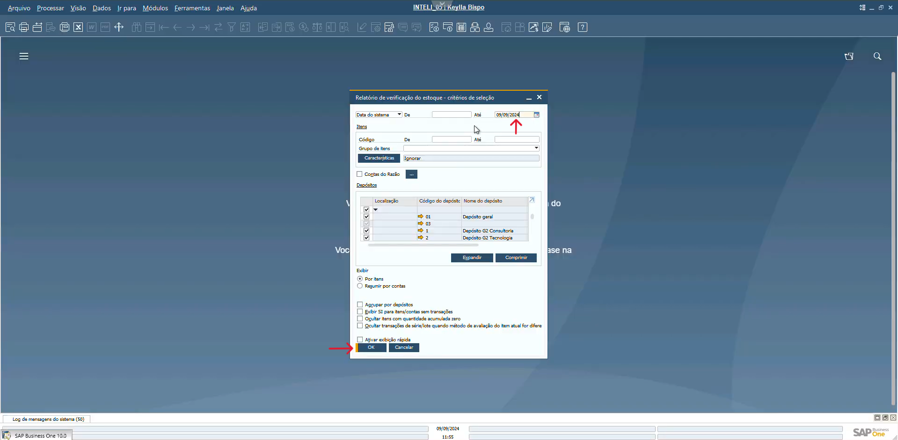

Fonte: Elaborado pelos Autores.

#### Passo 11.3: Relatórios apresentados

- Os relatórios serão apresentados em uma tabela;
- Após a visualização clique em "Ok";

Imagem 63 - Passo 11.3 

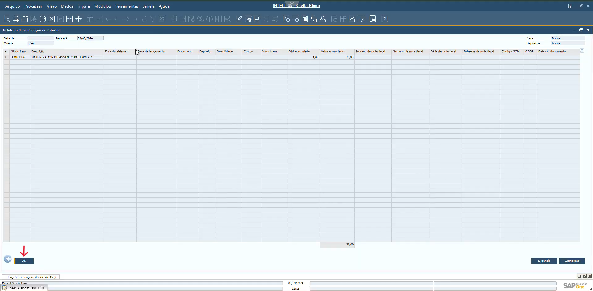

Fonte: Elaborado pelos Autores.

###  Passo 13: Pedido de reposição de produtos internos

#### Passo 13.1: Acessar o sistema

- Clique em "Módulos";
- Selecione "Compras - C/P"
- Clique em "Transações recorrentes";

Imagem 64 - Passo 13.1

Fonte: Elaborado pelos Autores.

#### Passo 13.2: Selecionar tipo

- Clique na cédula  "tipo";
- Selecione "pedido de compra";

Imagem 65 - Passo 13.2 

Fonte: Elaborado pelos Autores.

#### Passo 13.3: Verificar documentos

- Clique em "documentos";
- Verifique se todos os campos estão marcados e então clique em "Ok";

Imagem 66 - Passo 13.3 

Fonte: Elaborado pelos Autores.

#### Passo 13.4: Abrir modelos de transação recorrente

- Clique em "Modelos";
- Após isso clique em "Ok";

Imagem 67 - Passo 13.4 

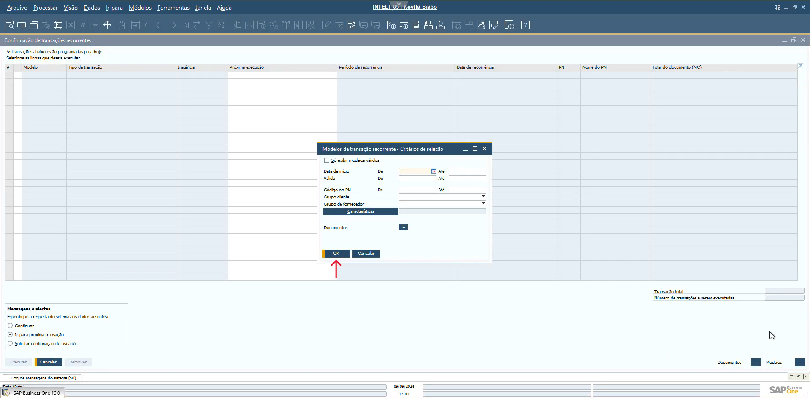

Fonte: Elaborado pelos Autores.

#### Passo 13.5: Configurar transação

- Clique em "Nº doc" e selecione o documento de compras que será utilizado para fazer a transação;
- Após isso preencha os outros campos necessários para a configuração;
- Após a configuração ser preenchida, clique em atualizar;

Imagem 68 - Passo 13.5 

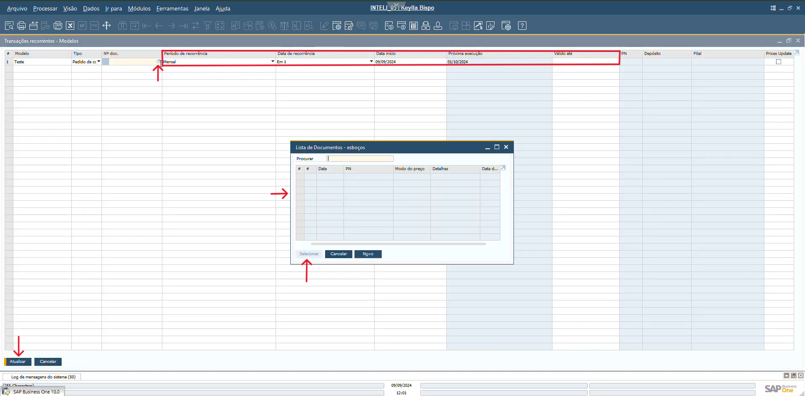

Fonte: Elaborado pelos Autores.

# 11. Plano de Cutover

&emsp;&emsp;O plano de *Cutover* é um documento detalhado que orienta a transição de um sistema antigo para um novo, particularmente durante a implementação de soluções de ERP, como SAP. Ele inclui uma série de tarefas, cronogramas, recursos necessários e procedimentos que devem ser seguidos durante essa transição crítica. [(Sabino, 2024)](https://radardeprojetos.com.br/plano-de-cutover-o-segredo-para-uma-transicao-de-projetos-bem-sucedida/#:~:text=Um%20Plano%20de%20Cutover%20%C3%A9,seguidos%20durante%20essa%20transi%C3%A7%C3%A3o%20cr%C3%ADtica.)

&emsp;&emsp;Um plano de Cutover comum inclui atividades como:

1. **Preparação dos Dados**: Extração, limpeza e carregamento dos dados do sistema antigo para o novo.
2. **Testes Finais**: Execução de testes de aceitação do usuário (UAT) para garantir que tudo funcione corretamente.
3. **Treinamento**: Garantir que todos os usuários finais estejam familiarizados com o novo sistema.
4. **Cronograma Detalhado**: Definição de prazos e momentos exatos de cada etapa do plano.
5. **Planos de Contingência**: Procedimentos de recuperação em caso de falhas ou imprevistos.

Além de servir como um guia para a equipe técnica, o plano também envolve todas as partes interessadas, como o time de negócios, garantindo que todos estejam cientes de suas responsabilidades e de como responder a eventuais desafios.

 

## 11.1 Testes Unitários

&emsp;&emsp;Testes unitários são uma parte fundamental do processo de desenvolvimento de software, especialmente em projetos de implementação de ERP. Eles garantem que pequenas unidades do sistema, como funções ou módulos, funcionem conforme o esperado de forma isolada. 

&emsp;&emsp;Ao analisar funcionalidades específicas de forma independente, as organizações podem identificar e corrigir problemas em um nível granular antes que os componentes sejam integrados, minimizando o risco de falhas quando o sistema é implementado no ambiente de produção. [(Medium, 2023)](https://medium.com/1erp/testing-your-new-erp-system-bd4faa3d26fd)

## 11.2 Objetivo

&emsp;&emsp;O propósito desta seção é oferecer uma descrição detalhada e sistemática de todos os processos relacionados às operações de compras no SAP Business One. Isso inclui a maneira como as solicitações de compras são feitas, como as notas fiscais de entrada são criadas e gerenciadas, e como os relatórios de compras são compilados e analisados para garantir eficiência e conformidade nas operações comerciais.

## 11.3 Escopo

&emsp;&emsp;O escopo deste documento cobre todas as regras de negócio associadas ao módulo de compras, detalhando cada processo, seus requisitos, e os procedimentos de teste associados. O objetivo é assegurar que todos os aspectos das compras sejam compreendidos e seguidos corretamente, minimizando erros e maximizando a eficiência.

### Solicitação de Compra, Oferta de Compra
- **Módulo:** Compras → Solicitação de Compras

- **Objetivo:** Selecionar fornecedor e itens, especificar detalhes para adição.
- **Campos Obrigatórios:** Datas (Lançamento, Validade, Necessária), Solicitante, Filial G2, Conteúdo do item.
- **Condições de Teste:** 
  - **Pré-requisito:** Adição de Solicitação e Ofertas de Compras.
  - **Resultado Esperado:** Teste sem erro de adição ou atualização.
  - **Data de Teste:** 11/09/2024 às 11:07
  - **Responsável:** Otto Lima
  - **Status:** OK

### Criar Pedido de Compra
- **Módulo:** Compras → Pedido de Compras

- **Objetivo:** Gerar pedidos de reembolso, especificando fornecedor, funcionário, datas, e detalhes financeiros.
- **Campos Obrigatórios:** Fornecedor, Funcionário, Datas de Lançamento, Pedido, Quantidade, Preço Unitário.
- **Resultado Esperado:** Teste sem erro de adição ou atualização.
- **Data de Teste:** 11/09/2024 às 11:10
- **Responsável:** Otto Lima
- **Status:** OK

### Criar Nota Fiscal de Entrada
- **Módulo:** Compras → Pedido de Compras → Nota Fiscal de Entrada

- **Objetivo:** Registrar entradas fiscais, utilizando informações de pedidos existentes.
- **Campos Obrigatórios:** Uso e Código de Imposto, Condições de Pagamento, Número da Nota Fiscal.
- **Resultado Esperado:** Teste sem erro de adição ou atualização.
- **Data de Teste:** 11/09/2024 às 11:12
- **Responsável:** Otto Lima
- **Status:** OK

### Devolução da Nota Fiscal de Entrada
- **Processo:** Utilize a opção 'Copiar para' para criar uma devolução da Nota Fiscal de Entrada a partir da nota original.

- **Resultado Esperado:** Teste sem erro de adição ou atualização.
- **Data de Teste:** 11/09/2024 às 11:14
- **Responsável:** Otto Lima
- **Status:** OK

### Recebimento de Mercadoria
- **Módulo:** Compras → Pedido de Compras

- **Objetivo:** Adicionar recebimento de mercadoria com base em pedido de compra.
- **Campos Obrigatórios:** Item, se é de estoque, preço.
- **Resultado Esperado:** Teste sem erro de adição ou atualização.
- **Data de Teste:** 11/09/2024 às 11:18
- **Responsável:** Otto Lima
- **Status:** OK
- **Observações:** Importante verificar o depósito físico onde está sendo dado entrada no pedido de compra.

### Processo de Adiantamento

- **Módulo:** Compras

- **Objetivo:** Gerar um pedido de compras e então copiar para adiantamento para fornecedor, especificando o percentual do valor do adiantamento.
- **Resultado Esperado:** Teste sem erro de adição ou atualização.
- **Data de Teste:** 11/09/2024 às 11:21
- **Responsável:** Otto Lima
- **Status:** OK

### Relatórios de Compras
- **Módulo:** Compras → Relatório de Compras

- **Objetivo:** Executar os relatórios de compras, listando itens em aberto e vencimentos do contas a pagar.
- **Resultado Esperado:** "Relatórios do SAP - Lista de itens em aberto e vencimentos do contas a pagar."
- **Data de Teste:** 11/09/2024 às 11:23
- **Responsável:** Otto Lima
- **Status:** OK

### Checar Estoque de Licenças
- **Módulo:** Estoque → Relatórios de Estoque

- **Objetivo:** Verificar o estoque de licenças para evitar compras desnecessárias.
- **Resultado Esperado:** Não realizar compra caso haja licenças no estoque.
- **Data de Teste:** 11/09/2024 às 11:25
- **Responsável:** Otto Lima
- **Status:** OK

### Pedido de Reposição de Produtos Internos
- **Módulo:** Compras → Transações Recorrentes → Modelos

- **Objetivo:** Criar e manter pedidos de compra recorrentes para reposição interna.
- **Resultado Esperado:** Compra realizada ou travada + consultar FNXXX
- **Data de Teste:** 11/09/2024 às 11:26
- **Responsável:** Otto Lima
- **Status:** OK

### 11.4 Resultado

&emsp;&emsp;Os testes realizados nas diversas regras de negócio do módulo de compras demonstraram que o sistema está apto a executar todas as funções conforme esperado, com poucas exceções. Todos os resultados esperados foram alcançados com sucesso, indicando que o sistema está configurado corretamente para suportar as operações de compras da organização.

### 11.5 Conclusão 

&emsp;&emsp;A implementação e teste das regras de negócio no módulo de compras do SAP Business One revelam um sistema robusto, capaz de gerenciar eficientemente todas as operações relacionadas a compras. Este documento serviu para verificar e validar os processos, assegurando que os procedimentos estão alinhados com os padrões organizacionais e regulatórios. Continuaremos a monitorar e revisar os processos para garantir que permaneçam eficazes e eficientes.

# 12. Matriz Raci

&emsp;&emsp;A Matriz RACI é uma ferramenta de gestão de projetos que facilita a atribuição de responsabilidades entre os membros da equipe. Cada letra no termo "RACI" representa um tipo de papel desempenhado pelos participantes:

- **R** (Responsável): O responsável por executar a tarefa.
- **A** (Aprovador): A pessoa que deve aprovar o trabalho antes que ele seja considerado concluído.
- **C** (Consultado): Aqueles que fornecem informações ou consultoria sobre a tarefa.
- **I** (Informado): Aqueles que são informados sobre o andamento e o resultado da tarefa.

&emsp;&emsp;Ao dividir as tarefas entre os membros do grupo, a Matriz RACI ajuda a garantir clareza nas responsabilidades, evitando confusões e garantindo que todas as atividades sejam bem geridas.

| **Tarefas**                                | **Responsável (R)** | **Aprovador (A)**  | **Consultado (C)**   | **Informado (I)**   |
|--------------------------------------------|---------------------|--------------------|----------------------|---------------------|
| Testes Unitários                           | Otto Coutinho        | Henrique Cox        | Walquiria Novaes      | Keylla Oliveira     |
| Anotação dos Testes Unitários              | Keylla Oliveira      | Luiza Santana       | Walquiria Novaes      | Otto Coutinho       |
| Documentação dos Testes Unitários          | Luiza Santana        | Keylla Oliveira     | Walquiria Novaes      | João Brandão        |
| Passo a Passo dos Testes Unitários         | João Brandão         | Daniel Zular        | Walquiria Novaes      | Henrique Cox        |
| Análise Financeira - Custos para o projeto | Daniel Zular         | Keylla Oliveira     | Eduarda Santos        | Henrique Cox        |
| Análise Financeira - Custos operação (1 ano)| Henrique Cox        | Otto Coutinho       | Eduarda Santos        | Daniel Zular        |
| Análise Financeira - Receitas previstas    | João Brandão         | Daniel Zular        | Eduarda Santos        | Keylla Oliveira     |
| Análise Financeira - Tendências de Mercado | Luiza Santana        | Henrique Cox        | Eduarda Santos        | Daniel Zular        |
| Análise Financeira - ROI                   | Luiza Santana        | Keylla Oliveira     | Eduarda Santos        | Otto Coutinho       |
| Análise Financeira - Modelagem Sensibilidade| Otto Coutinho       | Keylla Oliveira     | Eduarda Santos        | Henrique Cox        |
| Passo a Passo - Treinamento                | Daniel Zular         | Henrique Cox        | Walquiria Novaes      | Keylla Oliveira     |
| Manual elaborado - Treinamento             | João Brandão         | Keylla Oliveira     | Walquiria Novaes      | Daniel Zular        |
| Lista de presença - Treinamento            | João Brandão         | Keylla Oliveira     | Walquiria Novaes      | Luiza Santana       |
| Revisão das Referências                    | Henrique Cox         | Henrique Cox        | Não aplicável         | Keylla Oliveira     |
| Revisão Critérios EP - Negócios            | Keylla Oliveira      | Keylla Oliveira     | Rafael Ricardo Jacomossi         | Henrique Cox        |
| Revisão Critérios EP - UX                  | Luiza Santana        | Luiza Santana       | Júlia Stateri         | Keylla Oliveira     |
| Revisão Geral da Sprint                    | Luiza Santana        | Luiza Santana       | Renato Penha          | Keylla Oliveira     |
| Matriz Raci                                | Henrique Cox         | Keylla Oliveira     | Afonso Brandão        | João Brandão        |
| Slides - Conteúdo                          | Henrique Cox         | Keylla Oliveira     | Renato Penha          | Otto Coutinho       |
| Apresentação                               | Henrique Cox, Keylla Oliveira | Renato Penha | Renato Penha         | Daniel Zular        |

&emsp;&emsp;A Matriz RACI é essencial para uma gestão eficiente das atividades em equipe, permitindo que cada membro saiba seu papel exato em cada tarefa. Atribuindo as responsabilidades de forma clara, ela ajuda a manter o foco no que é necessário para o sucesso do projeto, minimizando confusões e atrasos.

 

# 13. Estratégia de Cutover

&emsp;&emsp;A estratégia de Cutover é uma fase crítica no processo de implantação de sistemas. Ela envolve a transição final entre o sistema antigo e o novo, garantindo que todos os dados, funcionalidades e operações estejam preparados para o uso em ambiente de produção. Deve ser meticulosamente planejada e executada para minimizar riscos e garantir uma migração suave e sem interrupções nas operações diárias.

&emsp;&emsp;Esse planejamento inclui uma série de atividades coordenadas, como a conversão de dados, testes finais, treinamento de usuários, verificação de integrações e processos de backup. 

&emsp;&emsp;Uma boa estratégia de Cutover considera tanto a preparação técnica quanto a comunicação eficaz com todas as partes envolvidas, garantindo que todos saibam suas responsabilidades. [(SAP, 2024)](https://community.sap.com/t5/enterprise-resource-planning-blogs-by-sap/sap-project-manager-s-guide-to-sap-project-cutover/ba-p/13510809)

## 13.1 Checklist Go Live

### Verificação de Backup
- [x] Confirmar que os backups foram configurados e testados adequadamente.
- [x] Realizar um teste de restauração para garantir a integridade do backup.

### Ações para Go Live
- [x] Realizar backup completo do sistema atual.
- [x] Implementar congelamento de mudanças no sistema legado.
- [x] Executar validação final dos dados migrados.
- [x] Configurar integrações finais.
- [x] Revisar a documentação de processos atualizada.
- [x] Comunicar o Go Live para todos os stakeholders.
- [x] Preparar equipe para monitoramento intensivo nas primeiras semanas após o Go Live

## 13.2 Identificação dos Stakeholders

&emsp;&emsp; Uma etapa essencial para qualquer projeto é o mapeamento de seus stakeholders. Eles são pessoas, grupos ou organizações que têm interesse ou estão envolvidos em um projeto. Podendo ser impactados pelas decisões, resultados ou execução do projeto. [(Brandão, 2024)](https://afonsobrandaointeli.github.io/modulo7si/06stakeholders/)

&emsp;&emsp; Os stakeholders podem ser classificados em dois tipos:

- **Internos:** Membros da equipe, gerentes, diretores.
- **Externos:** Clientes, fornecedores, parceiros, governos, comunidades.

&emsp;&emsp; Considerando a definição apresentada, os stakeholders do projeto e seus tipos são:

- **Gerente de Projeto**: Renato Penha - Interno 
- **Líder Técnico:** Egon Daxbacher - Interno | Eduarda - Externo 
- **Usuários Finais**: Externo - G2
- **Equipe de Suporte:** Walquíria, Lucas e Gabriel - Externo
- **Equipe de Desenvolvimento:** Daniel Zular, Henrique Cox, João Moura, Keylla Oliveira, Luiza Santana - Interno
- **Gestores de Área:** Eduarda - Externo

 

## 13.2 Plano de Comunicação

&emsp;&emsp; O plano de comunicação é um componente essencial para o sucesso da implementação do SAP B1 na G2. Ele visa garantir que todos os stakeholders estejam informados de maneira eficaz ao longo do processo, utilizando canais adequados e uma abordagem clara e eficiente. Este plano define os responsáveeis e os métodos de comunicação a serem utilizados, incluindo reuniões, e-mails e plataformas online, com uma frequência ajustada conforme a necessidade de cada grupo. A execução desse plano não só facilita a fluidez da comunicação, como também ajuda a monitorar o progresso e ajustar estratégias conforme necessário, assegurando o alcance ee cumprimento do plano de trabalho.

| **Stakeholder** | **Interesses** | **Influência** | **Impacto** | **Expectativas** |
|-----------------|----------------|----------------|-------------|------------------|
| Detalhamento    | Objetivos      | Poder e influência - de 1 a 5 | Impacto no projeto | O que espera que eu atinja para benefício dele |
| Gerente de Projeto: **Renato Penha** | Planejar o módulo e dar suporte aos alunos | 5 | Em poucos casos, pode influenciar nas decisões dos grupos | Aprendizado e boa nota dos alunos |
| Gerente de suporte: **Egon Daxbacher** | Manter o bom funcionamento do projeto | 4 | Assessora nas decisões do Gerente de Projeto | Sucesso no módulo |
| Líder Técnico e Gestor: **Eduarda** | Definir escopo e planejar processos | 4 | Influencia muito nas decisões dos grupos | Qualidade no trabalho |
| Equipe de Suporte: **Walquíria** | Suporte ao desenvolvimento | 3 | Orienta passos a serem seguidos | Entendimento do conteúdo |
| Equipe de Suporte: **Lucas** | Suporte ao desenvolvimento | 3 | Orienta passos a serem seguidos | Entendimento do conteúdo |
| Equipe de Suporte: **Gabriel** | Suporte ao desenvolvimento | 3 | Orienta passos a serem seguidos | Entendimento do conteúdo |
| Equipe de Desenvolvimento: **Daniel Zular** | Desenvolvimento dos entregáveis | 3 | Estando no escopo, tem poder de decisão e desenvolve o projeto | Colaboração e qualidade no trabalho |
| Equipe de Desenvolvimento: **Henrique Cox** | Desenvolvimento dos entregáveis | 3 | Estando no escopo, tem poder de decisão e desenvolve o projeto | Colaboração e qualidade no trabalho |
| Equipe de Desenvolvimento: **João Moura** | Desenvolvimento dos entregáveis | 3 | Estando no escopo, tem poder de decisão e desenvolve o projeto | Colaboração e qualidade no trabalho |
| Equipe de Desenvolvimento: **Keylla Oliveira** | Desenvolvimento dos entregáveis | 3 | Estando no escopo, tem poder de decisão e desenvolve o projeto | Colaboração e qualidade no trabalho |
| Equipe de Desenvolvimento: **Luiza Santana** | Desenvolvimento dos entregáveis | 3 | Estando no escopo, tem poder de decisão e desenvolve o projeto | Colaboração e qualidade no trabalho |
| Equipe de Desenvolvimento: **Otto Lima** | Desenvolvimento dos entregáveis | 3 | Estando no escopo, tem poder de decisão e desenvolve o projeto | Colaboração e qualidade no trabalho |

&emsp;&emsp;A implementação bem-sucedida do plano de comunicação depende de um monitoramento contínuo e ajustes constantes, com o objetivo de verificar a efetividade das mensagens, coletar feedback e analisar o impacto das ações tomadas. Este processo garante que as informações circulem de maneira fluida, promovendo um senso de colaboração entre a equipe de desenvolvimento, os gestores e os usuários finais. 

## 13.3 Validação do Ambiente de Produção

### 13.3.1 Integridade dos Dados

&emsp;&emsp; As verificações para garantir a integridade dos dados pós-migração foram executadas e validadas. O SAP Business One já realiza uma série de processos automáticos para assegurar que a consistência dos dados migrados em relação ao sistema legado seja mantida. Portanto, com base nessas avaliações internas e nos testes realizados, tanto unitários quanto integrados, confirmamos que a integridade dos dados está preservada e de acordo com os requisitos do projeto.

### 13.3.2 Acesso de Usuários

&emsp;&emsp; Todos os papéis de usuário foram devidamente atribuídos, segundo as necessidades operacionais e a estrutura hierárquica definida para a G2. Os acessos de usuários críticos e as permissões estão configuradas corretamente. O SAP Business One possui mecanismos automáticos de controle de permissões, garantindo que os níveis de acesso estejam conforme as regras de segurança e operação da empresa.

### 13.3.3 Validação Funcional

&emsp;&emsp; Foram realizadas verificações funcionais de ponta a ponta, assegurando que os fluxos de processos críticos de negócio sejam adequadamente testados. Por meio dos <a href="https://docs.google.com/spreadsheets/d/1I5oqatKUOyMItkKxnzUH9m8W-tIY3YtuN6QRIbMoPXc/edit?usp=sharing">testes integrados</a>, desenvolvidos entre os 5 módulos, esses fluxos foram postos à prova, permitindo identificar falhas, realizar correções e garantir a aprovação de cada etapa. Isso garantiu que todas as funcionalidades operacionais estejam funcionando conforme o esperado. 

### 13.3.4 Testes de Carga

&emsp;&emsp; A realização de testes de carga tem o objetivo de avaliar o comportamento de um sistema quando submetido a uma quantidade de usuários ou transações simultâneas equivalente ao seu uso esperado em situações reais. O objetivo é garantir que o sistema pode lidar com a carga projetada sem degradação significativa de desempenho ou falhas.

&emsp;&emsp; Tendo isso em vista, por meio desses testes, é possível midir diversos parâmetrosdo sistema, como:

- Tempo de resposta das funções críticas

- Uso de recursos

- Comportamento sob diferentes cenários de usuários 
simultâneos

- Identificação de gargalos, permitindo otimizações e ajustes nas configurações.

&emsp;&emsp; Para a realização dos testes de carga na SAP B1, é necessário realizar uma lista de passos que são essênciais para a seu funcionamento, sendo esses passos:

- **Definir Cenários de Testes:** Identificando os processos críticos, como criação de pedidos, execução de relatórios e gestão de inventário. Além de estimar a carga esperada (usuários simultâneos e transações).

- **Preparar o Ambiente de Teste:** Configurar um ambiente de teste idêntico ao de produção e fazer o backup dos dados, garantindo que o ambiente seja seguro para testes.

- **Executar os Testes:** Simular carga com usuários executando tarefas ao mesmo tempo, utilizando diversos processos para estressar o sistema.

- **Repetir e Validar:** Após todos os passos, faz-se a análise de todos os dados coletados, possíveis erros e então, são feitas melhorias e os testes são refeitos.

&emsp;&emsp; O processo ajuda a identificar gargalos e ajustar o sistema para garantir que ele esteja preparado para lidar com a carga de trabalho prevista. É uma parte essencial do planejamento de capacidade e da preparação do sistema para uso em produção.

### 13.3.5 Verificação de Backup

&emsp;&emsp; O **backup** é uma cópia de segurança dos dados armazenados no sistema, essencial para garantir a integridade e a disponibilidade das informações em caso de falhas, perda de dados ou corrupção. No contexto do SAP Business One, os backups podem ser gerenciados diretamente através do **Microsoft SQL Server**, que gerencia os dados do sistema, envolvendo a criação de cópias completas do banco de dados da empresa, e também por meio do **Service Manager**, uma ferramenta do próprio SAP B1, a qual permite a configuração de backups automáticos.

**SQL Server Agent**

Para garantir que os backups sejam realizados automaticamente via SQL Server, é recomendável configurar o SQL Server Agent: [(SAP Support, 2024)](https://help.sap.com/docs/SAP_BUSINESS_ONE_ADMIN_GUIDE_SQL/f6fb230cc90949d8b66586a39189992b/4ac95f18c2414ab28e87612d08280a5d.html)

- Acessar o SQL Server Management Studio (SSMS).
- Verificar o funcionamento do SQL Server Agent e iniciá-lo, se necessário.
- Criar um novo Job no SQL Server Agent para agendar os backups:
  - Nomear o Job e definir as etapas para realizar o backup do banco de dados.
  - Configurar o agendamento para backups periódicos (diários, semanais, etc.).
  - Monitorar a execução do Job e os logs gerados para garantir que os backups estejam sendo realizados conforme o planejado.

**Service Manager** 

Outra opção é gerenciar os backups através do Service Manager do SAP B1: [(SAP Community, 2024)](https://community.sap.com/t5/enterprise-resource-planning-blogs-by-sap/sap-project-manager-s-guide-to-sap-project-cutover/ba-p/13510809)

- Acessar o Service Manager em: *Start > Programs > SAP Business One > Server Tools.*
- Selecionar ‘SBO Backup’ no menu suspenso e clicar em ‘Schedule' para definir o agendamento do backup automático.
- Configurar o local onde os backups serão salvos clicando no botão ‘Setting’ e definindo o caminho.
- Fornecer os detalhes do servidor SQL na opção de conexão.
- Selecionar o banco de dados desejado e pressionar ‘Start’. O sistema fará o backup do banco de dados no horário e local especificados.

**Atualizações e Correções**

O Rapid Support Package (RSP) é uma ferramenta que auxilia na aplicação de correções e melhorias ao SAP Business One, contribuindo para a estabilidade do sistema e, indiretamente, para a eficácia dos backups: [(SAP Support, 2024)](https://support.sap.com/en/offerings-programs/support-small-medium-enterprises/business-one/remote-support.html?anchorId=section_90889002)

- **Instalação do RSP:** Garante que o sistema esteja livre de bugs que possam impactar o processo de backup.
- **Documentação:** O RSP também fornece informações sobre novas funcionalidades que podem melhorar a execução de backups.

**Confirmar Configuração e Testes de Backup**

- **Verificação de Configurações:** Confirme que os parâmetros de backup foram configurados corretamente no SQL Server e revise os logs para assegurar que os backups automáticos estão sendo realizados no horário previsto.
- **Teste de Restauração:** Realizar um teste de restauração em um ambiente de teste para garantir a recuperação dos dados:
  - No SSMS, selecionar Restore Database.
  - Escolher o arquivo de backup e definir um nome temporário para o banco de dados.
  - Verificar a integridade dos dados restaurados.
- Verificação de Integridade: Após a restauração, utilize o comando ‘DBCC CHECKDB’ para verificar a integridade do banco de dados restaurado.

&emsp;&emsp; Realizar a verificação regular dos backups é fundamental para garantir a segurança dos dados e a capacidade de recuperação em situações adversas. O uso de backups automáticos, juntamente com a aplicação de atualizações através do RSP, contribui significativamente para a eficiência e confiabilidade do processo de backup no SAP Business One. [(SAP Community, 2024)](https://community.sap.com/t5/enterprise-resource-planning-blogs-by-members/backup-atr%C3%A1ves-do-rsp/ba-p/13272984)

## 14. Plano de Contigência

&emsp;&emsp;A implementação do SAP Business One é um processo complexo que envolve diversas etapas críticas e potenciais riscos que podem afetar o sucesso do projeto. O Plano de Contingência ajuda na antecipação desses riscos e estabelecer ações preventivas que garantam a continuidade das operações durante a estratégia de cutover. Este plano detalha os cenários possíveis, as medidas de contenção a serem adotadas, os responsáveis por cada ação e os prazos para sua execução, garantindo boa organização para a transição de sistemas. [(Sabino, 2024)](https://radardeprojetos.com.br/plano-de-cutover-o-segredo-para-uma-transicao-de-projetos-bem-sucedida/#:~:text=Um%20Plano%20de%20Cutover%20%C3%A9,seguidos%20durante%20essa%20transi%C3%A7%C3%A3o%20cr%C3%ADtica.)

| **Cenário**                                         | **Ação de Contenção**                                                                                                         | **Responsável**                   | **Prazo**                         |
|-----------------------------------------------------|------------------------------------------------------------------------------------------------------------------------------|-----------------------------------|-----------------------------------|
| Desalinhamento entre a G2 e os Grupos               | Estabelecer checkpoints regulares para alinhamento, garantindo clareza nas expectativas e metas compartilhadas.               |  Equipes de Suporte e Desenvolvimento, Usuários Finais                | Imediato                          |
| Dificuldade na Customização do UX no SAP Business One | Realizar workshops focados na customização do UX, com suporte da G2 para garantir expertise nas personalizações necessárias.   | Equipe de Desenvolvimento e  Instrutor de UX     | Até 2 dias (Utilizar das reuniões regulares com a G2)                     |
| Falta de Participação de Membros na Daily           | Incentivar a participação ativa com lembretes e reforçar a importância das Dailys para o sucesso do projeto.                  | Equipe de Desenvolvimento                       | Imediato (Diário, durante as Dailys)         |
| Atraso na Entrega das Atividades                    | Implementar monitoramento rigoroso do cronograma com revisões regulares e ajustes durante o sprint para manter o prazo.        | Equipe de Desenvolvimento                       | Até 2 dias                   |
| Atraso na entrega de documentos por parte da G2     | Contatar o responsável da G2 e entender o prazo de entrega, reportar no Status Report e alinhar com a G2.                     | Líder Técnico e Gerente de Projeto                               | Imediato                    |
| Erros durante os testes integrados                  | Diagnosticar a causa do erro, corrigir, e reportar na planilha dos testes para consultas futuras.                             | Equipes de Desenvolvimento de todos os módulos                          | Até 2 horas (Durante os Testes Integrados)      |
| Configuração Incorreta de Parâmetros do Sistema     | Utilizar checklist detalhado, revisar definições com especialistas e realizar testes abrangentes para validar parâmetros.      | Equipe de Desenvolvimento                       | Imediato (pós identificação de erro)   |

&emsp;&emsp;Em suma, a preparação e a proatividade são elementos-chave para o sucesso na implementação do SAP Business One. O Plano de Contingência serve como um guia estratégico para lidar com adversidades, minimizando impactos e assegurando que a equipe preparada para desafios que surgirem. Através da colaboração e do comprometimento de todos os envolvidos, o projeto poderá atingir seus objetivos com eficiência e eficácia, garantindo uma transição bem-sucedida e a continuidade dos negócios.

## 15. Suporte Pós Go-Live

&emsp;&emsp;**Go-live** é o momento em que um novo sistema, como o SAP B1, entra em operação no ambiente de produção. Esse estágio é crítico, pois envolve a transição completa dos processos antigos para o novo sistema.
Não obstante, a fase pós go-live é igualmente importante, pois é nesse momento que surgem ajustes e desafios que não foram previstos durante a implementação. A falta de um suporte adequado pode comprometer o desempenho do sistema e a adaptação dos usuários.

&emsp;&emsp;Ter um **plano de suporte pós go-live** é essencial para garantir o sucesso contínuo. Esse plano aborda o acompanhamento ativo, resolução de problemas, coleta de feedback, treinamento adicional e melhorias necessárias para estabilizar o sistema e extrair o máximo de benefícios da solução implementada. Isso evita riscos operacionais e assegura que a empresa mantenha suas atividades sem interrupções. [(EPI-USE, 2024)](https://www.epiuse.com.br/artigo/4-dicas-para-manter-seu-projeto-estrategico-pos-go-live)

&emsp;&emsp;Portanto, apesar de não fazermos parte do acompanhamento pós go-live do projeto, elaboramos um plano fictício, que pode ser acessado <a href="https://docs.google.com/spreadsheets/d/17HR58MR7N1MOzB7BWPU6WP1m683Th3d9f0LI7A-MfFU/edit?usp=sharing">aqui</a>, e que julgamos relevante para essa fase.
O suporte pós go-live é a base que sustenta o desempenho e evolução contínua de um sistema recém-implementado. Ao oferecer um acompanhamento constante, identificar melhorias e capacitar os usuários, a G2 pode maximizar o valor do projeto, mitigando riscos e assegurando um crescimento fundamentado.

 

# 15. Procedimentos e Regras de Negócios

&emsp;&emsp; Esta seção visa listar as regras de negócios presentes na área de compras da G2 que ditam o seu funcionamento, deveres e necessidades. Por meio de diagramas DMN e outras representações, cada processo será apresentado e decomposto com o intuito de melhor analisar suas necessidades e possíveis melhorias, sejam de estrutura ou de decisão. 

&emsp;&emsp; As regras de negócios foram estruturadas seguindo as seguintes características:

- **Nome:** Nome dado à regra de negócio, com um título descritivo do que a regra se trata;

- **Código:** Código exclusivo para identificar a regra de negócio;

- **Evento:** Situação ou condição que aciona a aplicação da regra de negócio;

- **Exemplo:** Representação de como a regra de negócio seria aplicada.

## 15.1 Procedimento de compra de licenças

&emsp;&emsp; O processo de compra de licenças é uma operação crítica para assegurar que a organização possua os recursos necessários para desempenhar suas atividades com eficiência. A aquisição de novas licenças envolve uma série de etapas rigorosas que devem ser seguidas para otimizar os custos e evitar desperdícios.

&emsp;&emsp; As regras de negócios que regem este processo têm início a partir de uma solicitação proveniente dos setores de Vendas ou Estoque. Estas regras visam garantir que todas as compras sejam realizadas de maneira ordenada, transparente e econômica, respeitando os limites orçamentários e garantindo que as necessidades de licenciamento sejam atendidas sem exceder a capacidade financeira ou gerar estoque excessivo. 

Tabela 2 - Regra de negócios

|Item|Descrição|
|---|---|
|**Nome**| Solicitação de compra de licenças SAP pelo setor de Vendas|
|**Descrição**|Toda solicitação deve ser verificada no estoque antes de iniciar o processo de aquisição com fornecedores. Caso tenha estoque disponível, a compra não deve ser realizada|
|**Código**|CP001|
|**Evento**|Vendas abre pedido de compras de novas licenças|
|**exemplo**|Vendas fez um pedido de compras de 100 lincenças, sendo que no estoque há licenças suficientes para suprir a necessidade. A compra não é realizada|

Fonte: Elaborado pelos Autores.

Tabela 3 - Regra de negócios

|Item|Descrição|
|---|---|
|**Nome**| Cotação com mínimo de fornecedores|
|**Descrição**|O setor de Compras deve realizar cotações com no mínimo três (3) fornecedores diferentes para qualquer compra|
|**Código**|CP002|
|**Evento**|O procesos de compras é iniciado e é necessário a consulta com fornecedores|
|**exemplo**|Vendas fez um pedido de compras de 100 lincenças, sendo que no estoque há licenças suficientes para suprir a necessidade. A compra não é realizada|

Fonte: Elaborado pelos Autores.

Tabela 4 - Regra de negócios

|Item|Descrição|
|---|---|
|**Nome**| Limite financeiro|
|**Descrição**|Caso a realização de uma compra ultrapassar o limite estipulado pelo financeiro é necessário entrar em contato para liberação|
|**Código**|CP003|
|**Evento**|A cotação é finalizada e os valores estão acima do estipulado pelo financeiro|
|**exemplo**|A cotação apresenta valores acima de 100 mil reais e extrapolou o limite imposto, então a foi enviado um apedido de revisão para o financeiro|

Fonte: Elaborado pelos Autores.

### Diagrama

&emsp;&emsp; O Diagrama de Decisão (DMN) a seguir ilustra o fluxo de trabalho e as regras de decisão que guiam o processo de compra de licenças. Ele detalha os critérios que devem ser considerados antes da autorização de qualquer nova aquisição, incluindo a verificação de estoque, a realização de cotações com fornecedores, e a consulta ao setor financeiro para compras que excedam determinados valores. 

Imagem 69 - DMN  de compra de licenças

Fonte: Elaborado pelos Autores.

### Decisão 1

&emsp;&emsp; As decisões são ações tomadas pelo funcionário no sistema. Cada ação possui uma ou mais regras de negócio vinculadas a ela. No caso da primeira ação, é possível visualizar as regras para Conferir o estoque. 

Imagem 70 - Tabela DMN  estoque

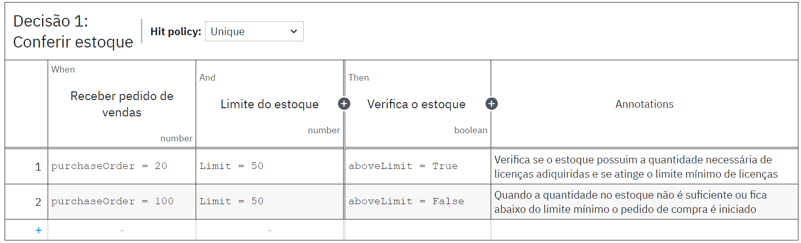

Fonte: Elaborado pelos Autores.

### Decisão 2

&emsp;&emsp; Verificação da quantidade de fornecedores consultadas pela equipe de compras. 

Imagem 71 - Tabela DMN  fornecedores

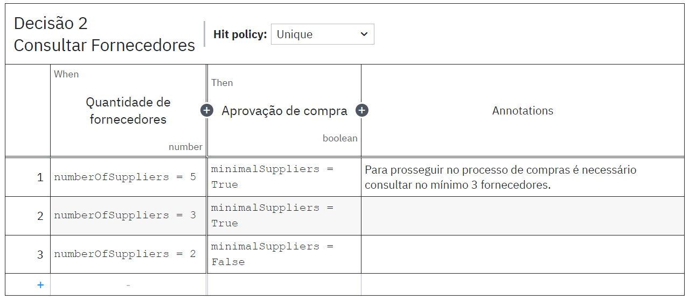

Fonte: Elaborado pelos Autores.

### Decisão 3

&emsp;&emsp; Verificação do orçamento liberado para a área de compras. 

Imagem 72 - Tabela DMN  orçamento

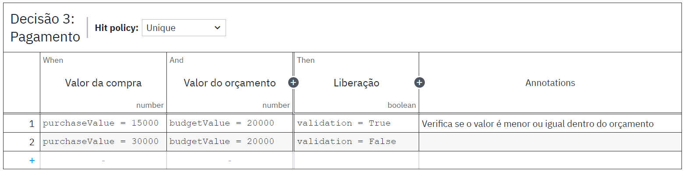

Fonte: Elaborado pelos Autores.

## 15.1.2 Procedimento de compra de internos

&emsp;&emsp;O procedimento de compra de materiais ou serviços internos é essencial para garantir que todos os setores da empresa tenham acesso aos recursos necessários para desempenhar suas funções de maneira eficiente e conforme os padrões da organização. Esse processo envolve a aquisição de itens que são de uso comum ou específico dentro da empresa, como materiais de escritório, ferramentas, ou serviços que auxiliam nas operações diárias.

&emsp;&emsp; Segue as tabelas:

Tabela 5 - Regra de negócios

|Item|Descrição|
|---|---|
|**Nome**| Reposição mensal|
|**Descrição**|A cada mês é necessário iniciar um pedido de reposição de produtos internos, caso não tenha problemas com caixa. Se for o caso, é necessário consultar o financeiro|
|**Código**|CP004|
|**Evento**|A cada fim de mês é acionado o pedido de novos produtos internos|
|**exemplo**|Ao chegar no primeiro dia do mês, verifica-se o caixa e se for possível a compra é realizada|

Fonte: Elaborado pelos Autores.

Tabela 6 - Regra de negócios

|Item|Descrição|
|---|---|
|**Nome**| Pagamento adiantado|
|**Descrição**|No caso de pagamento adiantado (inteiro ou parcial) é necessário criar uma fatura de adiantamento.|
|**Código**|CP005|
|**Evento**|Fornecedor solicita pagamento adiantado|
|**exemplo**|Durante a compra, dependendo do fornecedor, é necessário realizar o pagamento adiantado, junto com a emissão da fatura de adiantamento.|

Fonte: Elaborado pelos Autores.

### Diagrama

&emsp;&emsp; O Diagrama de Decisão (DMN) a seguir ilustra o fluxo de trabalho e as regras de decisão que guiam o processo de compra de internos. Ele detalha os critérios seguidos, além de um caso de pagamento adiantado, que pode ocorrer também com a compra de licenças. 

Imagem 73 - DMN  interno

Fonte: Elaborado pelos Autores.

### Decisão 2

&emsp;&emsp; A decisão de realizar o pagamento adiantado é baseada no pedido do fornecedor e na disponibilidade do caixa da G2.

Imagem 74 - Tabela DMN adiantamento

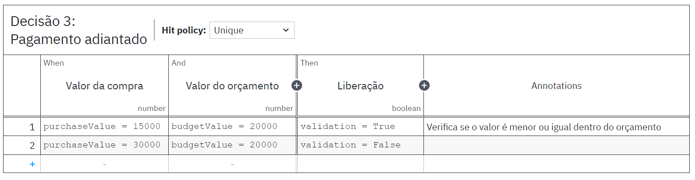

Fonte: Elaborado pelos Autores.

# Configurações Iniciais e Análise dos Dados Mestres

&emsp;&emsp;Neste documento, será listado o passo a passo das configurações realizadas na plataforma.

# 16. Configurações SAP

## 16.1. Configurações Iniciais 
  
### Configurações Padrão

&emsp;&emsp;As primeiras configurações são padrão do sistema SAP e devem ser implementadas em qualquer empresa que utilize a ferramenta. Estas configurações serão explicadas a seguir.

### 16.1.1 Administrar custo de item por depósito  

&emsp;&emsp;Durante esta etapa, são realizadas algumas regulamentações em relação a como os itens no depósitos serão gerenciados. Para acessá-la é necessário entrar, na barra superior, em Módulo -> Administração -> Inicialização do sistema -> Detalhes da empresa, como mostrado na imagem abaixo.
  

Imagem 75 - Administrar custo de item por depósito

Fonte: Autoria própria.

### 16.1.2 Ativar recursos de múltiplas filiais

&emsp;&emsp;A segunda configuração é relativa à administração dos estoques baseada nos depósitos registrados. Novamente, é preciso marcar a opção “Administrar estoque por depósito”. O menu pode ser encontrado em Módulo -> Administração -> Inicialização do sistema -> Configurações do documento -> Aba Geral

Imagem 76 - Administrar estoque por depósito

Fonte: Autoria própria.

&emsp;&emsp;**Importante:** Esta é uma configuração irreversível

### 16.1.3 Ativar recursos de múltiplas filiais 

&emsp;&emsp;O recurso de múltiplas filiais permite a adição de mais de um CNPJ ao sistema e deve ser sempre ativada. Para realizá-la é necessário entrar em Módulo -> Administração -> Inicialização do sistema -> Detalhes da empresa -> Aba Inicialização básica

Imagem 77 - Ativar recursos de múltiplas filiais

Fonte: Autoria própria.

&emsp;&emsp;**Importante:** Esta configuração é irreversível

### 16.1.4 Ativar determinação avançada

&emsp;&emsp;Esta etapa realiza a configuração de algumas regras de contabilidade. É possível acessá-la em Módulo -> Administração -> Inicialização -> Detalhes da empresa ->

Imagem 78 - Ativar determinação avançada

Fonte: Autoria própria.

-  **Importante:** Uma janela de confirmação aparece. Selecione a primeira opção e salve

### 16.2. Configurações específicas

### 16.2.1 Inscrição das filiais  

&emsp;&emsp;Esta configuração se refere às etapas 1.01 a 1.05 do Business Blueprint (BBP). Agora, serão adicionadas as filiais. O caminho é Módulo -> Administração -> Definição -> Finanças -> Filiais

Imagem 79 - Inscrição das filiais

Fonte: Autoria própria.

&emsp;&emsp;A filial necessária já veio adicionada no banco de dados.

### 16.2.2 Definição de moedas

&emsp;&emsp;Esta configuração está relacionada com o tópico 1.08 do BBP e diz respeito às moedas que serão utilizadas pelo sistema. É possível acessá-la em Módulos -> Administração -> Definição -> Finanças -> Moedas

Imagem 80 - Definição de moedas

Fonte: Autoria própria.

&emsp;&emsp;As moedas do sistema já vieram adicionadas.

### 16.2.3 Inicialização básica

&emsp;&emsp;As etapas a seguir serão configuradas na mesma aba, a qual pode ser acessada através do seguinte caminho: Módulos -> Administração -> Inicialização do Sistema -> Detalhes da empresa -> Aba Inicialização básica

### 16.2.3.1 Alteração de moedas

&emsp;&emsp;Nesse momento é necessário definir qual tipo de moeda será a corrente (tópico 1.08.02 do BBP) e qual será a do sistema (tópico 1.08.03 do BBP). Na aba “Inicialização básica” é possível definir “Moeda Corrente” e “Moeda do Sistema”, como mostra a imagem abaixo.

Imagem 81 - Alteração de moedas

Fonte: Autoria própria.

  

### 16.2.3.2 Suporte Multilíngue

&emsp;&emsp;O segundo passo é definir se a plataforma deve aceitar o multilíngues, definição feita no tópico 1.09 do BBP. Conforme o BBP, ativamos o *checkbox* “Suporte multilíngue”, como mostra a imagem abaixo.

Imagem 82 - Suporte Multilíngue

Fonte: Autoria própria.

  

### 16.2.3.3 Método de avaliação de grupos de itens

&emsp;&emsp;Nesse momento é necessário definir qual será o método de avaliação utilizado pela empresa, dado contido no tópico 1.10 no BBP. Na aba “Inicialização básica” é possível escolher entre 3 opções de métodos: Preço médio móvel; Padrão e FIFO, como mostra a imagem abaixo. Seguindo o BBP, escolhemos “Preço médio móvel”.

Imagem 83 - Método de avaliação de grupos de itens

Fonte: Autoria própria.

### 16.2.3.4 Permissão de liberação do estoque sem custo de item

&emsp;&emsp;É necessário deixar o *checkbox* do item “Permitir liberação do estoque sem custo do item” desativado, conforme a definição da empresa no tópico 1.11 do BBP, como mostra a imagem abaixo.

Imagem 84 - Permissão de liberação do estoque sem custo de item

Fonte: Autoria própria.

### 16.2.4 Informações bancárias 

&emsp;&emsp;O quarto passo é definir as informações bancárias da empresa, dado contido no tópico 4 do BBP, para preencher os dados é necessário acessar: Módulos -> Administração -> Definição -> Banco -> Contas bancárias da empresa, como mostra a imagem abaixo. Atenção: no BBP existem duas colunas diferentes: “Dígito Agência” e “Nº da Conta” e no SAP essas colunas estão contidas em “Nº da Conta”.

Imagem 85 - Informações bancárias

Fonte: Autoria própria.

 

Imagem 86 - Contas bancárias da empresa

Fonte: Autoria própria.

  
### 16.2.5 Filial padrão

&emsp;&emsp;O próximo passo é confirmar qual será a filial padrão da empresa, definido no tópico 1.12, para isso é necessário acessar Módulos -> Administração -> Inicialização do Sistema -> Detalhes da empresa, e acessar a aba “Inicialização básica” é possível definir a filial padrão, como mostra as imagens abaixo.
  

Imagem 87 - Filial padrão

Fonte: Autoria própria.

 

Imagem 88 - Filial padrão 2

Fonte: Autoria própria.
  

### 16.2.6 Restrições da atividade do cliente

&emsp;&emsp;É necessário ativar ou não o limite de crédito e limite de compromisso na aba: Módulos -> Administração -> Inicialização do sistema -> Configurações gerais -> aba PN, como mostra a imagem abaixo. A informação pode ser acessada no tópico 2.01 do BBP.

Imagem 89 - Restrições da atividade do cliente

Fonte: Autoria própria.

 

Imagem 90 - Restrições da atividade do cliente 2

Fonte: Autoria própria.
 

**Levantamento BBP:**

- Limite de Crédito e Limite de Compromisso: Conforme o documento BBP que o Limite de Crédito e Limite de Compromisso foi marcado como “Não”. O que significa que mesmo que o cliente esteja devendo um valor para a empresa, será aceita uma compra do mesmo. É importante revisar com o cliente se está certo.

### 16.2.7 Definição de comissão

&emsp;&emsp;Para definir quem irá receber a comissão, é necessário entrar em: Módulos -> Administração -> Inicialização do sistema -> Configurações gerais -> aba PN. O consultor deve acessar o tópico “Definir comissão para” e assinalar entre 3 opções: Vendedores; Itens e Clientes conforme o dado disponibilizado pela empresa no tópico 2.02 do BBP.

Imagem 91 - Definição de comissão

Fonte: Autoria própria.

 

Imagem 92 - Definição de comissão 2

Fonte: Autoria própria.

  

### 16.2.8 Criação de condições de pagamento

&emsp;&emsp;Nesse momento, é necessário procurar todas as condições de pagamento que já vem com o sistema, para isso é necessário acessar: Módulos -> Administração -> Definição -> Parceiro de Negócios -> Condições de pagamento, como mostrado na imagem abaixo. A seguir o consultor deve clicar no botão procurar e digitar “*” e procurar (Imagem 26). Após esse processo, o sistema abrirá uma aba nova com todas as condições já configuradas, e deve-se checar se todas informadas pelo cliente no tópico 11.01 estão no SAP B1 (Imagem 28). Importante: caso alguma não esteja, é possível cadastrar na aba Condições de pagamento, porém deve-se estar no modo “Adicionar”. (Imagem 29)

Imagem 93 - Criação de condições de pagamento

Fonte: Autoria própria.

 

Imagem 94 - Criação de condições de pagamento

Fonte: Autoria própria.

 

Imagem 95 - Criação de condições de pagamento

Fonte: Autoria própria.

 

Imagem 96 - Criação de condições de pagamento

Fonte: Autoria própria.

 

Imagem 97 - Criação de condições de pagamento

Fonte: Autoria própria.

  

### 16.2.9 Preferência de pagamento

&emsp;&emsp;A seguir, é necessário definir qual será o padrão de pagamento da empresa, para isso deve-se acessar: Módulos -> Administração -> Inicialização do sistema -> Configurações gerais -> aba PN, ir para “Preferências de Pagamento” e escolher a opção descrita no tópico 2.03 do BBP. A imagem abaixo mostra como realizar essa configuração. Lembre-se: existem 2 configurações que devem ser feitas aqui: “Condições padrão de pagamento para cliente” e “Condições padrão de pagamento para fornecedor”.

Imagem 98 - Preferência de pagamento

Fonte: Autoria própria.

 

Imagem 99 - Preferência de pagamento 2

Fonte: Autoria própria.

  

### 16.2.10 Formato hora e data

&emsp;&emsp;Para o sistema ficar ainda mais personalizado para a empresa, é possível definir o formato de data e de hora, conforme os tópicos 2.04 e 2.05 do BBP. Para configurar, é necessário acessar: 

- Módulos -> Administração -> Inicialização do sistema -> Configurações gerais -> aba Exibir, e definir nos campos “Formato da hora” e “Formato da data”, como mostra as imagens abaixo.

Imagem 100 - Formato hora e data

Fonte: Autoria própria.

 

Imagem 101 - Formato hora e data 2

Fonte: Autoria própria.

  

### 16.2.11 Exibição de casas decimais 

&emsp;&emsp;A seguir, é possível configurar a quantidade de casas decimais que a empresa deseja visualizar para cada tipo de produto, como: 

- Valores; 
- Preços; 
- Taxas; 
- Quantidades; 
- Percentagem; 

&emsp;&emsp;Unidades e Decimais na consulta, conforme o tópico 2.06 do BBP. Para realizar essa configuração é necessário acessar: 

- Módulos -> Administração -> Inicialização do sistema -> Configurações gerais -> aba Exibir e definir na parte “Casas Decimais”, como mostra as imagens abaixo.

**Atenção:** O consultor não pode alterar o campo “Valores” para diferente de 2.

Imagem 102 - Exibição de casas decimais

Fonte: Autoria própria.

 

Imagem 103 - Exibição de casas decimais 2

Fonte: Autoria própria.

  

### 16.2.12 Método de administração 

&emsp;&emsp;A próxima configuração é utilizada para definir em que momento deve ser pedido o número de série para a saída do depósito, o SAP fornece 2 opções: “Em todas as transações” e “ Apenas na liberação”, para defini-la é necessário seguir esse caminho: Módulos -> Administração -> Inicialização do sistema -> Configurações gerais -> aba Estoque. A configuração deve ser feita conforme o tópico 2.07 do BBP. As imagens abaixo demonstram como pode ser feita essa configuração.

Imagem 104 - Método de administração

Fonte: Autoria própria.

 

Imagem 105 - Método de administração 2

Fonte: Autoria própria.

### 16.2.13 Adição automática

&emsp;&emsp;No mesmo caminho feito no passo anterior, Módulos -> Administração -> Inicialização do sistema -> Configurações gerais -> aba Estoque, é possível atribuir um depósito automático aos itens, conforme a resposta da empresa no tópico 2.08 no BBP. As imagens abaixo mostram como pode ser feita essa etapa.

Imagem 106 - Adição automática

Fonte: Autoria própria.

 

Imagem 107 - Adição automática 2

Fonte: Autoria própria.

  

### 16.2.14 Determinação de conta do Razão

&emsp;&emsp;A seguir o consultor deve verificar se todas as informações cadastradas no tópico 5.012do BBP também está cadastrada no SAP B1, seguindo o caminho: Módulos -> Administração -> Definição -> Finanças -> Determinação de conta do Razão -> Determinação de conta do Razão -> aba Vendas. As imagens abaixo demonstram como realizar essa etapa.

Imagem 108 - Determinação de conta do Razão

Fonte: Autoria própria.

 

Imagem 109 - Determinação de conta do Razão 2

Fonte: Autoria própria.

### 16.2.15 Contabilidade de custo

### 16.2.15.1 Dimensões

&emsp;&emsp;Para essa etapa é necessário acessar: Módulos -> Finanças -> Contabilidade de custos -> Dimensões, e assim alterar a “Descrição” conforme o que a empresa descreveu no tópico 6.01 do BBP. As imagens abaixo demonstram a etapa.

Imagem 110 - Contabilidade de custo (dimensões)

Fonte: Autoria própria.

 

Imagem 111 - Contabilidade de custo (dimensões 2)

Fonte: Autoria própria.

  

### 16.2.15.2 Centros de custo

&emsp;&emsp;A segunda etapa de Contabilidade de Custo pode ser definida em: Módulos -> Finanças -> Contabilidade de custos -> Centros de custo, conforme o tópico 6.02 do BBP. As imagens abaixo demonstram essa etapa.

Imagem 112 - Contabilidade de custo (Centros de custo)

Fonte: Autoria própria.

 

Imagem 113 - Contabilidade de custo (Centros de custo 2)

Fonte: Autoria própria.

**Levantamento BBP:**

- Cód. Ordenação: Códigos não foram preenchidos pelo cliente.
  

### 16.2.16 Despesas de Importação

&emsp;&emsp;A seguir é necessário cadastrar quais são as despesas que a empresa tem com a importação, essa etapa deve ser definida em: Módulos -> Administração -> Definição -> Compras -> Despesas de importação. Essas despesas são definidas no tópico 7.01 do BBP. As imagens abaixo demonstram essa etapa.

**Obs:** Impostos não são cadastrados aqui.

Imagem 114 - Despesas de Importação

Fonte: Autoria própria.

  

**Levantamento BBP:**

- Informações não foram preenchidas pelo cliente.

### 16.2.17 Despesas adicionais

&emsp;&emsp;As despesas adicionais estão presentes no tópico 7.02 do BBP, e o consultor deve clicar no campo em vermelho para acessar a aba do Excel específico, como mostra a imagem 47. Para configurar no SAP B1, é necessário acessar: Módulos -> Administração -> Definição -> Geral -> Despesas adicionais, como mostra a imagem 48.

Imagem 115 - Despesas de Importação

Fonte: Autoria própria.

 

Imagem 116 - Despesas adicionais

Fonte: Autoria própria.

 

Imagem 117 - Despesas adicionais 2

Fonte: Autoria própria.

 

**Levantamento BBP:**

- Informações não foram preenchidas pelo cliente.

### 16.2.18 Definição dos depósitos

&emsp;&emsp;Agora, a próxima etapa é utilizada para cadastrar quais depósitos a empresa tem disponível, por meio do caminho: Módulos -> Administração -> Definição -> Estoque -> Depósitos, conforme o tópico 8.01 do BBP. As imagens abaixo demonstram essa etapa.

Imagem 118 - Definição dos depósitos

Fonte: Autoria própria.

 

Imagem 119 - Definição dos depósitos 2

Fonte: Autoria própria.

  

### 16.2.19 Definição de grupos de itens

&emsp;&emsp;O “grupos de itens” deve ser definido em: Módulos -> Administração -> Definição -> Estoque -> Grupos de itens, conforme o tópico 9.01 do BBP. Esses grupos de itens são todos os itens que a empresa vende. As imagens abaixo demonstram essa etapa.

Imagem 120 - Definição de grupos de itens

Fonte: Autoria própria.

 

Imagem 121 - Definição de grupos de itens 2

Fonte: Autoria própria.

  

### 16.2.20 Impostos

&emsp;&emsp;A próxima configuração é feita em: Módulos -> Administração -> Definição -> Finanças -> Imposto -> Imposto retido na fonte, contido no tópico 10.01 do BBP. Caso algum imposto não esteja cadastrado, o consultor deve cadastrar uma nova linha seguindo o padrão do SAP B1. Além disso, caso o imposto esteja cadastrado, porém, com outra linha, o consultor também deve criar uma nova linha com esses dados. Importante: é de suma importância clicar na célula em vermelho para acessar a aba “Taxas” e entender as taxas de cada imposto.

Imagem 122 - Impostos

Fonte: Autoria própria.

 

Imagem 123 - Impostos 2

Fonte: Autoria própria.

  

### 16.2.21 Cartões de crédito

&emsp;&emsp;A seguir é realizado o cadastro dos cartões que a empresa utiliza e que o sistema deve aceitar, essa etapa é feita em: Módulos -> Administração -> Definição -> Banco -> Cartões de crédito, o consultor deve acessar o tópico 12.01 para cadastrar. As imagens abaixo demonstram essa etapa.

Imagem 124 - Cartões de crédito

Fonte: Autoria própria.

 

Imagem 125 - Cartões de crédito 2 (Definição)

Fonte: Autoria própria.

  

### 16.2.22 Grupos de comissões

&emsp;&emsp;Agora, deve ser feito o cadastro dos grupos de comissões para serem selecionados no momento da criação dos vendedores, tópico 2.2.22 deste documento. Os dados estão contidos no tópico 14.02 do BBP e para realizar o cadastro, é necessário acessar: Módulos -> Administração -> Definição -> Geral -> Grupos de comissões, como mostra a imagem abaixo.

Imagem 126 - Grupos de comissões

Fonte: Autoria própria.

 

Imagem 127 - Grupos de comissões 2

Fonte: Autoria própria.

### 16.2.23 Cadastro de vendedores

&emsp;&emsp;Em seguida deve ser feito o cadastro dos vendedores que a empresa tem, conforme o tópico 14.03 do BBP. No SAP B1 essa configuração é feita em: Módulos -> Administração -> Definição -> Geral -> Vendedores/Compradores. As imagens abaixo demonstram essa etapa.

Imagem 128 - Cadastro de vendedores

Fonte: Autoria própria.

 

Imagem 129 - Cadastro de vendedores 2

Fonte: Autoria própria.

  

**Levantamento BBP:**

- % da comissão: Não foi adicionada a porcentagem de comissão dos vendedores.
  

### 16.2.24 Níveis de oportunidade

&emsp;&emsp;A próxima configuração é feita em: Módulos -> Definição -> Oportunidades -> Níveis de Oportunidade, conforme o cadastro feito pela empresa no tópico 14.04 do BBP. As imagens abaixo demonstram essa etapa.

Imagem 130 - Níveis de oportunidade

Fonte: Autoria própria.

 

Imagem 131 - Níveis de oportunidade 2

Fonte: Autoria própria.

**Atenção:** A ordem importa nessa configuração
  

### 16.2.25 Grupos de clientes

&emsp;&emsp;Em seguida, deve-se criar grupos de clientes conforme o tópico 15 do BBP. No SAP B1, essa configuração deve ser feita em: Módulos -> Administração -> Definição -> Parceiros de negócios -> Grupos de Clientes, as imagens abaixo demonstram essa etapa.

Imagem 132 - Grupos de clientes

Fonte: Autoria própria.

 

Imagem 133 - Grupos de clientes 2

Fonte: Autoria própria.

### 16.2.26 Fornecedores

&emsp;&emsp;A seguir, um grupo de fornecedores deve ser cadastrado conforme a lista disponibilizada pela empresa no tópico 16 do BBP. No SAP B1, essa configuração deve ser feita em: Módulos -> Administração -> Definição -> Parceiros de negócios -> Grupos de Fornecedores, as imagens abaixo demonstram essa etapa.

Imagem 134 - Fornecedores

Fonte: Autoria própria.

 

Imagem 135 - Fornecedores 2

Fonte: Autoria própria.

 

### 16.2.27 Tipos de expedição

&emsp;&emsp;A penúltima configuração deve ser feita em: Módulos -> Administração -> Definição -> Estoque -> Tipos de envio, esta etapa deve ser realizada conforme o tópico 17 do BBP. Nela, deve ser cadastrado o nome e o Website do tipo de expedição. As imagens abaixo demonstram essa etapa.

Imagem 136 - Tipos de expedição

Fonte: Autoria própria.

 

Imagem 137 - Tipos de expedição 2

Fonte: Autoria própria.

 

### 16.2.28 Configurações finais

&emsp;&emsp;A última configuração deve ser feita em: Módulos -> Administração -> Inicialização do Sistema -> Configurações do documento, contida no tópico 18 do BBP. Essa configuração tem algumas etapas que irão finalizar a configuração do SAP B1. As imagens abaixo demonstram essa etapa.

Imagem 138 - Configurações finais

Fonte: Autoria própria.

 

Imagem 139 - Configurações finais 2

Fonte: Autoria própria.

### 16.3 DTW

&emsp;&emsp;O DTW, também chamado de Data Transfer Warehouse, é um programa do SAP B1 que permite a importação de dados, como por exemplo, telas, cadastro de itens e cadastro de fornecedores. Nesse momento, serão realizadas as seguintes importações: 2.3.1 Cadastro de Item; 2.3.2 Cadastro de Parceiro de Negócios.

&emsp;&emsp;O cliente deverá preencher uma planilha previamente encaminhada pela consultoria, com as colunas mostradas abaixo, essa planilha chamaremos de “Planilha Cliente”. A consultoria irá criar uma nova planilha para o tratamento dos dados, que chamaremos de “Planilha Consultoria”, esta será importada pelo DTW para o SAP B1.

 

# 17. Validação dos Dados Mestres

&emsp;&emsp;Os dados analisados nesta seção foram extraídos das planilhas Cadastro de Itens e Cadastro de PNs, sendo que a última contém as abas: “OCRD - Parceiros de Negócio”, “CRD1 - Informações de Endereço”, “CRD7 - Identificação Fiscal” e “OCRB - Dados Bancários”. Essas planilhas contêm informações essenciais sobre os parceiros de negócios da empresa, sejam eles clientes ou fornecedores. Além disso, o processo de importação dos dados para o SAP Business One foi realizado utilizando a ferramenta DTW (Data Transfer Workbench), garantindo a integridade e consistência das informações no sistema.

## 17.1 OCRD

&emsp;&emsp;A aba OCRD reúne os dados gerais dos parceiros de negócios, sejam eles clientes ou fornecedores. Esta planilha é fundamental para o cadastro inicial dos parceiros no SAP Business One, pois contém informações como:

- Código do parceiro de negócio: Código alfanumérico que identifica o parceiro dentro do sistema.
- Razão social: Nome registrado do parceiro de negócio.
- Tipo de Parceiro de Negócio: Identifica se o parceiro é um cliente ou fornecedor.
- Grupo do Parceiro: Categoria do parceiro dentro do sistema.
- Contatos: Telefone, e-mail e outros dados de contato essenciais.

&emsp;&emsp;Esses dados são cruciais para o gerenciamento das relações comerciais e logísticas da empresa.

## 17.2 CRD1

&emsp;&emsp;A aba CRD1 contém as informações de endereço dos parceiros de negócios. Estes dados são aplicáveis tanto para clientes quanto para fornecedores e incluem:

- Tipo de Endereço: Identifica se o endereço é de entrega, cobrança, ou outro.
- Nome do Endereço: Nome do local ou estabelecimento.
- Logradouro: Nome da rua, avenida, ou outro tipo de via.
- Número, Bairro, Cidade, Estado e CEP: Detalhes completos do endereço.
- Complemento: Informação adicional para localizar o endereço.

&emsp;&emsp;Essas informações são usadas para fins de entrega de produtos, correspondência, e pagamentos, assegurando que as operações logísticas ocorram sem falhas.

## 17.3 CRD7

&emsp;&emsp;A aba CRD7 concentra os dados de identificação fiscal dos parceiros de negócios, essenciais para o cumprimento das obrigações tributárias e fiscais. Os campos incluídos são:

- CNPJ/CPF: Cadastro Nacional de Pessoa Jurídica ou Física.
- Inscrição Estadual/Municipal: Registro oficial para fins fiscais e tributários.
- Código CNAE: Classificação Nacional de Atividades Econômicas.
- I.E.S.T: Inscrição Estadual Substituto Tributário.
- ID estrangeiro: Identificação usada para parceiros estrangeiros.
- Suframa: Registro para operações na Zona Franca de Manaus.

&emsp;&emsp;Essas informações são fundamentais para a emissão de notas fiscais, pagamento de impostos, e outras obrigações fiscais.

## 17.4 OCRB

&emsp;&emsp;A aba OCRB armazena os dados bancários dos parceiros de negócios, necessários para a execução de transações financeiras, tanto para clientes quanto para fornecedores. As informações incluem:

- Código do banco e Agência: Identificação da instituição bancária.
- Número da conta: Conta bancária do parceiro.
- Nome da conta: Titular da conta.
- Conta contábil: Conta usada para registrar as transações financeiras no sistema.

&emsp;&emsp;Esses dados garantem que todas as operações financeiras, como pagamentos e reembolsos, sejam realizadas de forma correta e eficiente.

## 17.5 DTW

&emsp;&emsp;DTW (Data Transfer Workbench) é a ferramenta utilizada para a importação em massa dos dados mestres para o SAP Business One. No contexto deste projeto, o DTW foi aplicado para transferir todos os dados contidos nas planilhas OCRD, CRD1, CRD7, e OCRB para o SAP Business One. 

&emsp;&emsp;Passos para uso do DTW:

1. Preparação dos Dados: As planilhas foram limpas e preparadas de acordo com os padrões passados pela G2.

2. Validação dos Dados: Verificação completa para assegurar a precisão e a integridade dos dados antes da importação, com correção de erros e levantamento de incompletudes.

3. Importação via DTW: Os dados foram carregados no SAP Business One, associando as colunas das planilhas com os campos correspondentes no sistema.

4. Verificação Pós-Importação: Após a importação, todos os dados foram revisados com uma pessoa da G2 no SAP Business One para garantir que a migração foi realizada com sucesso.

&emsp;&emsp;A utilização do DTW garantiu que os dados fossem importados com mínimos erros, respeitando o formato necessário, crucial para a integridade e consistência das informações no sistema.

## 17.6 Itens

&emsp;&emsp;A tabela cadastro de itens contém diversas colunas que representam os atributos dos itens, como código, nome, grupo de itens, fabricante, e várias outras propriedades relevantes para a gestão de estoque e compras no SAP.

&emsp;&emsp;Cada campo tem um papel específico no SAP, ajudando a definir como o item será gerido em termos de logística, finanças e operações.

&emsp;&emsp;Analisar os Dados Mestres pode fornecer insights valiosos para a gestão do negócio, tais como:

- Otimização de Estoque: Verificar se os itens são comprados em quantidade adequada para evitar excesso ou falta.

- Eficiência de Compras: Avaliar o método de aquisição para melhorar a negociação com fornecedores.

- Compliance: Garantir que os dados estejam alinhados com as regulamentações, evitando problemas legais.

### 17.6.1 Campos e suas Descrições

1. **ItemCode**: Código único que identifica o item no sistema. Este código é essencial para rastreamento e referência em processos de compras, vendas e estoque.

2. **ItemName**: Nome ou descrição do item. Facilita a identificação do item por usuários que não estão familiarizados com o código.

3. **ForeignName**: Nome estrangeiro do item, se aplicável. Utilizado em transações internacionais ou quando o nome do item precisa ser registrado em outro idioma.

4. **ItemsGroupCode**: Código que agrupa itens similares em categorias. Ajuda na organização e na aplicação de políticas de compra e venda por grupo.

5. **ItemType**: Tipo de item (ex.: matéria-prima, produto acabado). Define a natureza do item e como ele será tratado nos processos de fabricação e estoque.

6. **PurchaseItem**: Indicador (Sim/Não) de se o item é comprável. Informa se o item pode ser adquirido através de pedidos de compra.

7. **SalesItem**: Indicador (Sim/Não) de se o item é vendável. Informa se o item pode ser incluído em ordens de venda.

8. **InventoryItem**: Indicador (Sim/Não) de se o item é controlado em estoque. Especifica se o item é sujeito a controle de inventário.

9. **Manufacturer**: Nome do fabricante do item. Importante para rastreabilidade e garantia de qualidade.

10. **ShipType**: Tipo de envio ou transporte do item. Pode ser usado para determinar o método de envio preferencial ou necessário.

11. **GLMethod**: Método de contabilização associado ao item. Determina como as transações financeiras relacionadas ao item serão tratadas na contabilidade.

12. **EvaluationSystem**: Sistema de avaliação do item (ex.: custo médio, FIFO). Define como o custo do item será calculado no inventário.

13. **ByWh**: Armazém específico associado ao item, se aplicável. Indica se o item é controlado em um ou mais armazéns específicos.

14. **PartiallyAP**: Indicador de aplicação parcial de AP. Pode indicar se o item permite tratamento de contabilidade parcial.

15. **CreatedBy**: Usuário que criou o item no sistema. Fornece rastreamento de auditoria e responsabilidade.

16. **CreateDate**: Data de criação do item no sistema. Importante para controle de tempo e ciclo de vida do item.

17. **UpdDate**: Data da última atualização do item. Ajuda a rastrear quando as informações do item foram modificadas pela última vez.

18. **ValidUntil**: Data até a qual o item é válido. Pode ser usado para itens que têm um ciclo de vida limitado ou data de expiração.

19. **FrozenFor**: Indicador de se o item está congelado para transações. Pode ser utilizado para bloquear temporariamente o item de ser utilizado em operações.

20. **FrozenFrom**: Data a partir da qual o item foi congelado. Mostra desde quando o item foi bloqueado para operações.

21. **ValidFrom**: Data a partir da qual o item é válido. Especifica quando o item começou a ser válido para uso no sistema.

22. **U_License**: Licença associada ao item, se aplicável. Pode ser usada para itens que exigem licenciamento especial.

23. **SWW**: Indicador ou código específico da empresa relacionado ao item (o significado exato depende da configuração da empresa).

24. **MaxInventory**: Quantidade máxima de inventário permitida para o item. Ajuda a evitar excesso de estoque.

25. **PlanningSystem**: Sistema de planejamento associado ao item (ex.: MRP, reabastecimento). Define como as necessidades de estoque para o item serão planejadas.

26. **ProcurementMethod**: Método de aquisição do item (ex.: produção interna, compra externa). Informa como o item será obtido.

27. **OrderMultiple**: Múltiplo de pedido, indicando a quantidade mínima que deve ser encomendada. Útil para otimizar pedidos e reduzir custos.

28. **MinOrderQuantity**: Quantidade mínima de pedido para o item. Ajuda a garantir que pedidos não sejam feitos abaixo de um valor economicamente viável.

29. **LeadTime**: Tempo de entrega ou produção do item. Crucial para planejamento de compras e produção.

30. **User_Text**: Campo de texto livre para o usuário adicionar informações adicionais sobre o item.

31. **U_SKILL_CEST**: Código Especificador da Substituição Tributária (CEST). Relacionado à tributação e compliance.

32. **U_SKILL_LisSer**: Lista de serviços associados ao item, se aplicável. Pode ser usada para definir serviços adicionais ligados ao produto.

33. **U_SKILL_SerMun**: Código de serviço municipal, relacionado à tributação local do item.

### 17.6.2 Relação o Módulo de Compras

&emsp;&emsp;Na área de Compras, os Dados Mestres desempenham um papel vital, eles permitem que os compradores acessem informações precisas e atualizadas sobre os itens, como preços, condições de compra e dados de fornecedores. 

#### Impacto das Colunas Vazias

&emsp;&emsp;Colunas vazias na tabela de Dados Mestres podem ter impactos significativos no dia a dia e nos processos do módulo de compras, afetando tanto a eficiência operacional quanto a precisão das operações. A seguir, é explicado o impacto de cada grupo de colunas comumente encontradas vazias:

### 1. **Campos de Identificação e Descrição (ex.: ItemCode, ItemName, ForeignName)**
   - **Impacto**: Se esses campos estiverem vazios, o item pode não ser identificado corretamente no sistema, dificultando o processo de compra, rastreamento e análise. Isso pode levar a erros em pedidos, atrasos e até falhas na identificação de produtos durante as auditorias.

### 2. **Campos de Classificação e Agrupamento (ex.: ItemsGroupCode, ItemType)**
   - **Impacto**: Colunas vazias nesses campos podem causar problemas na categorização de itens, dificultando a aplicação de políticas de compras ou a análise de dados por grupo de produtos. Isso pode levar a uma gestão ineficaz de inventário e ao aumento dos custos operacionais.

### 3. **Campos de Controle de Estoque (ex.: PurchaseItem, SalesItem, InventoryItem)**
   - **Impacto**: Se o campo `PurchaseItem` estiver vazio, o sistema pode não reconhecer o item como comprável, impossibilitando a criação de pedidos de compra. Já o campo `InventoryItem` vazio pode impedir o controle adequado de estoque, resultando em falta de produtos ou excesso de estoque.

### 4. **Campos Relacionados ao Fornecedor e Método de Aquisição (ex.: Manufacturer, ProcurementMethod)**
   - **Impacto**: Colunas vazias relacionadas ao fabricante e ao método de aquisição podem levar à falta de informações críticas sobre como e de onde obter o item. Isso pode causar atrasos nos pedidos, aumentar o tempo de entrega e resultar em escolhas de fornecedores menos eficientes.

### 5. **Campos Financeiros e Contábeis (ex.: GLMethod, EvaluationSystem)**
   - **Impacto**: A ausência de informações nesses campos pode comprometer a correta contabilização de transações, resultando em inconsistências nos registros financeiros e dificuldade em realizar análises de custos e margens de lucro.

### 6. **Campos de Planejamento e Reabastecimento (ex.: PlanningSystem, MaxInventory, LeadTime)**
   - **Impacto**: Se campos relacionados ao planejamento e reabastecimento estiverem vazios, isso pode causar falhas no planejamento de compras e na gestão de estoque. O sistema pode não conseguir prever adequadamente as necessidades de reabastecimento, levando a faltas ou excessos de estoque.

### 7. **Campos de Compliance e Regulamentação (ex.: U_SKILL_CEST, U_SKILL_LisSer, U_SKILL_SerMun)**
   - **Impacto**: Campos vazios relacionados a compliance podem resultar em problemas com a conformidade fiscal e regulatória, o que pode levar a multas e complicações legais. Além disso, a ausência desses dados pode comprometer a correta tributação nas compras e vendas.

### 8. **Campos de Configuração e Parâmetros (ex.: OrderMultiple, MinOrderQuantity)**
   - **Impacto**: Campos vazios nesses parâmetros podem levar à criação de pedidos de compra em quantidades não ideais, resultando em custos adicionais, desperdício ou problemas de abastecimento.

### 9. **Campos de Auditoria e Controle (ex.: CreatedBy, CreateDate, UpdDate)**
   - **Impacto**: A falta de preenchimento desses campos pode dificultar o rastreamento de mudanças e a identificação de responsabilidades, comprometendo a integridade dos dados e complicando auditorias internas.

### Impactos Gerais:
- **Ineficiência Operacional**: Processos manuais, retrabalho e atrasos na cadeia de suprimentos.
- **Aumento de Custos**: Compras não otimizadas, excesso ou ruptura de estoque.
- **Problemas de Conformidade**: Risco de multas e penalidades devido à falta de dados fiscais ou regulamentares.
- **Dificuldade em Análises e Decisões**: Informações incompletas dificultam a análise e a tomada de decisões estratégicas.

&emsp;&emsp;Preencher adequadamente todas as colunas com informações precisas é importante para garantir que o sistema funcione de maneira eficiente e que os processos sejam executados sem problemas.

# 18. Relatórios

&emsp;&emsp;Os relatórios são importantes para ver informações relevantes e personalizadas a partir dos dados armazenados no SAP. Eles permitem que tenha uma visão clara dos processos e operações, auxiliando na tomada de decisões. Cada relatório pode ser configurado com filtros específicos para adaptar-se às necessidades de diferentes áreas, como compras, vendas e finanças, estoque e contabilidade.

&emsp;&emsp;No módulo de Compras, os relatórios são importantes para acompanhar os fornecedores, controlar pedidos de compras e analisar o histórico. Com essas informações, é possível gerenciar melhor o estoque, planejar aquisições e evitar rupturas ou excessos de produtos, garantindo assim uma gestão mais eficiente e estratégica​

&emsp;&emsp;[Neste documento](https://github.com/Inteli-College/2024-2A-T10-SI07-G05/blob/main/documents/outros/Guia%20Relatórios.pdf) apresentamos detalhadamente como é o processo de geração e visualização de relatórios.

### Relatório Gerado

&emsp;&emsp;Foi gerado um relatório com objetivo de acompanhar todas as obrigações de pagamento em aberto que possuem vencimento dentro do mês. Esse relatório é essencial para monitorar de maneira eficiente o status das notas fiscais de entrada, identificando valores e datas de vencimento das parcelas, assim como evitar o pagamento de juros por atrasos ou perda de prazos importantes.

&emsp;&emsp;O relatório apresenta informações detalhadas, como ID e CNPJ da filial, status das notas fiscais (ativa/cancelada), nome e código dos fornecedores, datas de lançamento e vencimento, além dos valores de cada parcela. Com essa visão, é possível gerenciar melhor as obrigações financeiras da empresa, garantindo que todas as transações estejam organizadas e acompanhadas. O relatório pode ser acessado no sistema do SAP Business One.

## Referências

ALFA ERP. **Big Data com SAP Business One**. 2024. Disponível em: <https://alfaerp.com.br/big-data-com-sap-business-one/>. Acesso em: 4 set. 2024.

ALVES, N. H., & TESSMANN, L. G. dos S.: Matriz De Risco: Um Estudo Em Uma Empresa Calçadista Do Vale do Paranhana, Revista Eletrônica de Ciências Contábeis, 2018.

CHANG, V.: Business Integration as a Service: Computational risk analysis for small and medium enterprises adopting SAP, SCHOOL OF COMPUTING AND CREATIVE TECHNOLOGIES, LEEDS METROPOLITAN UNIVERSITY, LEEDS, UK, 2013.

COMPARE PLANO DE SAÚDE. **A importância da gestão financeira na era da globalização**. 2024. Disponível em: <https://compareplanodesaude.com.br/empresarial/gestao-financeira/importancia-gestao-financeira-era-globalizacao/>. Acesso em: 4 set. 2024.

PRIME INSTITUTE. **O que é o SAP Business One (SAP B1) e suas principais vantagens para pequenas e médias empresas**. 2024. Disponível em: <https://www.primeinstitute.com/noticias/o-que-e-o-sap-business-one-sap-b1-e-suas-principais-vantagens-para-pequenas-e-medias-empresas-435>. Acesso em: 4 set. 2024.

SAP BRASIL. **SAP Brasil cresce com maior adoção de soluções de nuvem e chegada da inteligência artificial**. 2024. Disponível em: <https://news.sap.com/brazil/2024/01/sap-brasil-cresce-com-maior-adocao-de-solucoes-de-nuvem-e-chegada-da-inteligencia-artificial/>. Acesso em: 4 set. 2024.

SILVA, V. F., PENHA, R., BIZARRIAS, F. S.: A RELEVÂNCIA DA HABILIDADE DE EXECUTIVE PRESENCE PARA GERENTES DE PROJETOS, Simpósio Internacional de Gestão de Projetos, Inovação e Sustentabilidade, 2020.

TEKNISA. **O que é ERP?**. 2024. Disponível em: <https://www.teknisa.com/blog/o-que-e-erp/>. Acesso em: 4 set. 2024.

O que é ERP?. SAP, [s.d.]. Disponível em: <https://www.sap.com/brazil/products/erp/what-is-erp.html>. Acesso em: 10 de ago. de 2024.

Amini, Mahyar e Sadat Safavi, Nazli, Artigo de revisão: Critical Success Factors for ERP Implementation (abril de 2013). International Journal of Information Technology & Information Systems, Volume 5, Edição 15, pp. 1-23, disponível em SSRN: https://ssrn.com/abstract=2256382. Acesso em: 12 ago. 2024.

AHMAD, M. M.; PINEDO CUENCA, R. Critical success factors for ERP implementation in SMEs. Robotics and Computer-Integrated Manufacturing, v. 29, n. 3, p. 104–111, jun. 2013. Disponível em: <https://www.sciencedirect.com/science/article/abs/pii/S0736584512000658#preview-section-references> Acesso em: 12 ago. 2024.

JAWAD, A.; AMAYA, V. User experience (UX) design in ERP systems : optimizing user interface. Theseus.fi, 2023. Disponível em: <https://www.theseus.fi/handle/10024/816039> Acesso em: 12 ago. 2024.

ATLASSIAN. User Stories | Examples and Template. Disponível em: <https://www.atlassian.com/agile/project-management/user-stories#:~:text=A%20user%20story%20is%20the>. Acesso em: 21 ago. 2024.

MORAIS, Izabelly S.; ZANIN, Aline. Engenharia de software. Porto Alegre: Grupo A, 2020. E-book. ISBN 9788595022539. Disponível em: https://integrada.minhabiblioteca.com.br/#/books/9788595022539/. Acesso em: 22 ago. 2024.

AFONSO BRANDÃO. Regras de negócio e tomada de decisão - Módulo 7 SI 🖥️. Disponível em: <https://afonsobrandaointeli.github.io/modulo7si/01regras/>. Acesso em: 23 ago. 2024.

SIQUEIRA, ANDRÉ. Persona: o que é e como criar uma para a sua empresa. Disponível em: <https://www.rdstation.com/blog/marketing/persona-o-que-e/>.

CUSTÓDIO, MÔNICA. O que é Mapa de Empatia e o passo a passo para criar um. Disponível em: <https://www.rdstation.com/blog/marketing/mapa-da-empatia/>.

LUGÃO, P. Jornada do usuário: o que é, como montar e ferramentas. Disponível em: <https://www.cursospm3.com.br/blog/as-diferentes-estruturas-da-jornada-do-usuario/>.

**BRANDÃO, Afonso.** Stakeholders. Disponível em: https://afonsobrandaointeli.github.io/modulo7si/06stakeholders/. Acesso em: 10 set. 2024.

**EPI-USE.** 4 dicas para manter seu projeto estratégico pós-Go-Live. EPI-USE Brasil, 2024. Disponível em: https://www.epiuse.com.br/artigo/4-dicas-para-manter-seu-projeto-estrategico-pos-go-live. Acesso em: 27 set. 2024.

**MEDIUM.** Testing your new ERP system. Medium, 2023. Disponível em: https://medium.com/1erp/testing-your-new-erp-system-bd4faa3d26fd. Acesso em: 8 set. 2024.

**MEHRABAN, P.** Backup & Restore SAP Business One 9.2 Database. SAP Community, 2018. Disponível em: https://community.sap.com/t5/enterprise-resource-planning-blogs-by-members/backup-restore-sap-business-one-9-2-database/ba-p/13330441. Acesso em: 27 set. 2024.

**SABINO, Gaby.** Plano de Cutover: o segredo para uma transição de projetos bem-sucedida. 09 abr. 2023. Disponível em: https://radardeprojetos.com.br/plano-de-cutover-o-segredo-para-uma-transicao-de-projetos-bem-sucedida/. Acesso em: 27 set. 2024.

**SAP Community.** SAP project manager’s guide to SAP project cutover. SAP Community, 2023. Disponível em: https://community.sap.com/t5/enterprise-resource-planning-blogs-by-sap/sap-project-manager-s-guide-to-sap-project-cutover/ba-p/13510809. Acesso em: 27 set. 2024.

**SAP Community.** SAP project manager’s guide to SAP project cutover. SAP Community, 2023. Disponível em: https://community.sap.com/t5/enterprise-resource-planning-blogs-by-sap/sap-project-manager-s-guide-to-sap-project-cutover/ba-p/13510809. Acesso em: 27 set. 2024.

**SAP Community.** Backup através do RSP. SAP Community, 2018. Disponível em: https://community.sap.com/t5/enterprise-resource-planning-blogs-by-members/backup-atr%C3%A1ves-do-rsp/ba-p/13272984. Acesso em: 27 set. 2024.

**SAP Support.** SAP Business One, Administrator's Guide SQL – Backup. SAP Help Portal, 2023. Disponível em: https://help.sap.com/docs/SAP_BUSINESS_ONE_ADMIN_GUIDE_SQL/f6fb230cc90949d8b66586a39189992b/4ac95f18c2414ab28e87612d08280a5d.html. Acesso em: 27 set. 2024.

**SAP Support.** Remote Support Platform for SAP Business One. SAP Support Portal, 2024. Disponível em: https://support.sap.com/en/offerings-programs/support-small-medium-enterprises/business-one/remote-support.html?anchorId=section_90889002. Acesso em: 27 set. 2024.

