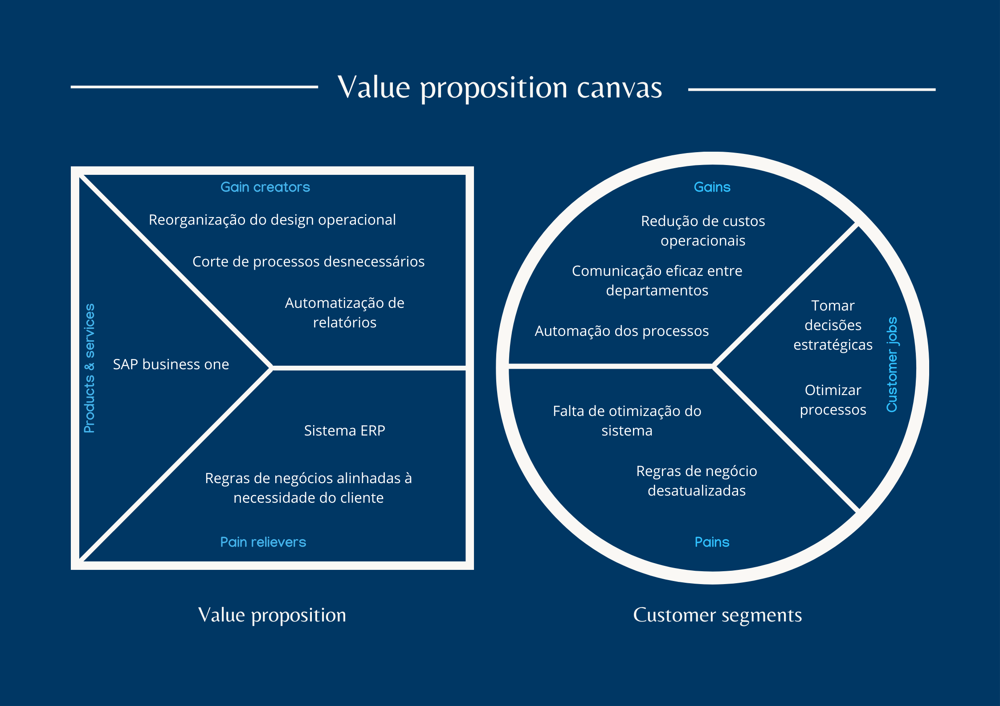
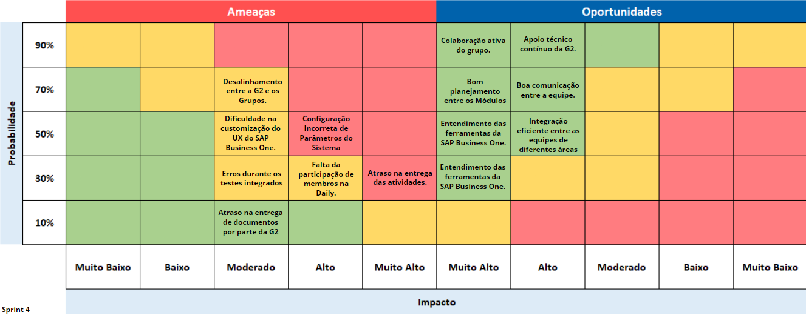

# Entendimento do Negócio

&emsp;&emsp; A implementação de um sistema SAP em uma empresa oferece vantagens significativas, como a melhoria na comunicação e na transferência de dados entre as áreas, aumento da agilidade dos processos e facilitação na tomada de decisões. No entanto, para que essa integração seja eficaz, é essencial realizar análises detalhadas utilizando metodologias e ferramentas específicas, alinhadas tanto ao desenvolvimento do projeto quanto às necessidades do cliente, e que podem ser encontradas abaixo neste documento. 

## 1. Canvas Proposta de Valor

&emsp;&emsp; O Canvas Proposta de Valor é uma ferramenta visual projetada para ajudar empresas a entenderem melhor as necessidades e desejos de seus clientes. Ele permite que as organizações definam e comuniquem claramente o valor que suas ofertas proporcionam, alinhando os benefícios dos produtos ou serviços com as expectativas dos consumidores. Utilizando essa metodologia, as empresas podem criar propostas de valor mais eficazes e direcionadas, facilitando a tomada de decisões estratégicas e o desenvolvimento de soluções que realmente atendam às demandas do mercado.

<!-- Molde para imagens -->

Imagem XX - Canvas Proposta de Valor

Fonte: Autoria própria.

<!------------------------>

&emsp;&emsp; O Segmento de Clientes, à direita, descreve o cenário atual do cliente. Nele, identificamos as tarefas executadas, como a Tomada de Decisões e a Otimização de Processos. Em seguida, são destacadas as vantagens do sistema utilizado, como a redução de custos e a comunicação eficaz entre departamentos. Por fim, são identificadas as dores do cliente, como a falta de otimização e as regras de negócio desatualizadas, que orientam a criação da proposta de valor.  
&emsp;&emsp; Já o quadrante de Proposta de Valor ajuda o cliente a entender o que será entregue no projeto. Primeiramente, são apresentados os “pain relievers”, que são os recursos destinados a resolver as dores do cliente. Em seguida, a etapa de produto detalha o que será entregue. Por fim, os criadores de ganho demonstram as vantagens que o cliente obterá com a nova solução.

## 2. Matriz de Risco

&emsp;&emsp;Esta seção tem como objetivo apresentar uma análise detalhada dos riscos e oportunidades identificados durante a Sprint 1 do projeto de implementação do SAP Business One para a G2 Tecnologia. A análise abrange ameaças que podem impactar negativamente o projeto, bem como oportunidades que podem ser aproveitadas para garantir o sucesso da implementação. Cada risco e oportunidade foi avaliado com base em sua probabilidade e impacto, e foram definidos planos de ação para mitigar riscos e potencializar oportunidades.

  
 <b>Figura X </b> - Matriz de Risco

  
<b>Fonte: Matriz de Risco Sprint 4</b> 
  
  <b>Feito por Grupo ASAP.<b>

## Ameaças

### Desalinhamento entre a G2 e os Grupos
- **Probabilidade:** 70%
- **Impacto:** Moderado
- **Descrição:** Esta ameaça se refere à possibilidade de haver falta de alinhamento entre a G2 e os grupos da faculdade, o que pode causar desentendimentos, atrasos no cronograma e divergências na execução das atividades.
- **Responsável pelo Risco:** Equipe ASAP / G2
- **Plano de Contenção:** Estabelecer checkpoints regulares para alinhamento entre G2 e os grupos, garantindo que as expectativas e metas estejam claras e compartilhadas por todos.
- **Prazo:** Imediato.

### Dificuldade na Customização do UX no SAP Business One
- **Probabilidade:** 50%
- **Impacto:** Moderado
- **Descrição:** A dificuldade na personalização da interface de usuário do SAP Business One pode limitar a usabilidade do sistema e reduzir a eficiência da equipe durante a implementação.
- **Responsável pelo Risco:** Equipe ASAP / Instrutor de UX
- **Plano de Contenção:** Realizar workshops focados na customização do UX, com suporte da G2, para garantir que a equipe tenha a expertise necessária para realizar ajustes no sistema conforme necessário.
- **Prazo**: 

### Falta de Participação de Membros na Daily
- **Probabilidade:** 30%
- **Impacto:** Alto
- **Descrição:** A ausência de membros nas reuniões diárias pode levar a uma falta de coesão no time, causando atrasos na entrega das atividades e falta de visibilidade sobre o progresso do projeto.
- **Responsável pelo Risco:** Equipe ASAP
- **Plano de Contenção:** Incentivar a participação ativa nas Dailys através de lembretes e reforçar a importância dessas reuniões para o sucesso do projeto.

### Atraso na Entrega das Atividades
- **Probabilidade:** 30%
- **Impacto:** Muito Alto
- **Descrição:** Atrasos na entrega das atividades podem comprometer o cronograma do projeto, impactando negativamente a entrega final.
- **Responsável pelo Risco:** Equipe ASAP
- **Plano de Contenção:** Implementar um monitoramento rigoroso do cronograma, com reuniões de revisão de progresso e ajustes necessários ao longo do sprint para manter o prazo em dia.

### Atraso na entrega de documentos por parte da G2
- **Probabilidade:** 10%
- **Impacto:** Moderado
- **Descrição:** Atraso na entrega de documentos necessários para realizar atividades dos artefatos por parte da G2. Isso causa impedimentos e atrasos na entrega.
- **Responsável pelo Risco:** G2
- **Plano de Contenção:** Caso aconteça o atraso, entrar em contato com o responsável da G2 por enviar os documentos e entender até quando podemos receber os mesmos. Ademais, é importante colocar no Status Report os atrasos e alinhar isso com a G2.
- **Prazo:** 

### Erros durante os testes integrados
- **Probabilidade:** 30%
- **Impacto:** Moderado
- **Descrição:** Risco de ocorrer erros durante os testes integrados entre os módulos, impedindo a realização dos mesmos.
- **Responsável pelo Risco:** Turma 10
- **Plano de Contenção:** Entender o que está causando o erro, e corrigi-lo, ademais, reportar isso na planilha dos testes integrados para consultas futuras. 
- **Prazo:** Durante os Testes Integrados 

### Configuração Incorreta de Parâmetros do Sistema
- **Probabilidade:** 50%
- **Impacto:** Alto
- **Descrição:** Parâmetros configurados inadequadamente podem levar a erros no processamento de transações, cálculos incorretos ou comportamentos inesperados do sistema.
- **Responsável pelo Risco:** Equipe ASAP
- **Plano de Contenção:** Utilizar um checklist detalhado durante a configuração, revisar as definições com especialistas e realizar testes abrangentes para validar os parâmetros estabelecidos.
- **Prazo:** Durante a fase de configuração

## Oportunidades

### Colaboração Ativa do Grupo
- **Probabilidade:** 90%
- **Impacto:** Muito Alto
- **Descrição:** A colaboração ativa entre os membros do grupo pode fortalecer o desempenho coletivo e garantir a entrega bem-sucedida do projeto.
- **Responsável pela Oportunidade:** Equipe ASAP
- **Plano de Ação:** Promover um ambiente colaborativo através de ferramentas de comunicação e rituais ágeis, incentivando o compartilhamento de conhecimento e a ajuda mútua.

### Apoio Técnico Contínuo da G2
- **Probabilidade:** 90%
- **Impacto:** Alto
- **Descrição:** Receber suporte técnico contínuo da G2 pode garantir que problemas técnicos sejam resolvidos rapidamente, melhorando a eficiência do projeto e ajudando no aprendizado sobre o SAP Business One.
- **Responsável pela Oportunidade:** G2
- **Plano de Ação:** Garantir que a G2 esteja aqui na faculdade nos encontros e prazos acordados (segunda, quarta e sexta).

### Boa Comunicação entre a Equipe
- **Probabilidade:** 70%
- **Impacto:** Alto
- **Descrição:** Uma comunicação eficiente dentro da equipe pode reduzir mal-entendidos e aumentar a eficácia na execução das atividades do projeto.
- **Responsável pela Oportunidade:** Equipe ASAP
- **Plano de Ação:** Estabelecer canais de comunicação claros e acessíveis, promover a participação ativa em reuniões e incentivar feedback constante entre os membros da equipe.

### Entendimento das Ferramentas do SAP Business One
- **Probabilidade:** 50%
- **Impacto:** Muito Alto
- **Descrição:** Um bom entendimento das ferramentas oferecidas pelo SAP Business One pode maximizar a eficiência operacional e a qualidade das entregas.
- **Responsável pela Oportunidade:** Equipe ASAP
- **Plano de Ação:** Organizar sessões de treinamento e de prática, aproveitando o suporte da G2, para garantir que todos os membros da equipe dominem as funcionalidades principais do sistema.

### Integração Eficiente entre as Equipes de Diferentes Áreas
- **Probabilidade:** 50%
- **Impacto:** Alto
- **Descrição:** A integração eficiente entre as diferentes áreas do projeto pode garantir uma visão holística e um alinhamento estratégico, aumentando a qualidade e a consistência das entregas.
- **Responsável pela Oportunidade:** Turma 10
- **Plano de Ação:** Promover a comunicação ativa entre as equipes para alinhar as metas e processos entre as áreas de Compras, Vendas, Contábil, Financeiro e Estoque, garantindo que todos trabalhem em sinergia.

### Bom planejamento entre os módulos 
- **Probabilidade:** 70% 
- **Impacto:** Muito Alto 
- **Descrição:** Um bom planejamento para as entregas, entre os diferentes módulos (5 grupos), garantindo que os grupos estejam integrados e alinhados. 
- **Responsável pela Oportunidade:** Turma 10
- **Plano de Ação:** Promover dailys e fechamentos entre os grupos, além de uma comunicação afetiva por canais de mensagem como Slack e WhatsApp, garantindo que todos os grupos estejam alinhados com suas tasks.

A análise apresentada identifica os principais riscos e oportunidades relacionados ao projeto de implementação do SAP Business One para a G2 Tecnologia durante a primeira Sprint. A gestão proativa desses riscos, aliada ao aproveitamento das oportunidades, é essencial para o sucesso do projeto. A adoção de estratégias de mitigação e de potencialização das oportunidades permitirá que o projeto seja executado de forma eficiente e eficaz, garantindo que os objetivos sejam atingidos e que o sistema SAP Business One seja implementado com sucesso.

# 3. Análise Financeira

&emsp;&emsp;O planejamento financeiro é um pilar fundamental para o sucesso de qualquer projeto, fornecendo uma visão clara dos recursos necessários e dos resultados esperados. Esta seção tem como objetivo apresentar um conjunto de estratégias e ferramentas que permitem aos gestores e equipes da G2 elaborarem projeções financeiras robustas, mesmo em cenários de incerteza. 

&emsp;&emsp;Ao longo deste guia, exploraremos em detalhes como calcular o ROI de um projeto, considerando tanto os custos de desenvolvimento quanto as receitas projetadas para um período de um ano. Além disso, discutiremos a importância de simular custos de mercado e de considerar as despesas operacionais para garantir um planejamento financeiro completo e confiável.

## 3.1 Tendências de Mercado

&emsp;&emsp;Atualmente, as empresas enfrentam uma rápida transformação tecnológica, o que torna essencial a adoção de ferramentas que promovam eficiência operacional, integração e automação de processos. Nesse contexto, sistemas de Planejamento de Recursos Empresariais (ERP), como o SAP Business One (SAP B1), têm ganhado cada vez mais relevância, especialmente entre pequenas e médias empresas (PMEs), que buscam competir em um cenário global. Esta seção da documentação tem como objetivo analisar as principais tendências do mercado de ERP, com foco no SAP B1, identificando as motivações para sua adoção e as inovações que impulsionam essa transformação.

&emsp;&emsp;A motivação para a implementação de ERPs tem sido impulsionada por fatores como a necessidade de otimização de custos e a busca por maior transparência e controle nos processos empresariais. A centralização de informações e a automação de tarefas se destacam como pontos cruciais, promovendo não apenas melhorias operacionais, mas também permitindo uma gestão mais eficaz e orientada por dados. A digitalização tem facilitado essa transformação ao substituir processos manuais por fluxos digitais mais ágeis, aumentando a eficiência e reduzindo os erros humanos.

&emsp;&emsp;Nos últimos anos, os setores de óleo e gás, transporte e serviços públicos se consolidaram como os principais líderes na adoção de ERPs no Brasil, refletindo a demanda por soluções que permitam a integração de processos em larga escala. O varejo, a construção e as ciências da vida também estão adotando essas tecnologias, à medida que buscam soluções mais robustas para enfrentar os desafios de um mercado cada vez mais competitivo. Pequenas e médias empresas também estão adotando sistemas como o SAP B1, atraídas por suas funcionalidades que integram operações de estoque, contabilidade, vendas e relacionamento com clientes (CRM). [(SAP, 2024)](https://news.sap.com/brazil/2024/01/sap-brasil-cresce-com-maior-adocao-de-solucoes-de-nuvem-e-chegada-da-inteligencia-artificial/).

&emsp;&emsp;Com o aumento da demanda por personalização e integração, o SAP Business One tem se destacado por sua capacidade de adaptação às necessidades específicas de diferentes negócios. Isso permite que empresas de todos os portes possam escalar suas operações conforme crescem, mantendo a flexibilidade necessária para integrar outras ferramentas e sistemas já utilizados. Além disso, a escalabilidade do SAP B1 é um ponto de destaque, possibilitando que as PMEs adicionem novos módulos e funcionalidades conforme suas demandas aumentam, sem a necessidade de grandes investimentos adicionais em infraestrutura. [(Prime Institute, 2024)](https://www.primeinstitute.com/noticias/o-que-e-o-sap-business-one-sap-b1-e-suas-principais-vantagens-para-pequenas-e-medias-empresas-435).

&emsp;&emsp;Outro fator que impulsiona a adoção de ERPs é o avanço de tecnologias emergentes, como Internet das Coisas (IoT), Big Data e Inteligência Artificial (IA). Esses avanços, integrados ao SAP B1, permitem a coleta de dados em tempo real, otimizando a tomada de decisões e aumentando a previsibilidade operacional. O uso de Big Data aliado ao SAP HANA, por exemplo, facilita análises detalhadas e rápidas, enquanto a IA melhora a automação de tarefas repetitivas e a precisão dos processos. Esses recursos não apenas aumentam a eficiência operacional, mas também proporcionam uma visão mais estratégica e integrada das operações empresariais. [(Alfa Erp, 2024)](https://alfaerp.com.br/big-data-com-sap-business-one/).

&emsp;&emsp;A preferência por soluções baseadas em nuvem tem se consolidado como uma tendência clara no mercado de ERP, devido a benefícios como menor custo inicial, escalabilidade e acessibilidade remota. Soluções on-premise ainda têm seu espaço, principalmente em setores que exigem maior controle e segurança dos dados, mas a flexibilidade e a facilidade de implementação das soluções em nuvem estão ganhando cada vez mais adeptos, especialmente entre empresas que desejam modernizar suas operações com rapidez e eficiência. [(Teknisa, 2024)](https://www.teknisa.com/blog/o-que-e-erp/).

&emsp;&emsp;No entanto, a adoção de ERPs também traz desafios. Os custos iniciais de implementação, somados à resistência à mudança por parte de algumas equipes, podem dificultar o processo de transição. Além disso, a competitividade com ERPs personalizados pode representar uma ameaça, já que algumas empresas optam por soluções sob medida que atendem de forma mais específica às suas necessidades. Ainda assim, as oportunidades oferecidas pela centralização de dados e pela automação de processos superam esses desafios, tornando os ERPs uma ferramenta essencial para empresas que desejam se manter competitivas no cenário atual. Tais fatores podem ser facilmente vizualizados na matriz abaixo.

Imagem XX - Matriz SWOT

Fonte: Autoria própria.

&emsp;&emsp;A análise de fatores macroeconômicos, como a inflação e as flutuações cambiais, também desempenha um papel importante na adoção de ERPs. O aumento dos custos operacionais e a volatilidade cambial podem impactar diretamente o planejamento financeiro das empresas, principalmente na hora de investir em soluções tecnológicas de longo prazo. Por isso, é crucial que as empresas tenham uma gestão estratégica que considere esses fatores ao avaliar os custos e benefícios da implementação de um ERP como o SAP B1. [(Compare, 2024)](https://compareplanodesaude.com.br/empresarial/gestao-financeira/importancia-gestao-financeira-era-globalizacao/)

&emsp;&emsp;Em suma, o mercado de ERP está em constante evolução, impulsionado por inovações tecnológicas e pela crescente demanda por eficiência e integração nas operações empresariais. O SAP Business One, em particular, oferece uma solução robusta e escalável para empresas que buscam centralizar suas operações e automatizar processos, tornando-se uma escolha cada vez mais popular, especialmente entre as PMEs. A digitalização, a automação e a flexibilidade proporcionadas pelo ERP são fatores que continuarão a moldar o futuro das empresas no cenário competitivo atual.

## 3.2 Custos

### Desenvolvimento do Projeto

&emsp;&emsp;A seguir, são apresentados os custos de desenvolvimento inicial do projeto ASAP. O projeto, com duração de 10 semanas, tem alguns custos semanais e outros mensais, portanto, eles estão separados em tabelas diferentes e em seguida somados, estimando um valor de investimento para o desenvolvimento do projeto.

### Custos Semanais
&emsp;&emsp;Os custos semanais envolvem principalmente o valor dos funcionários envolvidos na produção. Cada um tem uma carga horária diferente, que, multiplicada pelo valor pago por hora e a quantidade de funcionários, resulta no custo total semanal. Consideramos 10 semanas nos cálculos.

| Descrição             | Horas/Semana | Valor por Hora (R$) | Quantidade | Custo Total Semanal (R$)     | Custo de 10 Semanas (R$) |
|-----------------------|--------------|---------------------|------------|------------------------------|--------------------------|
| Consultores Junior (alunos)    | 10           | 75                  | 34          |  25.500       |  255.000      |
| Consultores Sênior    | 10           | 75                  | 3          | 2.250      |  22.500      |
| Gerente de Projeto    | 2,5          | 100                 | 1          | 250          |  2.500         |
| **Total Semanal**     |              |                     |            | **28.000**                    | **280.000**               |

### Custos Mensais

&emsp;&emsp;Aqui são apresentados os serviços cobrados mensalmente. São envolvidas as licenças usadas e o serviço de nuvem contratado. Como o projeto tem duração de dois meses e meio, consideramos três, pois o serviço é cobrado integralmente independente da quantidade de uso por mês.

| Descrição               | Quantidade | Valor unitário por Mês (R$) | Valor Total Mensal (R$) | Valor 3 Meses (R$) |
|-------------------------|------------|-----------------------------|-------------------------|--------------------|
| Licenças SAP B1 Professional | 5          | 750                           | 3.750                       |11.250                  |
| Cloud Skyone            | 5          | 180                           | 900                       | 2.700                  |
| **Total**               |            |                             | 4.650                       | 13.950                  |

### Custo Total

| Descrição               | Valor (R$)     |
|-------------------------|----------------|
| Total Custos Semanais   | 280.000         |
| Total Custos Mensais    |  13.950             |
| Total Custos Projeto    | 293.950               |

### Resumo

&emsp;&emsp;Os custos de desenvolvimento do projeto ASAP são divididos em semanais e mensais.  Os semanais, que envolvem os consultores junior, sênior e gerente de projeto, totalizam 280.000 reais (considerando 10 semanas).  Os mensais, que compõem as licenças e a nuvem, totalizam 13.950 reais (considerando 3 meses). Portanto, o desenvolvimento na totalidade requer um investimento de 293.950 reais.

### Observações

- Esta seção cobre apensas os custos de desenvolvimento e não contempla os custos de operação.
- Os valores são estimativas baseadas nos custos correntes e podem variar conforme as negociações com fornecedores e alterações no escopo do projeto.
- É importante considerar custos adicionais como impostos, treinamentos e outros gastos não listados nesta tabela.

### Custos de Manutenção da Operação

&emsp;&emsp;Após a implementação do SAP B1 no cliente G2, consideramos os seguintes custos fixos e opções para a manutenção da operação ao longo de um ano.

#### Licenças Profissionais
- **Quantidade**: 5 licenças
- **Custo por licença**: R$740,00 mensalmente
- **Cálculo Mensal**: 5 licenças x R$740,00 = R$3.700,00 por mês
- **Cálculo Anual**: R$3.700,00 x 12 meses = R$44.400,00

#### Cloud
- **SkyOne (Nuvem)**: Os custos associados ao serviço de nuvem fornecido pela SkyOne durante a duração de implementação do projeto (3 meses) é de R$180,00 por usuário.
Portanto, consideranndo os custos de manutenção da operação em um período de 1 ano, temos que:
  -  Quantidade: R$180,00 x 5 usuários = R$900,00 (3 meses)
  - Custo por mês: R$900,00 / 3 meses = R$300,00 por mês
  - Custo por ano: R$300,00 x 12 meses = R$3600,00 por ano.

### Custos Opcionais
&emsp;&emsp;Esses custos não se aplicam ao nosso caso, mas estão disponíveis para o cliente:

- **Horas de Suporte**: Sistema de tickets onde o cliente pode contratar horas de suporte conforme necessário.
- **Melhoria Contínua**: Inclui melhorias na base de dados, relatórios personalizados, entre outros. Nota-se que a hora de suporte é mais barata que a hora de melhoria.

### Add-ons
- Os Add-ons são recursos ou funcionalidades adicionais que podem ser integrados ao SAP B1 para expandir suas funcionalidades. Embora eles sejam potenciais criadores de custo devido à licença e manutenção adicionais, não se aplicam ao nosso projeto específico.

### Conclusão 

&emsp;&emsp;O custo total fixo anual, considerando as Licenças profissionais e a Nuvem é de **R$47.600,00**, sendo que **R$44.000,00** é o custo das licenças e **R$3.600,00** é o custo da nuvem. Este é um exemplo baseado na nossa implementação.

&emsp;&emsp;As opções de suporte e melhoria, bem como os add-ons, são flexíveis e podem ser adaptadas conforme a necessidade do projeto e do cliente, mas não se aplicam para o nosso cenário.

## 3.3 ROI

&emsp;&emsp;O Retorno sobre Investimento (ROI) é uma métrica essencial no ambiente empresarial, utilizada para avaliar a eficácia e a rentabilidade de um investimento. No caso da G2, que está implementando o SAP Business One, o ROI oferece uma maneira de mensurar o ganho financeiro gerado em comparação ao custo da implantação, fornecendo insights sobre o valor agregado pela automação de processos e melhoria nas rotinas operacionais.

&emsp;&emsp;O cálculo do ROI é simples: divide-se o ganho líquido obtido com o investimento pelo custo inicial do projeto, e o resultado é expresso em porcentagem. A fórmula básica para calcular o ROI é:

&emsp;&emsp;ROI = (Ganho do Investimento - Custo do Investimento) / Custo do Investimento * 100

- **Custo Total do Projeto (Desenvolvimento + Manutenção Anual)**: A G2 estima um custo médio de R$ 7.000 a R$ 10.000 durante a implementação, sendo este o custo semanal para a G2 ao utilizar a plataforma SAPB1 (média de 16 horas semanais). O custo total inclui o desenvolvimento inicial e a manutenção anual, além das despesas fixas e variáveis associadas.
  
- **Receitas Previstas**: Para a G2, espera-se um ganho anual estimado de R$ 700.000 com a implementação do SAP Business One, baseando-se nas melhorias proporcionadas em rotinas como automação de processos financeiros, gestão de estoque, aprimoramento nas vendas, entre outros.

- **ROI**: Considerando um custo de investimento de R$ 250.000 e um ganho projetado de R$ 700.000, o ROI seria de aproximadamente 180%. Essa projeção reflete a lucratividade da G2 ao otimizar suas operações com o SAP Business One.

- **Tempo de Retorno do Investimento**: O tempo necessário para recuperar o valor investido dependerá do impacto financeiro direto nas operações e das economias geradas ao longo do tempo, que foram estimadas em 2% do faturamento anual da G2, uma economia significativa para a empresa.

- **Ganho Reputacional**: Além do retorno financeiro, a implementação do SAP Business One pode resultar em um aumento do reconhecimento de mercado, melhoria na reputação da empresa e impacto positivo nas operações dos clientes da G2, ampliando a adesão ao sistema e fortalecendo sua posição no mercado.

## 3.4 Conclusão

&emsp;&emsp; Nesta análise financeira, foram discutidos vários aspectos relacionados ao planejamento e execução de um projeto de implementação do SAP Business One para a G2. Primeiramente, foi abordada a importância do planejamento financeiro, que ajuda a enxergar uma boa base para prever os custos e as receitas esperadas.

&emsp;&emsp; Em seguida, a análise focou nas tendências de mercado para sistemas ERP, destacando a adoção dessas soluções por empresas de médio e pequeno porte, que buscam melhorar a eficiência operacional e a integração de processos. O SAP Business One foi identificado como uma escolha estratégica, especialmente por sua escalabilidade e capacidade de automação, além de ser o _Carro-Chefe_ de vendas da G2 e proposta do módulo.

&emsp;&emsp; Os custos de desenvolvimento e custos de manutenção também foram detalhados, evidenciando os custos envolvidos no projeto, tanto durante a fase de implementação (10 semanas) e após a implementação. Os custos após a implementação são analisados na seção de Custos de Manutenção da Operação em 1 ano, que seriam os custos que a empresa arcará após implementar o seu projeto, para poder mantê-lo.

&emsp;&emsp; A análise do Retorno sobre o Investimento (ROI) indicou que o projeto trará um retorno estimado em 180%, reforçando a viabilidade financeira da implementação.

&emsp;&emsp; Em resumo, a implementação do SAP Business One para a G2 oferece tanto benefícios financeiros quanto operacionais, que justificam o investimento, além de preparar a empresa para enfrentar os desafios futuros com maior eficiência.

 

## Referências

ALFA ERP. **Big Data com SAP Business One**. 2024. Disponível em: https://alfaerp.com.br/big-data-com-sap-business-one/. Acesso em: 4 set. 2024.

ALVES, N. H., & TESSMANN, L. G. dos S.: **Matriz De Risco: Um Estudo Em Uma Empresa Calçadista Do Vale do Paranhana**, Revista Eletrônica de Ciências Contábeis, 2018.

CHANG, V.: Business Integration as a Service: Computational risk analysis for small and medium enterprises adopting SAP, SCHOOL OF COMPUTING AND CREATIVE TECHNOLOGIES, LEEDS METROPOLITAN UNIVERSITY, LEEDS, UK, 2013.

COMPARE PLANO DE SAÚDE. **A importância da gestão financeira na era da globalização**. 2024. Disponível em: https://compareplanodesaude.com.br/empresarial/gestao-financeira/importancia-gestao-financeira-era-globalizacao/. Acesso em: 4 set. 2024.

PRIME INSTITUTE. **O que é o SAP Business One (SAP B1) e suas principais vantagens para pequenas e médias empresas**. 2024. Disponível em: https://www.primeinstitute.com/noticias/o-que-e-o-sap-business-one-sap-b1-e-suas-principais-vantagens-para-pequenas-e-medias-empresas-435. Acesso em: 4 set. 2024.

SAP BRASIL. **SAP Brasil cresce com maior adoção de soluções de nuvem e chegada da inteligência artificial**. 2024. Disponível em: https://news.sap.com/brazil/2024/01/sap-brasil-cresce-com-maior-adocao-de-solucoes-de-nuvem-e-chegada-da-inteligencia-artificial/. Acesso em: 4 set. 2024.

SILVA, V. F., PENHA, R., BIZARRIAS, F. S.: **A RELEVÂNCIA DA HABILIDADE DE EXECUTIVE PRESENCE PARA GERENTES DE PROJETOS**, Simpósio Internacional de Gestão de Projetos, Inovação e Sustentabilidade, 2020.

TEKNISA. **O que é ERP?**. 2024. Disponível em: https://www.teknisa.com/blog/o-que-e-erp/. Acesso em: 4 set. 2024.
