# Módulo de Compras

#### Autores
- Daniel Zular
- Henrique Cox
- João Moura
- Keylla Oliveira
- Luiza Santana
- Otto Coutinho 

#### Orientador
- Prof. Renato Penha

#### Coordenador
- Prof. Egon Daxbacher

#### Instituição
- Instituto de Tecnologia e Liderança

## Sumário
[Introdução](#c11)  

[Manual](#c1)  

&emsp;&emsp;[Passo 1: Solicitação de compra, oferta de compra](#c2)  
&emsp;&emsp;[Passo 2: Criar pedido de compra](#c3)  
&emsp;&emsp;[Passo 3: Criar nota fiscal de entrada](#c4)  
&emsp;&emsp;[Passo 4: Devolução da nota fiscal de entrada](#c5)  
&emsp;&emsp;[Passo 5: Recebimento de mercadoria](#c6)  
&emsp;&emsp;[Passo 6: Processo de adiantamento](#c7)  
&emsp;&emsp;[Passo 8: Relatório compras](#c8)  
&emsp;&emsp;[Passo 11: Checar estoque de licenças](#c9)  
&emsp;&emsp;[Passo 13: Pedido de reposição de produtos internos](#c10)  

[Treinamento](#c12)   (anexar as evidências do passo a passo) junto com o link do checklist + lista de assinatura do treinamento

###  Introdução

&emsp;&emsp; Um plano de cutover é essencial para a transição de sistemas ou processos de uma solução antiga para uma nova, assegurando uma mudança suave e minimizando a interrupção das operações. Ele detalha todas as etapas necessárias para a migração, desde o planejamento até a execução, e inclui cronogramas, responsabilidades e recursos necessários. O objetivo é garantir que todos os aspectos da mudança sejam cuidadosamente coordenados e monitorados, abordando possíveis riscos e imprevistos, e garantindo que o novo sistema ou processo esteja totalmente operacional e integrado ao ambiente existente.

#  Manual
&emsp;&emsp; O objetivo do documento apresentado a seguir é oferecer as instruções sobre como utilizar o sistema SAP B1 no módulo de compras, assim como as modificações específicas do cliente.

###  Passo 1: Solicitação de compra, oferta de compra

&emsp;&emsp; Este passo tem como objetivo criar uma solicitação de compra dentro do sistema.

#### Passo 1.1: Acessar o sistema

- Clique em "Módulos";
- Selecione "Compras - C/P"
- Clique em "Solicitação de compra"

Imagem 01 - Passo 1.1: Caminho

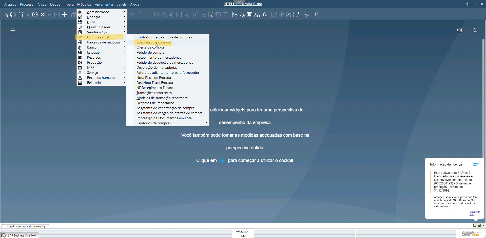

Fonte: Elaborado pelos Autores.

#### Passo 1.2: Solicitante

- Na aba solicitante escolha quem está fazendo a solicitação;

Imagem 02 - Passo 1.2: Solicitante

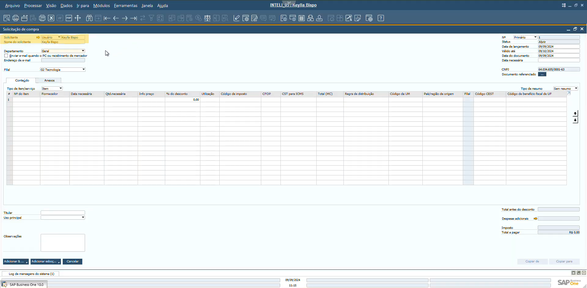

Fonte: Elaborado pelos Autores.

#### Passo 1.3: Seleção do Item

- Clique na célula 1 do "Nº de item;
- Clique no símbolo que aparece dentro da cédula;
- Na janela, selecione o item desejado;

Imagem 03 - Passo 1.3 - nome da imagem

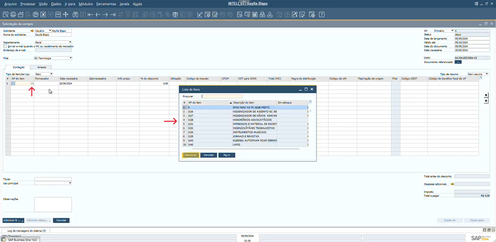

Fonte: Elaborado pelos Autores.

#### Passo 1.4: Acessar o sistema

- Clique em "Adicionar &..." para finalizar a tarefa.

Imagem 04 - Passo 1.4 - nome da imagem

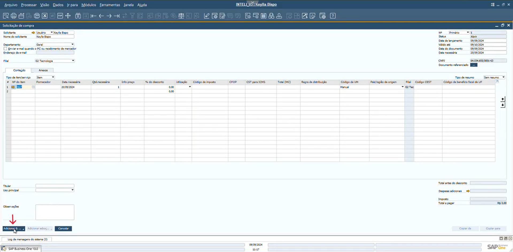

Fonte: Elaborado pelos Autores.

###  Passo 2: Criar pedido de compra

&emsp;&emsp; Este passo tem como objetivo criar um pedido de compra dentro do sistema.

#### Passo 2.1: Acessar o sistema

- Clique em "Módulos";
- Selecione "Compras - C/P"
- Clique em "Pedido de compra"

Imagem 05 - Passo 2.1 - Caminho

Fonte: Elaborado pelos Autores.

#### Passo 2.2: Selecionar fornecedor

- Clique no campo "Fornecedor";
- Clique no pequeno símbolo;
- Selecione o fornecedor na janela apresentada;

Imagem XX - Passo 2.2 - nome da imagem

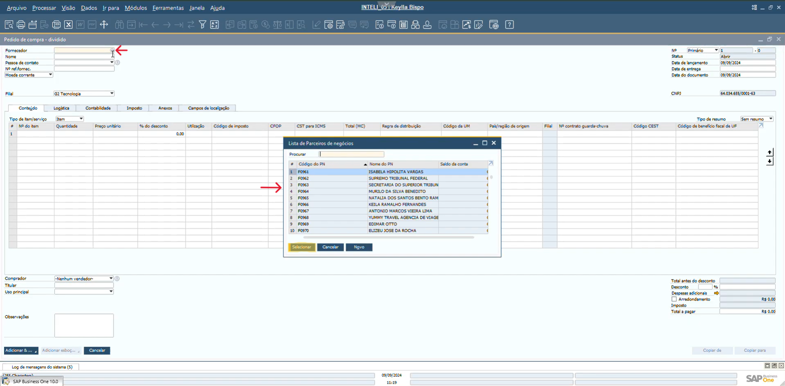

Fonte: Elaborado pelos Autores.

#### Passo 2.3: Selecionar fornecedor

- Clique na célula 1 do "Nº de item";
- Clique no símbolo que aparece dentro da cédula;
- Na janela, selecione o item desejado;

Imagem XX - Passo 2.3 - nome da imagem

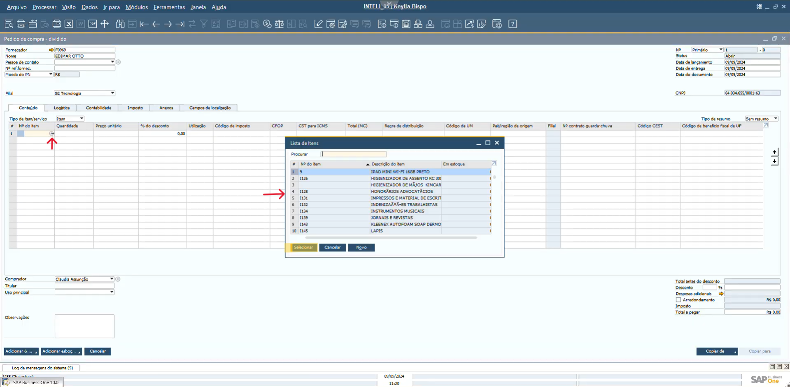

Fonte: Elaborado pelos Autores.

#### Passo 2.4: Preencher preço unitário

- Clique na cédula 1 do "Preço unitário";
- Preencha com o valor;

Imagem XX - Passo 2.4 - nome da imagem

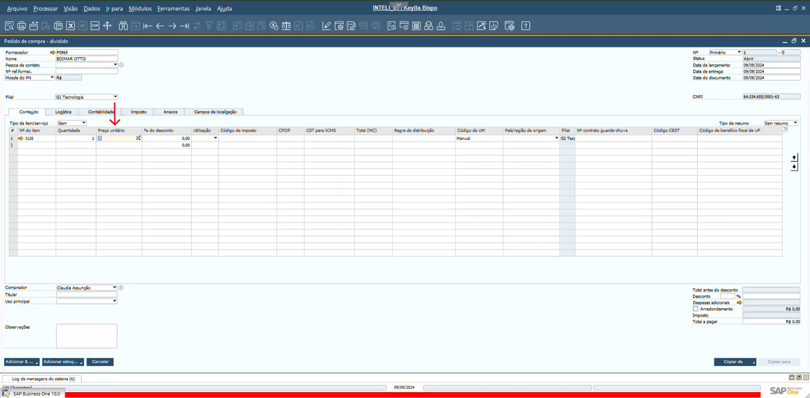

Fonte: Elaborado pelos Autores.

#### Passo 2.5: Finalizar pedido

- Clique no "Adicionar &..." para finalizar o pedido.

Imagem XX - Passo 2.5 - nome da imagem

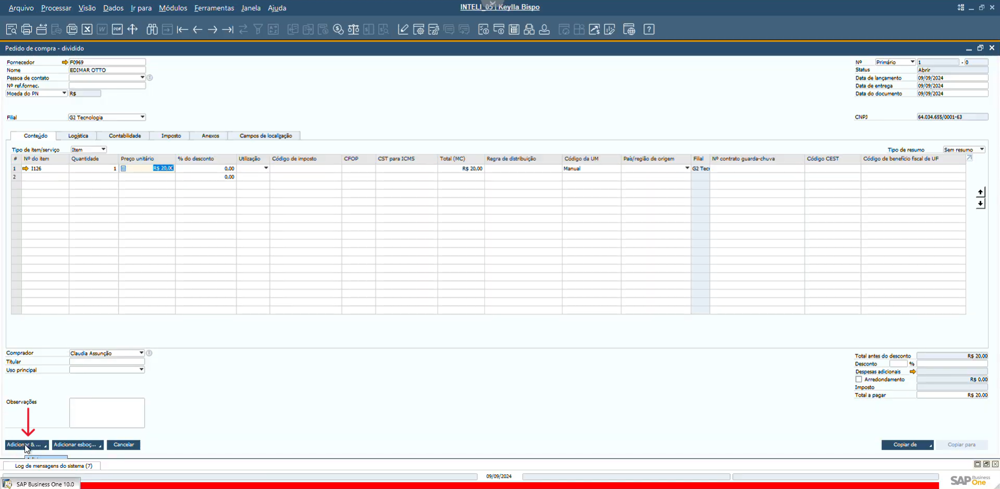

Fonte: Elaborado pelos Autores.

###  Passo 3: Criar nota fiscal de entrada

#### Passo 3.1: Acessar o sistema

- Clique em "Módulos";
- Selecione "Compras - C/P"
- Clique em "Pedido de compra"

Imagem XX - Passo 3.1 - nome da imagem

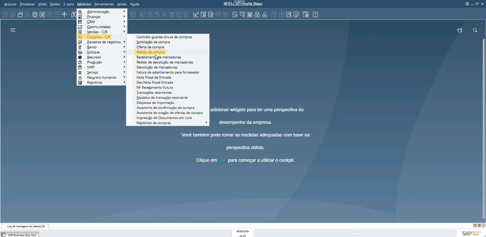

Fonte: Elaborado pelos Autores.

#### Passo 3.2: Acessar registro

- Clique em "Registro anterior" ou selecione o registro desejado;

Imagem XX - Passo 3.2 - nome da imagem

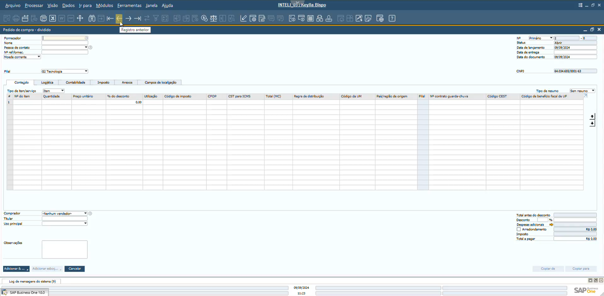

Fonte: Elaborado pelos Autores.

#### Passo 3.3: Acessar nota fiscal de entrada

- Clique em "Copiar para";
- Selecione "Nota fiscal de Entrada"

Imagem XX - Passo 3.3 - nome da imagem

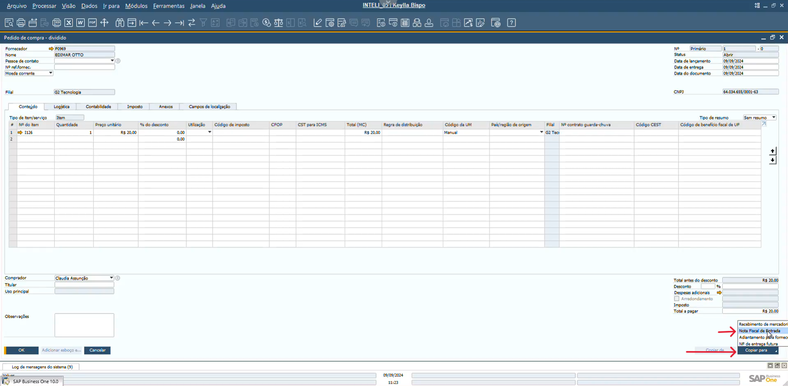

Fonte: Elaborado pelos Autores.

#### Passo 3.4: Preencher os campos de Utilização e Código de imposto

- Preencha a cédula "Utilização";
- Preencha a cédula "Código de imposto";

Imagem XX - Passo 3.4 - nome da imagem

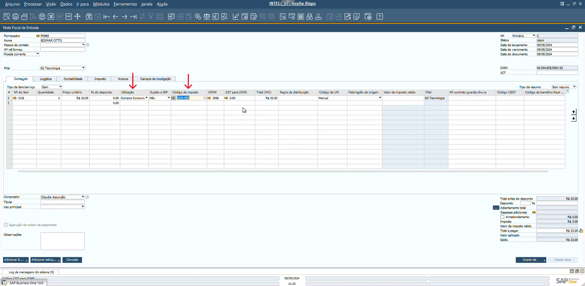

Fonte: Elaborado pelos Autores.

#### Passo 3.5: Preencher condição de pagamento

- Clique na aba "Contabilidade"
- Clique no campo "Condições de pagamento" e selecione a opção que se aplica;

Imagem XX - Passo 3.5 - nome da imagem

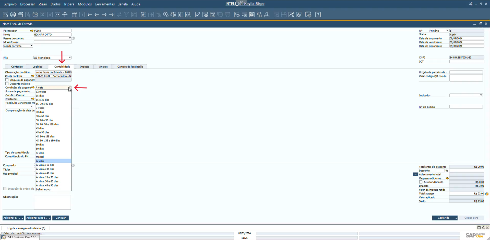

Fonte: Elaborado pelos Autores.

#### Passo 3.6: Preencher a aba imposto

- Clique na aba "Imposto"
- Preencha o campo "Nº NF" e "Série";

Imagem XX - Passo 3.6 - nome da imagem

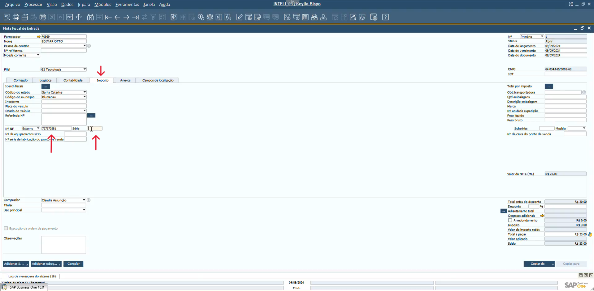

Fonte: Elaborado pelos Autores.

#### Passo 3.7: Selecionar o modelo

- Clique na aba "Modelo"
- Preencha o campo com "NFe(55)";

Imagem XX - Passo 3.7 - nome da imagem

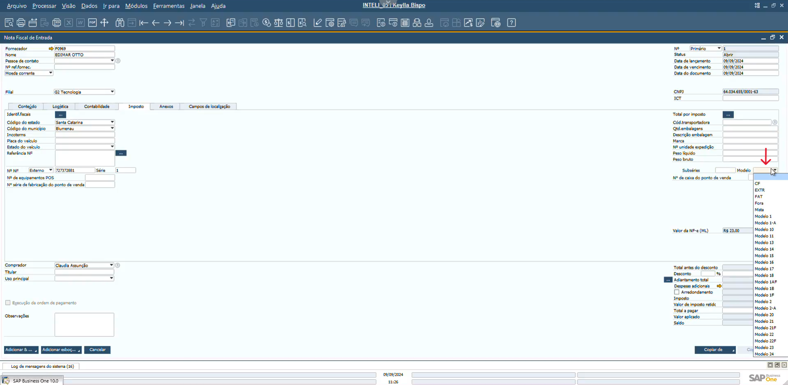

Fonte: Elaborado pelos Autores.

#### Passo 3.8: Finalizar a nota fiscal

- Clique em "Adicionar & ..." para finalizar a nota fiscal.

Imagem XX - Passo 3.8 - nome da imagem

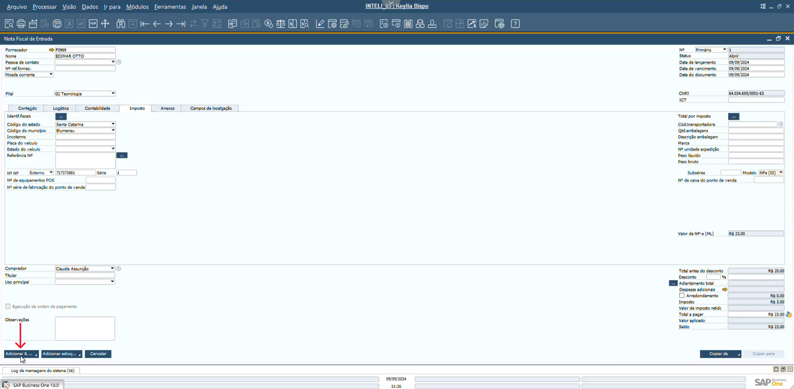

Fonte: Elaborado pelos Autores.

###  Passo 4: Devolução da nota fiscal de entrada

#### Passo 4.1: Acessar o sistema

- Clique em "Módulos";
- Selecione "Compras - C/P"
- Clique em "Nota Fiscal de Entrada"

Imagem XX - Passo 4.1 - nome da imagem

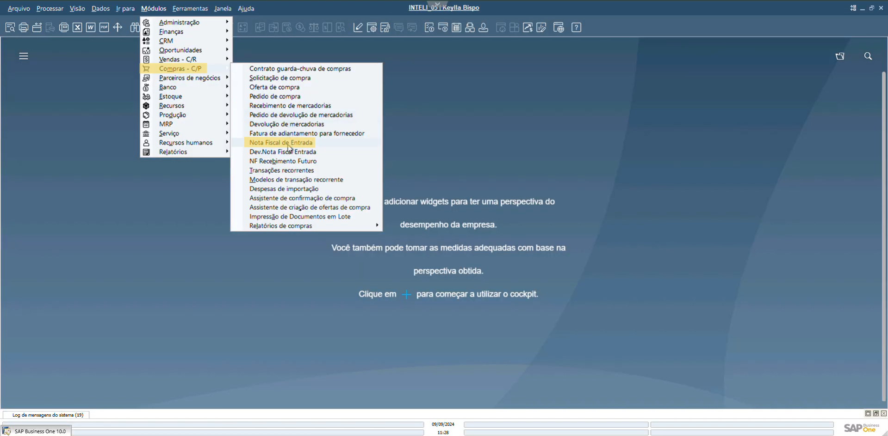

Fonte: Elaborado pelos Autores.

#### Passo 4.2: Acessar a Dev/Nota Fiscal de Entrada

- Selecione uma nota fiscal já registrada; 
- Clique em "Copiar para";
- Selecione "Dev/Nota Fiscal de Entrada";

Imagem XX - Passo 4.2 - nome da imagem

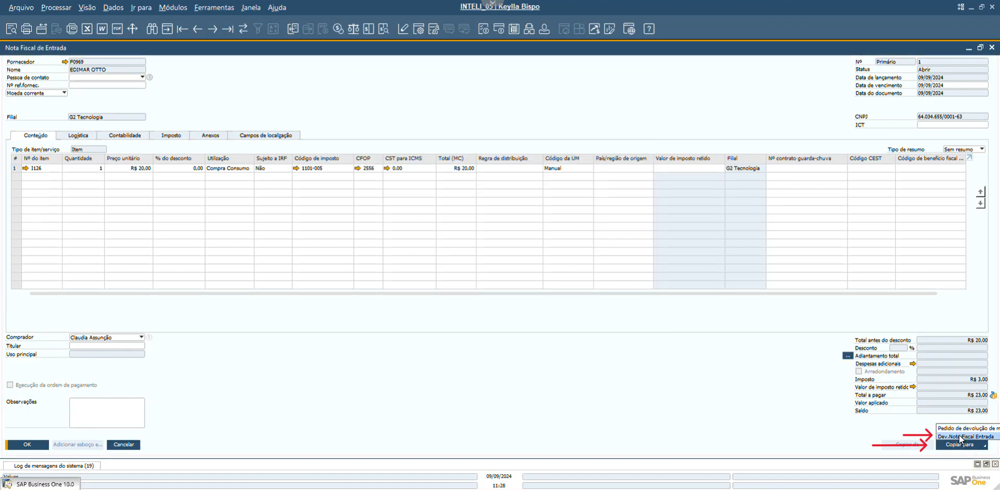

Fonte: Elaborado pelos Autores.

#### Passo 4.3: Selecionar as datas

- No canto superior direito possui datas;
- As datas podem ser alteradas de acordo com o intuito desejado;

Imagem XX - Passo 4.3 - nome da imagem

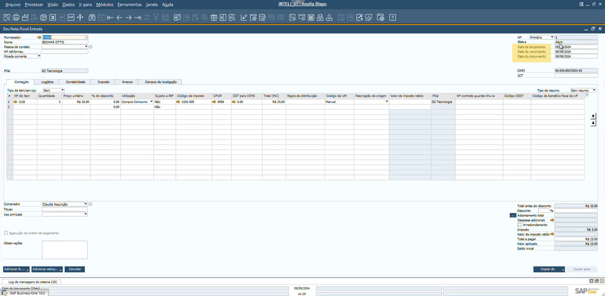

Fonte: Elaborado pelos Autores.

#### Passo 4.4: Acessar a aba Imposto

- Clique na aba "Imposto";
- Nessa aba, os campos podem ser preenchidos de acordo com a necessidade

Imagem XX - Passo 4.4 - nome da imagem

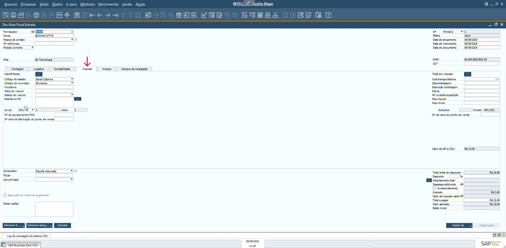

Fonte: Elaborado pelos Autores.

#### Passo 4.5: Finalizar a devolução

- Clique em "Adicionar & ..." para finalizar o processo.

Imagem XX - Passo 4.5 - nome da imagem

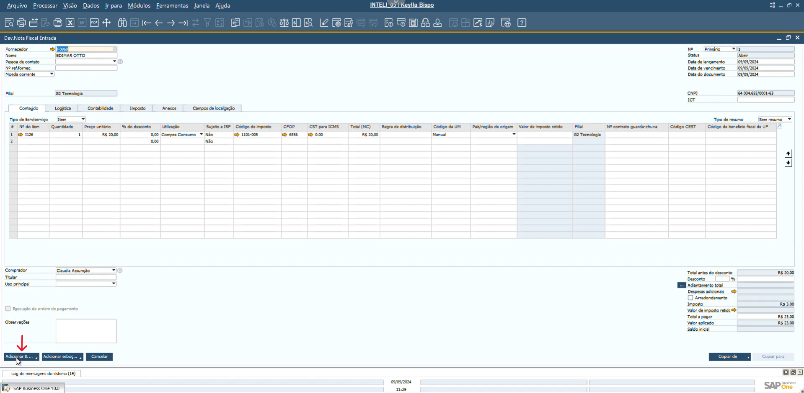

Fonte: Elaborado pelos Autores.

###  Passo 5: Recebimento de mercadoria

#### Passo 5.1: Acessar o sistema

- Clique em "Módulos";
- Selecione "Compras - C/P"
- Clique em "Pedido de Compra"

Imagem XX - Passo 5.1 - nome da imagem

Fonte: Elaborado pelos Autores.

#### Passo 5.2: Selecionar Fornecedor

- Clique no campo "Fornecedor";
- Clique no pequeno símbolo;
- Selecione o fornecedor desejado e confirme;

Imagem XX - Passo 5.2 - nome da imagem

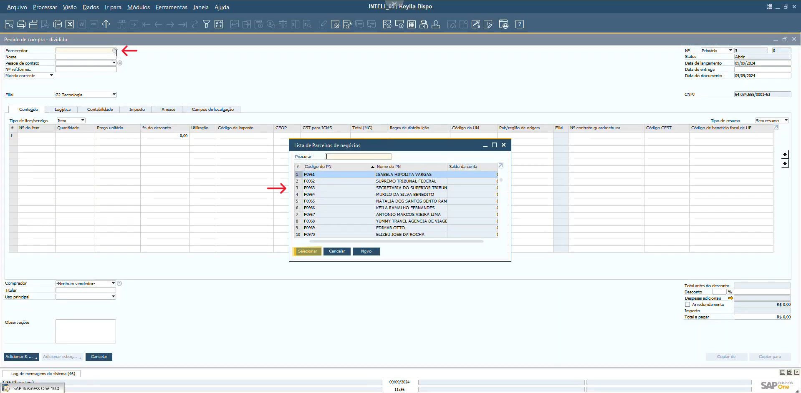

Fonte: Elaborado pelos Autores.

#### Passo 5.3: Selecionar Item

- Clique na cédula "Nº do Item";
- Clique no pequeno símbolo;
- Selecione o item desejado e confirme;

Imagem XX - Passo 5.3 - nome da imagem

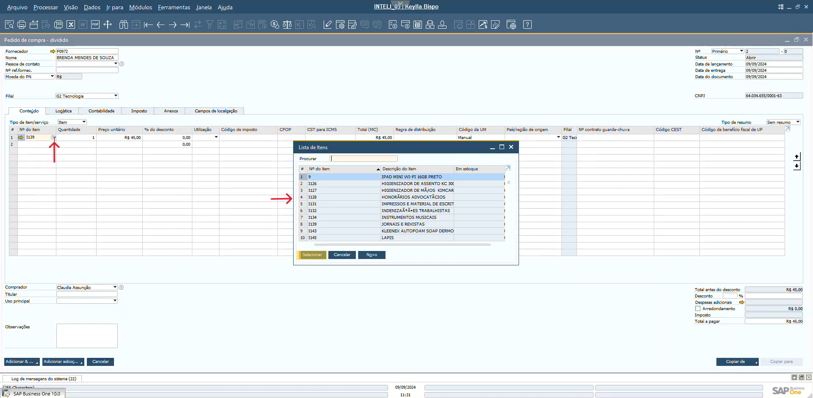

Fonte: Elaborado pelos Autores.

#### Passo 5.4: Selecionar itens de estoque

&emsp;&emsp; Para confirmar o recebimento de um item, o item em questão deve estar cadastrado como um item de estoque. Para verificar se um item é de estoque ou não, deve-se fazer o seguinte passo:

- Clique no campo "Configuração de formulário";

Imagem XX - Passo 5.4 - nome da imagem

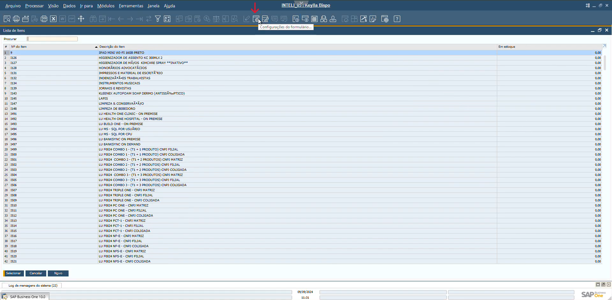

Fonte: Elaborado pelos Autores.

#### Passo 5.5: Selecionar itens de estoque

- Selecione um novo campo e escolha "item de estoque";

Imagem XX - Passo 5.5 - nome da imagem

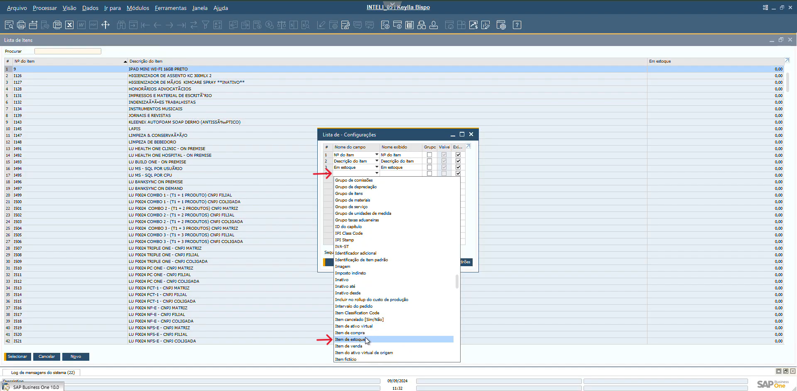

Fonte: Elaborado pelos Autores.

#### Passo 5.6: Selecionar itens de estoque

- Ao lado escreva o nome da coluna e confirme a mudança;

Imagem XX - Passo 5.6 - nome da imagem

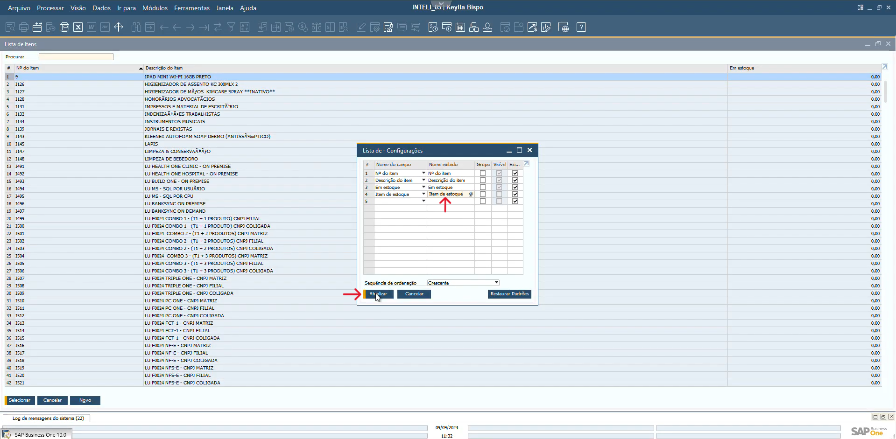

Fonte: Elaborado pelos Autores.

#### Passo 5.7: Coluna de estoque

- Ao lado da tabela anterior vai aparecer uma nova coluna indicando se o item pertence ao estoque ou não;

Imagem XX - Passo 5.7 - nome da imagem

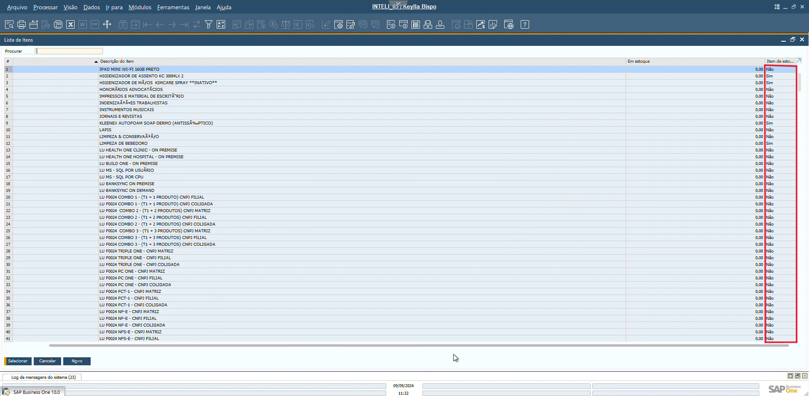

Fonte: Elaborado pelos Autores.

#### Passo 5.8: Coluna de estoque

- Clique no botão "Adicionar & ..."

Imagem XX - Passo 5.8 - nome da imagem

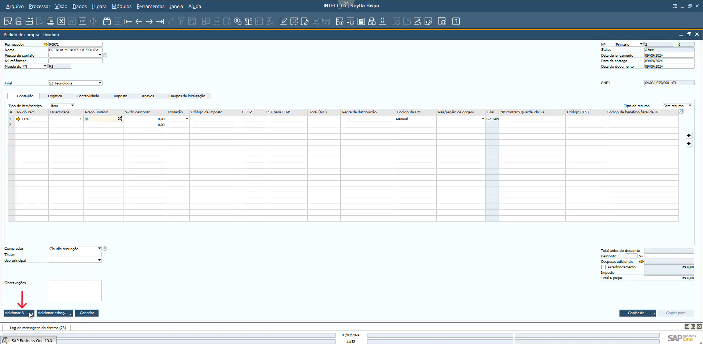

Fonte: Elaborado pelos Autores.

#### Passo 5.9: Confirmação do pedido

- Clique em "Registro anterior" ou no registro desejado;

Imagem XX - Passo 5.9 - nome da imagem

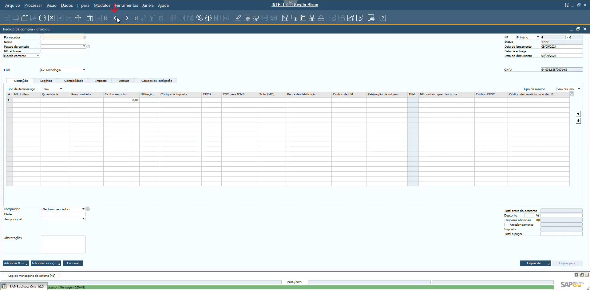

Fonte: Elaborado pelos Autores.

#### Passo 5.10: Recebimento de mercadoria

- Clique em "Copiar para";
- Em seguida clique em "Recebimento de mercadoria"

Imagem XX - Passo 5.10 - nome da imagem

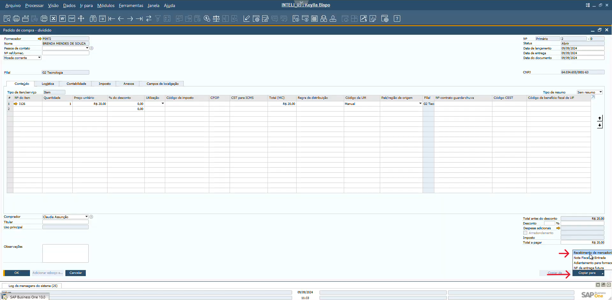

Fonte: Elaborado pelos Autores.

#### Passo 5.11: Recebimento de mercadoria

- Clique em na cédula de utilização;
- Em seguida clique na utilização do item em questão;

Imagem XX - Passo 5.11 - nome da imagem

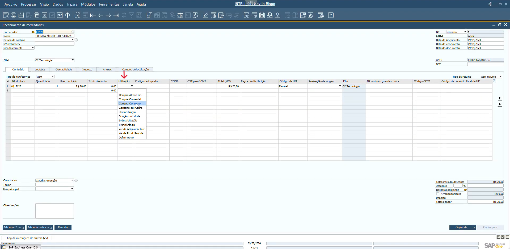

Fonte: Elaborado pelos Autores.

#### Passo 5.12: Código de imposto

- Clique na cédula de "Código de imposto";
- Em seguida clique no imposto adequado e confirme;

Imagem XX - Passo 5.12 - nome da imagem

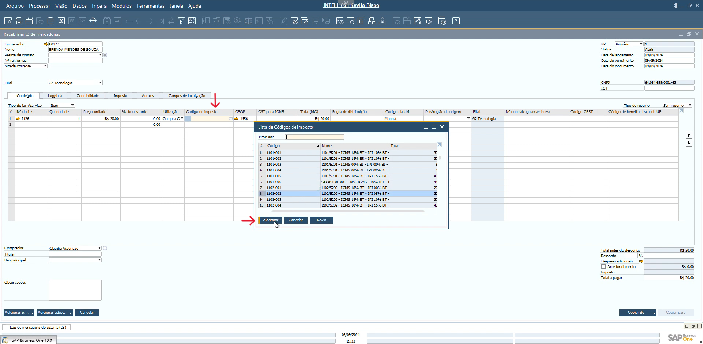

Fonte: Elaborado pelos Autores.

#### Passo 5.13: Aba imposto

- Clique na aba "Imposto";
- Em seguida preencha os campos "Nº NF" e "Série";

Imagem XX - Passo 5.13 - nome da imagem

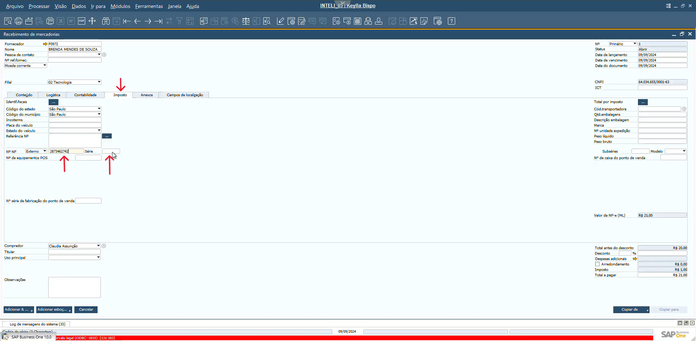

Fonte: Elaborado pelos Autores.

#### Passo 5.14: Recebimento de mercadoria

- Clique em "Adicionar & ..." para concluir o registro;

Imagem XX - Passo 5.14 - nome da imagem

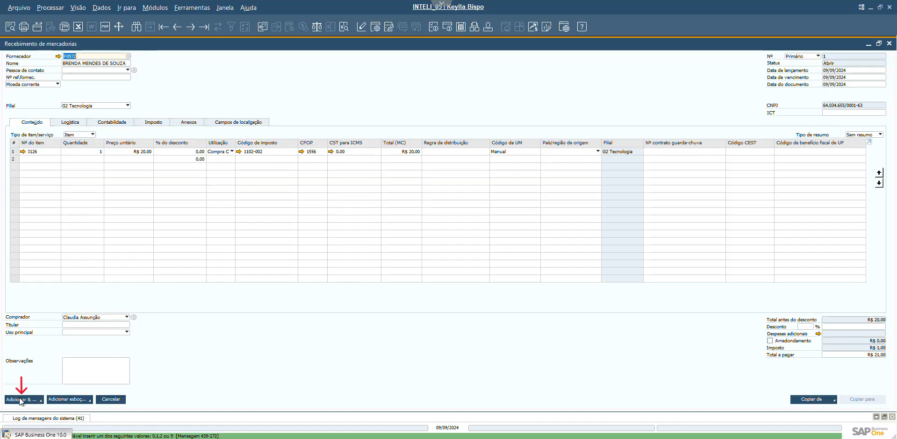

Fonte: Elaborado pelos Autores.

#### Passo 5.15: Seleção de registro

- Clique em "Registro anterior" ou no registro desejado;

Imagem XX - Passo 5.15 - nome da imagem

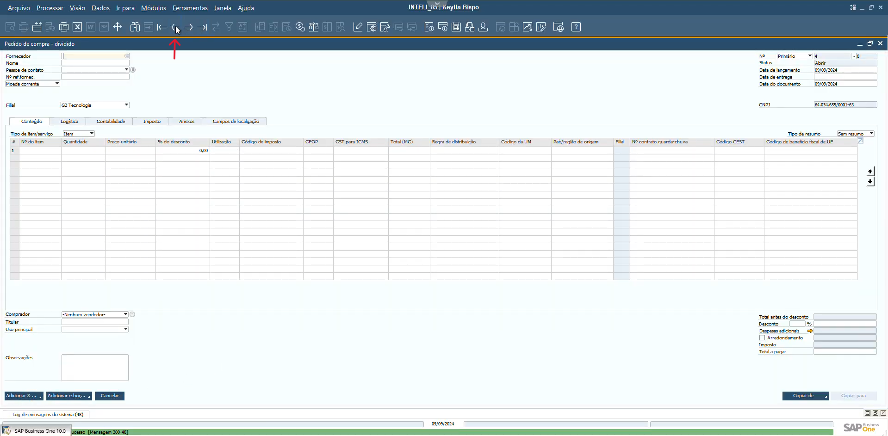

Fonte: Elaborado pelos Autores.

#### Passo 5.16: Confirmação do pedido

- Clique em "Copiar para" e em seguida clique em "Nota Fiscal de Entrada";

Imagem XX - Passo 5.16 - nome da imagem

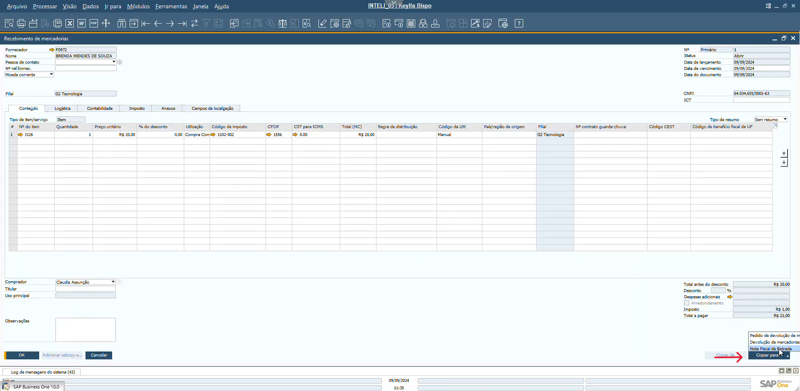

Fonte: Elaborado pelos Autores.

#### Passo 5.17: Confirmação do modelo

- Na aba imposto vá na opção de "Modelo"
- Selecione a opção "NFe(55)";

Imagem XX - Passo 5.17 - nome da imagem

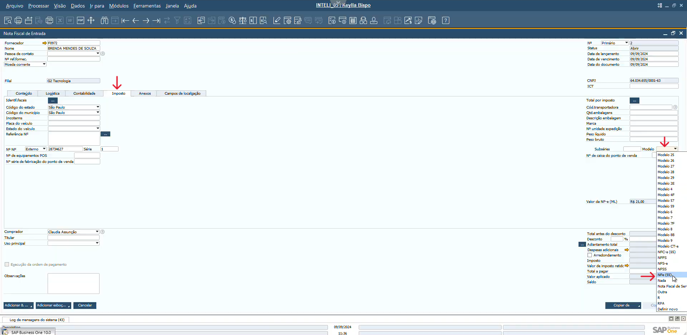

Fonte: Elaborado pelos Autores.

#### Passo 5.18: Aba de contabilidade

- Na aba "Contabilidade" vá no campo "Condições de pagamento"
- Selecione a opção que melhor se encaixa;

Imagem XX - Passo 5.18 - nome da imagem

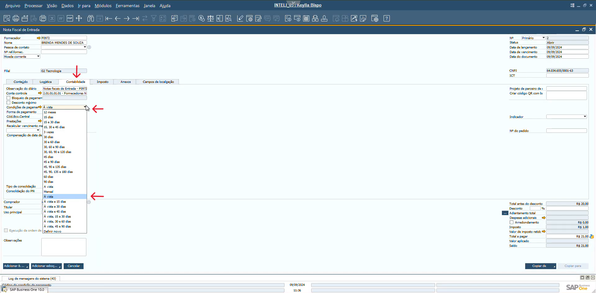

Fonte: Elaborado pelos Autores.

#### Passo 5.19: Aba de conteúdo

- Clique no botão "Adicionar & ..." para finalizar esse passo.

Imagem XX - Passo 5.19 - nome da imagem

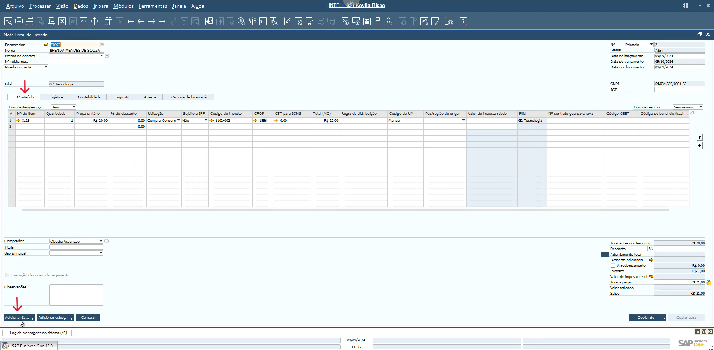

Fonte: Elaborado pelos Autores.

###  Passo 6: Processo de adiantamento

#### Passo 6.1: Acessar o sistema

- Clique em "Módulos";
- Selecione "Compras - C/P"
- Clique em "Pedido de Compra"

Imagem XX - Passo 6.1 - nome da imagem

Fonte: Elaborado pelos Autores.

#### Passo 6.2: preencher fornecedor

- Clique no campo "Fornecedor";
- Selecione o fornecedor desejado e confirme;

Imagem XX - Passo 6.2 - nome da imagem

Fonte: Elaborado pelos Autores.

#### Passo 6.3: Preencher preço unitário

- Preencha o preço unitário do item;

Imagem XX - Passo 6.3 - nome da imagem

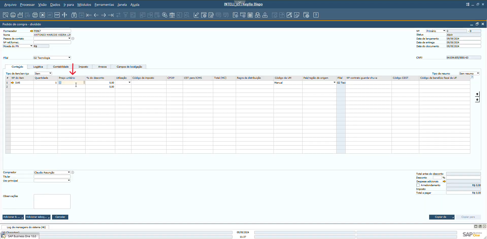

Fonte: Elaborado pelos Autores.

#### Passo 6.4: Adicionar item

- Clique no botão "Adicionar & ...";
- Selecione o fornecedor desejado e confirme;

Imagem XX - Passo 6.4 - nome da imagem

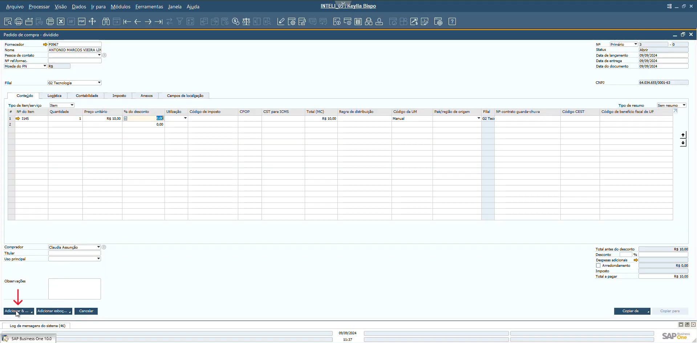

Fonte: Elaborado pelos Autores.

#### Passo 6.5: Selecionar registro

- Clique no botão "Registro anterior" ou selecione o registro desejado;

Imagem XX - Passo 6.5 - nome da imagem

Fonte: Elaborado pelos Autores.

#### Passo 6.6: Adiantar fornecedor

- Clique no botão "Copiar para";
- Selecione o "Adiantamento para fornecedor";

Imagem XX - Passo 6.6 - nome da imagem

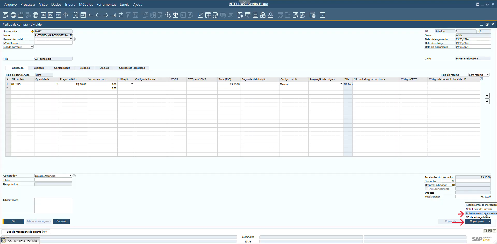

Fonte: Elaborado pelos Autores.

#### Passo 6.7: Adiantamento

- Na seção de adiantamento, coloque a porcentagem do valor a ser adiantado;
- Clique no botão "Adicionar & ..." para finalizar o processo;

Imagem XX - Passo 6.7 - nome da imagem

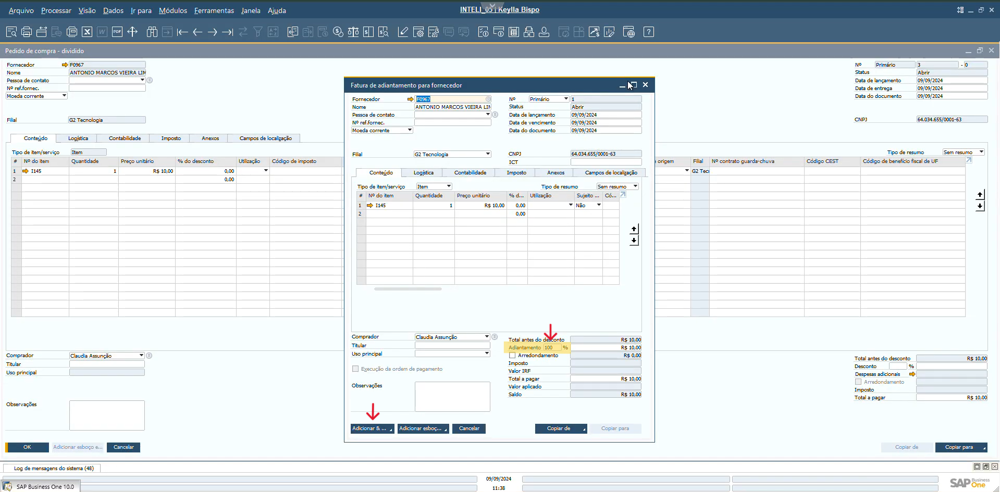

Fonte: Elaborado pelos Autores.

###  Passo 8: Relatório compras

#### Passo 8.1: Acessar o sistema

- Clique em "Módulos";
- Selecione "Compras - C/P"
- Selecione "Relatórios de Compras"
- Clique em "Lista de itens em aberto"

Imagem XX - Passo 8.1 - nome da imagem

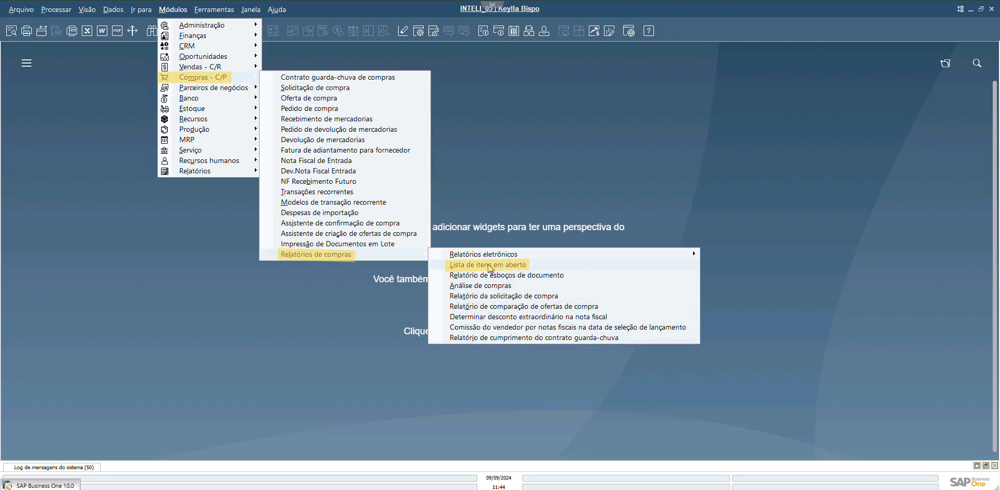

Fonte: Elaborado pelos Autores.

#### Passo 8.2: Acessar os relatórios

- Clique em "Notas fiscais de saída";
- Abaixo irá aparecer todos os documentos em aberto da área que for selecionada;

Imagem XX - Passo 8.2 - nome da imagem

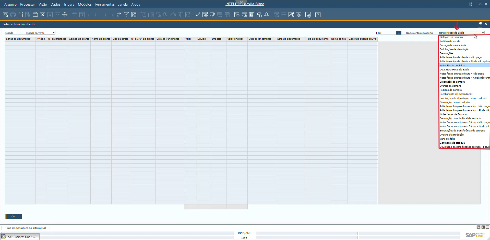

Fonte: Elaborado pelos Autores.

###  Passo 11: Checar estoque de licenças

#### Passo 11.1: Acessar o sistema

- Clique em "Módulos";
- Selecione "Estoque"
- Selecione "Relatórios de estoque"
- Clique em "Relatório de verificação de estoque"

Imagem XX - Passo 11.1 - nome da imagem

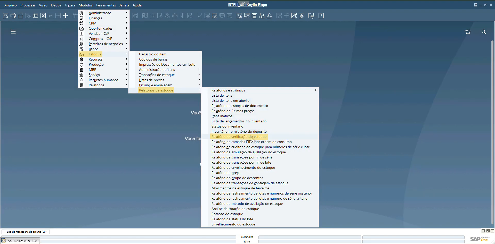

Fonte: Elaborado pelos Autores.

#### Passo 11.2: Relatórios

- Clique o campo da data;
- Selecione até que periodo se deseja visualizar o relatório;
- Após a escolha clique em "Ok";

Imagem XX - Passo 11.2 - nome da imagem

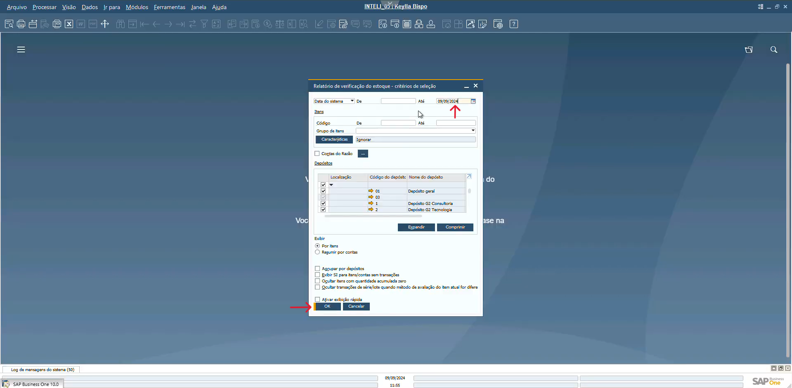

Fonte: Elaborado pelos Autores.

#### Passo 11.3: Relatórios apresentados

- Os relatórios serão apresentados em uma tabela;
- Após a visualização clique em "Ok";

Imagem XX - Passo 11.3 - nome da imagem

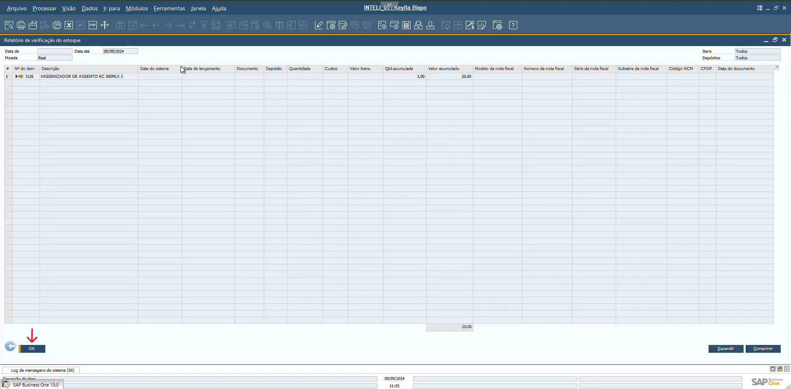

Fonte: Elaborado pelos Autores.

###  Passo 13: Pedido de reposição de produtos internos

#### Passo 13.1: Acessar o sistema

- Clique em "Módulos";
- Selecione "Compras - C/P"
- Clique em "Transações recorrentes";

Imagem XX - Passo 13.1 - nome da imagem

Fonte: Elaborado pelos Autores.

#### Passo 13.2: Selecionar tipo

- Clique na cédula  "tipo";
- Selecione "pedido de compra";

Imagem XX - Passo 13.2 - nome da imagem

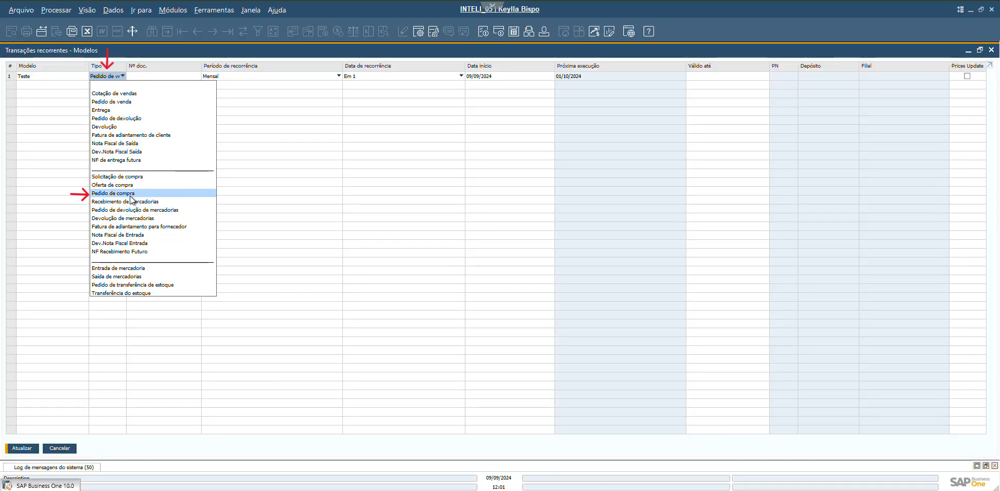

Fonte: Elaborado pelos Autores.

#### Passo 13.3: Verificar documentos

- Clique em "documentos";
- Verifique se todos os campos estão marcados e então clique em "Ok";

Imagem XX - Passo 13.3 - nome da imagem

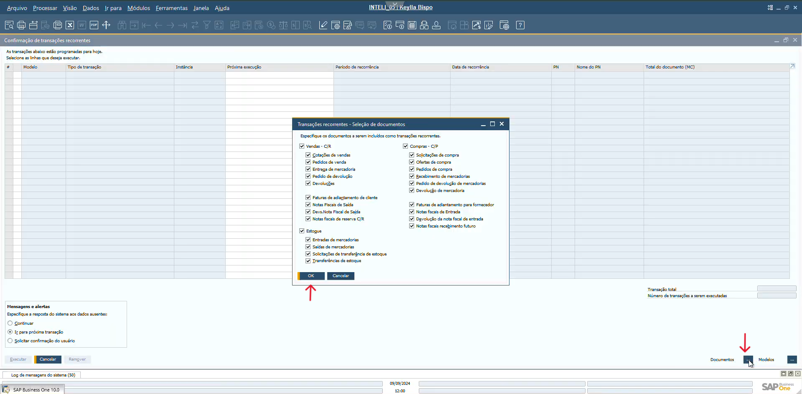

Fonte: Elaborado pelos Autores.

#### Passo 13.4: Abrir modelos de transação recorrente

- Clique em "Modelos";
- Após isso clique em "Ok";

Imagem XX - Passo 13.4 - nome da imagem

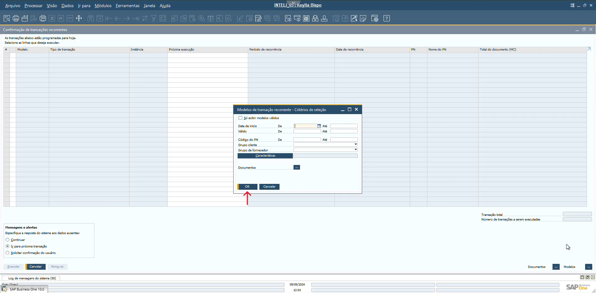

Fonte: Elaborado pelos Autores.

#### Passo 13.5: Configurar transação

- Clique em "Nº doc" e selecione o documento de compras que será utilizado para fazer a transação;
- Após isso preencha os outros campos necessários para a configuração;
- Após a configuração ser preenchida, clique em atualizar;

Imagem XX - Passo 13.5 - nome da imagem

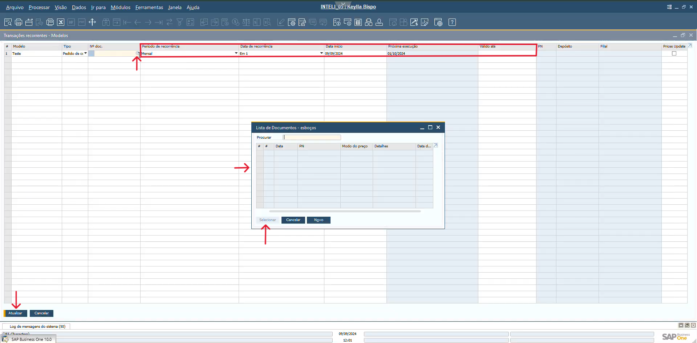

Fonte: Elaborado pelos Autores.
