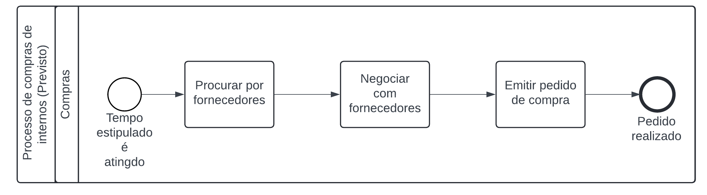
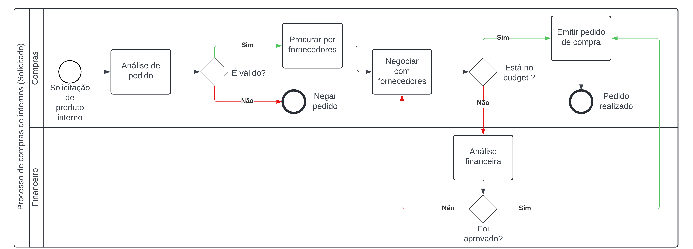

# Desenho da Solução - Mapeamento dos Processos
 

&emsp;&emsp; A SAP é uma das principais fornecedoras de software de gestão empresarial do mundo, oferecendo soluções que integram processos e informações dentro das empresas. Em nosso projeto atual, estamos focando em cinco setores essenciais para o bom funcionamento do negócio: vendas, compras, estoque, financeiro e contábil. 

&emsp;&emsp;Dentro de cada setor, existem atividades que se conectam e formam um macroprocesso, que é o conjunto de processos inter-relacionados que contribuem para um objetivo comum dentro da organização. Mapear esses macroprocessos é crucial, pois permite uma visão clara das interações entre diferentes áreas, ajudando a identificar oportunidades de melhoria, otimizar recursos e garantir que todos os processos estejam alinhados com as metas estratégicas da empresa. 

&emsp;&emsp;Este documento tem como objetivo explorar em detalhes o processo do setor de compras da G2, abordando suas etapas e interações, desde o pedido de aquisição de materiais até o recebimento e pagamento dos fornecedores.

## 1. Requisição de Material Direto

&emsp;&emsp; No contexto do mapeamento do processo de "compras" na G2, o primeiro  foco será nos produtos diretos que a empresa comercializa, ou seja, as licenças SAP. O mapeamento desse processo é essencial para garantir que a aquisição e a gestão das licenças sejam realizadas de maneira eficiente, alinhada aos padrões de qualidade e às necessidades dos clientes.

### 1.1 Requisição de Compras - Vendas

Imagem XX - Processo de Compras iniciado pelo setor de Vendas

Fonte: Elaborado pelos Autores.

&emsp;&emsp; O processo de compras de licenças na G2 começa quando o setor de Vendas faz um pedido de X licenças a serem vendidas. Esse pedido é recebido pelo setor de Compras, que então verifica a disponibilidade no estoque. Se as licenças estiverem disponíveis, o processo é finalizado com a comunicação ao setor de Vendas. Caso contrário, o setor de Compras inicia um processo de aquisição, que envolve cotação com fornecedores e consulta ao setor Financeiro para aprovação do orçamento. Após a compra ser aprovada e realizada, as licenças são recebidas, e o processo é concluído com a disponibilização das licenças para venda.

### Detalhamento dos Macro Fluxos

#### **Pedido de Compras (Setor de Vendas)**
1. **Ponto de Entrada:** Pedido de X licenças feito pelo setor de Vendas.
2. **Atividades:**
   - **Vendas** realiza o pedido de X licenças para serem vendidas.
   - **Compras** recebe o pedido.
   - **Compras** requisita a disponibilidade no estoque.
3. **Resultado Esperado:** Pedido de compra iniciado e disponibilidade de estoque verificada.

#### **Verificação da Disponibilidade de Licenças**
1. **Ponto de Entrada:** Requisição de disponibilidade no estoque feita pelo setor de Compras.
2. **Atividades:**
   - **Estoque** confere a disponibilidade de licenças.
   - **Estoque** confirma a presença de licenças no estoque.
3. **Resultado Esperado:** Confirmação de licenças em estoque ou necessidade de adquirir mais.

#### **Aquisição de Licenças (Se necessário)**
1. **Ponto de Entrada:** Caso o estoque não tenha a quantidade necessária de licenças.
2. **Atividades:**
   - **Estoque** informa a necessidade de compra de mais licenças para o setor de Compras.
   - **Compras** realiza uma pré-cotação para a aquisição das novas licenças.
   - **Compras** verifica se a aquisição está dentro do orçamento disponível.
   - **Compras** realiza cotação com fornecedores e levanta o preço final.
   - **Compras** consulta o setor Financeiro para confirmar o valor orçado.
   - **Financeiro** aprova ou não a compra baseada no orçamento.
   - **Compras** realiza a compra se aprovado.
3. **Resultado Esperado:** Licenças adquiridas e recebidas, ou processo finalizado sem compra.

#### **Recebimento e Conclusão**
1. **Ponto de Entrada:** Compra de licenças aprovada e realizada.
2. **Atividades:**
   - **Compras** recebe as licenças.
   - **Compras** finaliza o processo, repassando a informação ao setor de Vendas.
3. **Resultado Esperado:** Licenças disponíveis para venda e conclusão do processo de compra.

### 1.2 Requisição de Compras - Estoque

Imagem XX - Processo de Compras iniciado pelo setor de Estoque/p>

Fonte: Elaborado pelos Autores.

&emsp;&emsp; O processo de reposição de licenças na G2 é acionado quando o setor de Estoque identifica a necessidade de reposição de licenças, solicitando a compra ao setor de Compras. Este, por sua vez, trata a aquisição das licenças necessárias, verificando se a compra está dentro do orçamento. Se o orçamento permitir, a compra é realizada. Caso contrário, são realizadas cotações com fornecedores e o setor Financeiro é consultado para aprovar o orçamento. Após a aprovação, a compra é finalizada e as licenças são recebidas, encerrando o processo. 

### Detalhamento dos Macro Fluxos

#### **Identificação da Necessidade e Pedido de Compra**
1. **Ponto de Entrada:** Necessidade de reposição de licenças identificada pelo setor de Estoque.
2. **Atividades:**
   - **Estoque** identifica a necessidade de reposição de X licenças.
   - **Estoque** faz o pedido de compras para o setor de Compras.
   - **Compras** recebe o pedido.
3. **Resultado Esperado:** Pedido de reposição de licenças realizado e recebido pelo setor de Compras.

#### **Tratamento da Compra de Licenças**
1. **Ponto de Entrada:** Recebimento do pedido de reposição de licenças pelo setor de Compras.
2. **Atividades:**
   - **Compras** trata a compra de mais licenças, orçando com alguns fornecedores.
   - **Compras** verifica se a compra está dentro do orçamento (budget).
   - **Compras** realiza a compra diretamente, caso o valor esteja dentro do orçamento.
3. **Resultado Esperado:** Compra realizada ou necessidade de cotação e aprovação financeira identificada.

#### **Cotação e Consulta ao Setor Financeiro**
1. **Ponto de Entrada:** Caso a compra não esteja dentro do orçamento.
2. **Atividades:**
   - **Compras** realiza cotação com fornecedores para obter o melhor preço.
   - **Compras** levanta o preço final após cotação.
   - **Compras** consulta o setor Financeiro para verificar a aprovação do valor orçado.
   - **Financeiro** confere o valor orçado e decide sobre a aprovação.
   - **Financeiro** aprova ou não a compra com base na análise orçamentária.
3. **Resultado Esperado:** Aprovação financeira para a realização da compra ou ajuste do orçamento.

#### **Realização da Compra e Recebimento das Licenças**
1. **Ponto de Entrada:** Aprovação da compra pelo setor Financeiro.
2. **Atividades:**
   - **Compras** realiza a compra das licenças.
   - **Compras** recebe as licenças adquiridas.
   - **Estoque** é atualizado com as novas licenças recebidas.
3. **Resultado Esperado:** Licenças recebidas e estoque atualizado, finalizando o processo de reposição.

## 2. Requisição de Material Indireto

&emsp;&emsp; Seguindo as necessidades da G2, a compra de materias indiretos também precisa ser mapeada e analisada. O mapeamento desse processo é essencial para garantir que a aquisição desse material seja feita de maneira controlada e eficiente.

### 2.1 Requisição de Compras Internas

Imagem XX - Processo de Compras de internos iniciado por tempo atingido/p>

Fonte: Elaborado pelos Autores.

&emsp;&emsp; O processo de reposição de materiais na G2 é acionado quando o tempo estimado para a compra desses materiais é atingido. A área de compras trata de procurar os melhores fornecedores do(s) material(is) necessário(s). Após isso inicia as negociações sobre a compra, verificando valor, tempo, qualidade e outras características estipuladas pela G2. Em seguida, quando a negociação é feita, o pedido de compras é emitido. Depois da emissão, o pedido é finalizado. 

### Detalhamento dos Macro Fluxos

#### **Pedido de Compras Interno Periódico**
1. **Ponto de Entrada:** Atinge a data estipulada para fazer compras fixas.
2. **Atividades:**
   - Compras verifica se é a data determinada para as compras regulares.
   - Compras faz a cotação de fornecedores.
   - Compras emite o pedido.
3. **Resultado Esperado:** Pedido de compra periódico finalizado na data.

### 2.2 Requisição de Compras Internas Solicitada

Imagem XX - Processo de Compras de internos iniciado por solicitação

Fonte: Elaborado pelos Autores.

&emsp;&emsp; O processo de reposição é iniciado por uma solicitação dentro da empresa. A área de compras trata de analisar o pedido, uma vez que precisa verificar a urgência dessa compra assim como se a reposição por tempo está próxima, podendo o pedido ser negado, encerrando o processo, ou seguir adiante se aprovado. Caso siga, a área de compras procura os melhores fornecedores do(s) material(is) necessário(s). Após isso inicia as negociações sobre a compra, verificando valor, tempo, qualidade e outras características estipuladas pela G2. Em seguida, após as negociações com os fornecedores acabarem, é verificado se o valor final das negociações estão dentro do "Budget" do setor. Caso seja, o pedido de compras é emitido e o processo é finalizado em seguida. Se não, o caso é enviado para o setor finaceiro que realiza sua própria análise do caso, podendo aprovar a compra ou recusar. Caso for aprovado, o pedido de compra é emitido e o processo finalizado. Se não for aprovado, o processo volta para a etapa de negociar com os fornecedores. 

### Detalhamento dos Macro Fluxos

#### **Identificação da Necessidade e Pedido de Compra**
1. **Ponto de Entrada:** Solicitação de produto interno.
2. **Atividades:**
   - **Compras** Analisa o pedido solicitado.
   - **Compras** Julga se o pedido é válido ou não.
3. **Resultado Esperado:** 
   - O pedido é recebido por compras e negado.
   - O pedido é recebido por compras e aprovado.

#### **Negociação com fornecedores**
1. **Ponto de Entrada:** 
   - Pesquisa dos melhores fornecedores feita pela equipe de compras.
   - Negação do orçamento pelo setor financeiro.
2. **Atividades:**
   - **Compras** trata a compra de internos, orçando com alguns fornecedores.
   - **Compras** verifica se a compra está dentro do orçamento (budget).
   - **Compras** realiza a compra diretamente, caso o valor esteja dentro do orçamento.
3. **Resultado Esperado:** Compra realizada ou necessidade de cotação e aprovação financeira identificada.

#### **Cotação e Consulta ao Setor Financeiro**
1. **Ponto de Entrada:** Caso a compra não esteja dentro do orçamento.
2. **Atividades:**
   - **Compras** realiza cotação com fornecedores para obter o melhor preço.
   - **Compras** levanta o preço final após cotação.
   - **Compras** consulta o setor Financeiro para verificar a aprovação do valor orçado.
   - **Financeiro** confere o valor orçado e decide sobre a aprovação.
   - **Financeiro** aprova ou não a compra com base na análise orçamentária.
3. **Resultado Esperado:** Aprovação financeira para a realização da compra ou ajuste do orçamento.

#### **Realização da Compra e Recebimento das Licenças**
1. **Ponto de Entrada:** Aprovação da compra pelo setor Financeiro.
2. **Atividades:**
   - **Compras** realiza a compra dos internos.
   - **Compras** recebe os produtos adquiridos.
3. **Resultado Esperado:** Produto recebidos, finalizando o processo de reposição.
